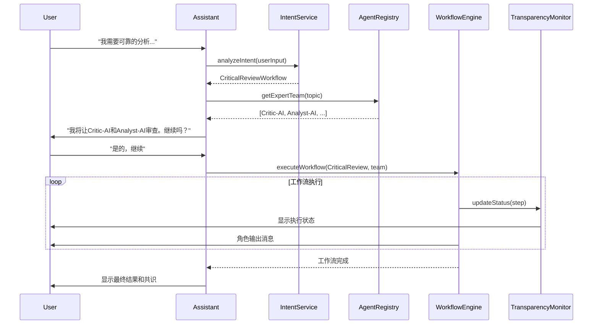
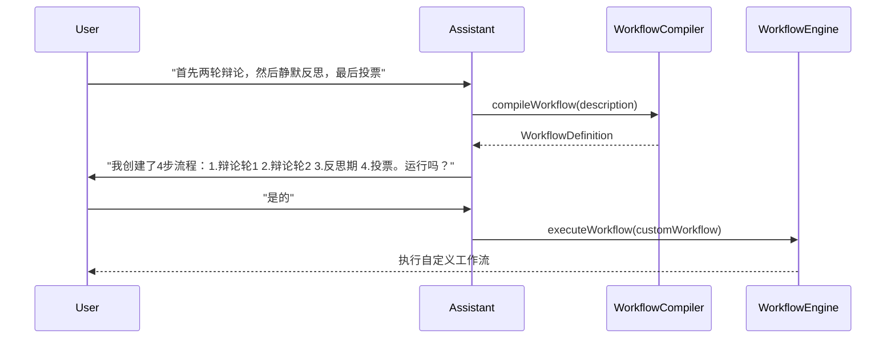

# Design Document: Personal Intelligence Hub - Core User Experience

## Overview

Personal Intelligence Hub是一个统一的对话界面，用户通过与单一的智能个人助手交互，该助手将自然语言指令转换为强大的底层"社会制度"(工作流)的执行。该设计基于现有DAIP-LIVE项目已实现的强大后端功能，专注于用户体验优化和界面设计。

**设计原则：**
- 基于现有功能模块，绝不重新实现底层服务，尽量用全用足已有的底层服务和技术
- 提供直观的自然语言交互体验
- 实现完全透明的系统运作过程
- 支持从引导式体验到创意体验的渐进式用户成长

## Architecture

### Lona Web应用架构

Lona is a Python web framework for building responsive web applications with full Python. It allows developers to write both the frontend and backend logic in Python, simplifying the development process and reducing the need for JavaScript.

Lona's HTML elements are used to create the user interface components. Lona provides a set of Python classes that correspond to HTML elements, such as `Div`, `H1`, `TextInput`, and `Button`. These classes can be used to create and manipulate HTML elements in Python code. For example:

```python
from lona.html import HTML, Div, H1, TextInput, Button

# Create a div element
div = Div()

# Create a heading element
h1 = H1("Welcome to Lona!")

# Create a text input element
text_input = TextInput(value="Enter your name")

# Create a button element
button = Button("Submit")

# Create an HTML node with the elements
html = HTML(
    h1,
    div,
    text_input,
    button
)
```

Key features of Lona:

- **Full Python**: Write both frontend and backend logic in Python.
- **Component-Based**: Build reusable UI components with Python classes.
- **Real-Time**: Built-in WebSocket support for real-time updates.
- **Data Binding**: Automatically synchronize data between the server and the client.
- **HTML Templating**: Use Jinja2 templates to generate HTML.

In the Personal Intelligence Hub, Lona is used to create the user interface and handle real-time updates. The `ChatInterface`, `TransparencyMonitor`, `WikiPanel`, and `TaskPanel` components are all built using Lona's component-based architecture.

```python
# main_app.py - Lona应用入口点

```python
# main_app.py - Lona应用入口点
from lona import LonaApp, View
from lona.html import HTML, Div, H1

from components.chat_interface import ChatInterface
from components.transparency_monitor import TransparencyMonitor
from components.wiki_panel import WikiPanel
from components.task_panel import TaskPanel
from services.personal_assistant import PersonalAssistantService

app = LonaApp(__file__)

@app.route('/')
class IndexView(View):
    def handle_request(self, request):
        return HTML(
            H1("欢迎使用 Personal Intelligence Hub"),
            Div("正在初始化系统...")
        )

@app.route('/hub')
class PersonalIntelligenceHubView(View):
    def handle_request(self, request):
        # 初始化服务
        assistant_service = PersonalAssistantService()
        
        # 初始化组件
        chat_interface = ChatInterface(assistant_service)
        transparency_monitor = TransparencyMonitor()
        wiki_panel = WikiPanel()
        task_panel = TaskPanel()
        
        return HTML(
            H1("Personal Intelligence Hub"),
            Div(
                # 主要聊天界面
                Div(
                    chat_interface.render(),
                    _class="main-chat-area"
                ),
                
                # 右侧面板
                Div(
                    transparency_monitor.render(),
                    wiki_panel.render(),
                    task_panel.render(),
                    _class="side-panels"
                ),
                
                _class="hub-layout"
            )
        )

if __name__ == '__main__':
    app.run(host='localhost', port=8080, debug=True)
```

### 系统架构概览

```mermaid
graph TB
    subgraph "Personal Intelligence Hub UI Layer"
        ChatInterface[Central Chat Interface]
        TransparencyMonitor[Transparency Monitor]
        WikiPanel[Wiki Panel]
        TaskPanel[Task Panel]
        AnalyticsPanel[Analytics Panel]
    end
    
    subgraph "Personal Assistant Layer"
        PersonalAssistant[Personal Assistant]
        IntentAnalysis[Intent Analysis]
        PromptOptimization[Prompt Optimization]
        ContextCoCreation[Context Co-creation]
        WorkflowCompiler[Workflow Compiler]
    end
    
    subgraph "Existing Backend Services (Already Implemented)"
        IntentAnalysisService[Intent Analysis Service]
        CognitiveAgentRegistry[Cognitive Agent Registry]
        WorkflowEngine[Workflow Engine]
        CriticalReviewWorkflow[Critical Review Workflow]
        MultiPerspectiveWorkflow[Multi-perspective Workflow]
        SSKG[SSKG Manager]
        MemAgent[Memory Agent]
        TaskContextOptimizer[Task Context Optimizer]
        WikiService[Wiki Service]
        FactExtractionService[Fact Extraction Service]
        ConsensusAlgorithms[Consensus Algorithms]
        PromptOptimizationService[Prompt Optimization Service]
    end
    
    ChatInterface --> PersonalAssistant
    PersonalAssistant --> IntentAnalysisService
    PersonalAssistant --> PromptOptimizationService
    PersonalAssistant --> CognitiveAgentRegistry
    PersonalAssistant --> WorkflowEngine
    
    WorkflowEngine --> CriticalReviewWorkflow
    WorkflowEngine --> MultiPerspectiveWorkflow
    
    TransparencyMonitor --> WorkflowEngine
    TransparencyMonitor --> MemAgent
    TransparencyMonitor --> TaskContextOptimizer
    
    WikiPanel --> WikiService
    WikiPanel --> SSKG
    
    TaskPanel --> WorkflowEngine
    
    AnalyticsPanel --> ConsensusAlgorithms
    AnalyticsPanel --> FactExtractionService
    
    style PersonalAssistant fill:#FFE6CC,stroke:#333
    style ChatInterface fill:#E6F3FF,stroke:#333
    style TransparencyMonitor fill:#F0F8E6,stroke:#333
```



### 核心设计理念

1. **单一入口点**: 用户只需与一个智能助手交互
2. **渐进式复杂度**: 从简单的引导式体验到高级的自定义工作流
3. **完全透明**: 所有系统内部过程对用户可见
4. **实时反馈**: 工作流执行过程的实时状态更新
5. **上下文感知**: 基于用户历史和偏好的个性化体验

## Components and Interfaces

### 1. Central Chat Interface (核心聊天界面)

**职责**: 提供主要的用户交互界面，支持自然语言对话

**设计特点**:
- 持久化的聊天历史记录
- 支持富文本和结构化内容显示
- 实时消息流更新
- 支持特殊命令(如 `/consensus now`)

**Lona组件设计**:
```python
from lona.html import HTML, Div, TextInput, Button, P, Span
from dataclasses import dataclass
from datetime import datetime
from typing import Optional, Dict, Any, List
from enum import Enum

class MessageType(Enum):
    TEXT = "text"
    WORKFLOW_STATUS = "workflow_status"
    AGENT_OUTPUT = "agent_output"
    CONSENSUS_RESULT = "consensus_result"

@dataclass
class ChatMessage:
    id: str
    sender: str  # 'user' | 'assistant' | 角色ID
    content: str
    timestamp: datetime
    message_type: MessageType = MessageType.TEXT
    metadata: Optional[Dict[str, Any]] = None

class ChatInterface:
    def __init__(self, assistant_service):
        self.assistant_service = assistant_service
        self.messages: List[ChatMessage] = []
        
    def handle_send_message(self, input_event):
        """处理发送消息事件"""
        message_text = input_event.node.value.strip()
        if not message_text:
            return
        
        # 创建用户消息
        user_message = ChatMessage(
            id=f"msg_{len(self.messages)}",
            sender="user",
            content=message_text,
            timestamp=datetime.now()
        )
        self.messages.append(user_message)
        
        # 清空输入框
        input_event.node.value = ""
        
        # 处理命令或发送给助手
        if message_text.startswith('/'):
            self.handle_command(message_text)
        else:
            self.send_to_assistant(message_text)
    
    def handle_command(self, command: str):
        """处理特殊命令如 /consensus now"""
        if command == "/consensus now":
            response = ChatMessage(
                id=f"msg_{len(self.messages)}",
                sender="system",
                content="正在计算当前辩论状态的共识...",
                timestamp=datetime.now(),
                message_type=MessageType.WORKFLOW_STATUS
            )
            self.messages.append(response)
    
    def send_to_assistant(self, message: str):
        """发送消息给Personal Assistant"""
        # TODO: 集成Personal Assistant服务
        response = ChatMessage(
            id=f"msg_{len(self.messages)}",
            sender="assistant",
            content=f"收到您的消息: {message}",
            timestamp=datetime.now()
        )
        self.messages.append(response)
    
    def render_message(self, message: ChatMessage) -> HTML:
        """渲染单个消息"""
        return Div(
            Div(message.sender, _class="message-sender"),
            Div(message.content, _class="message-content"),
            Div(message.timestamp.strftime("%H:%M:%S"), _class="message-timestamp"),
            _class=f"message message-{message.sender} message-type-{message.message_type.value}"
        )
        
    def render(self) -> HTML:
        message_input = TextInput(placeholder="输入消息或命令...")
        send_button = Button("发送")
        
        # 绑定事件处理
        def handle_click(input_event):
            # 获取输入框的值并处理
            self.handle_send_message(input_event)
        
        send_button.onclick = handle_click
        
        return Div(
            # 消息历史显示区域
            Div(
                *[self.render_message(msg) for msg in self.messages],
                _class="message-history"
            ),
            # 输入区域
            Div(
                message_input,
                send_button,
                _class="message-input-area"
            ),
            _class="chat-interface"
        )
```

### 2. Personal Assistant (个人助手)

**职责**: 理解用户意图，编排工作流执行，提供个性化体验

**核心功能**:
- 意图分析和工作流映射
- 团队组建和确认
- 提示优化和上下文创建
- 自然语言工作流编译

**Lona服务集成设计**:
```python
from dataclasses import dataclass
from typing import List, Optional
from enum import Enum

class WorkflowType(Enum):
    CRITICAL_REVIEW = "critical_review"
    MULTI_PERSPECTIVE = "multi_perspective"
    CUSTOM = "custom"

@dataclass
class TeamProposal:
    agents: List['CognitiveAgent']
    diversity_score: float
    rationale: str
    confirmation_message: str

@dataclass
class WorkflowSelection:
    workflow_type: WorkflowType
    confidence: float
    reasoning: str

class PersonalAssistantService:
    def __init__(self, intent_service, agent_registry, workflow_engine):
        self.intent_service = intent_service
        self.agent_registry = agent_registry
        self.workflow_engine = workflow_engine
    
    async def analyze_intent(self, user_input: str, context: 'ConversationContext') -> 'IntentResult':
        """分析用户意图"""
        return await self.intent_service.analyze_intent(user_input, context)
    
    async def select_workflow(self, intent: 'IntentResult') -> WorkflowSelection:
        """选择合适的工作流"""
        pass
        
    async def assemble_team(self, topic: str, workflow_type: str) -> TeamProposal:
        """组建专家团队"""
        agents = await self.agent_registry.get_expert_team(topic)
        return TeamProposal(
            agents=agents,
            diversity_score=self._calculate_diversity(agents),
            rationale=f"基于话题'{topic}'选择的专家团队",
            confirmation_message=f"我将让{', '.join([a.name for a in agents])}使用{workflow_type}流程分析。继续吗？"
        )
    
    async def execute_workflow(self, workflow_def, team) -> 'WorkflowExecution':
        """执行工作流"""
        return await self.workflow_engine.execute(workflow_def, team)
    
    async def compile_workflow(self, description: str) -> 'WorkflowDefinition':
        """编译自然语言工作流描述"""
        pass
        
    def _calculate_diversity(self, agents: List['CognitiveAgent']) -> float:
        """计算团队认知多样性"""
        pass
```

### 3. Transparency Monitor (透明度监控器)

**职责**: 实时显示系统内部运作过程，提供完全透明度

**监控内容**:
- 活跃的认知代理
- 当前使用的推理框架
- MemAgent的记忆操作
- LLM后端调用详情
- Token消耗和成本估算

**Lona透明度监控组件**:
```python
from lona import Component
from lona.html import HTML, Div, H3, P, Span
from dataclasses import dataclass
from datetime import datetime
from typing import List, Optional
from enum import Enum

class AgentStatus(Enum):
    IDLE = "idle"
    THINKING = "thinking"
    RESPONDING = "responding"
    WAITING = "waiting"

@dataclass
class AgentStatusInfo:
    agent_id: str
    name: str
    status: AgentStatus
    current_task: Optional[str] = None
    reasoning_framework: Optional[str] = None
    epistemology: Optional[str] = None

@dataclass
class LLMCall:
    id: str
    model_id: str
    input_tokens: int
    output_tokens: int
    cost: float
    latency: float
    timestamp: datetime

@dataclass
class SystemStatus:
    active_agents: List[AgentStatusInfo]
    current_workflow: Optional['WorkflowStatus'] = None
    memory_operations: List['MemoryOperation'] = None
    llm_calls: List[LLMCall] = None
    token_usage: Optional['TokenUsage'] = None

class TransparencyMonitor(Component):
    def __init__(self):
        self.system_status = SystemStatus(active_agents=[])
        self.operation_logs: List['OperationLog'] = []
        
    async def update_status(self, status: SystemStatus) -> None:
        """更新系统状态"""
        self.system_status = status
        await self.refresh()
        
    def render(self) -> HTML:
        return Div(
            H3("系统透明度监控"),
            
            # 活跃代理状态
            Div(
                H3("活跃代理"),
                *[self.render_agent_status(agent) for agent in self.system_status.active_agents],
                _class="active-agents"
            ),
            
            # LLM调用监控
            Div(
                H3("LLM调用"),
                *[self.render_llm_call(call) for call in (self.system_status.llm_calls or [])],
                _class="llm-calls"
            ),
            
            # Token使用统计
            self.render_token_usage(),
            
            _class="transparency-monitor"
        )
    
    def render_agent_status(self, agent: AgentStatusInfo) -> HTML:
        status_color = {
            AgentStatus.IDLE: "gray",
            AgentStatus.THINKING: "blue", 
            AgentStatus.RESPONDING: "green",
            AgentStatus.WAITING: "orange"
        }.get(agent.status, "gray")
        
        return Div(
            Span(agent.name, _class="agent-name"),
            Span(agent.status.value, _class=f"agent-status status-{status_color}"),
            P(f"推理框架: {agent.reasoning_framework or 'N/A'}"),
            P(f"认识论: {agent.epistemology or 'N/A'}"),
            _class="agent-status-card"
        )
```

### 4. Wiki Panel (Wiki面板)

**职责**: 显示和管理知识库内容，支持实时更新

**功能特点**:
- 实时知识更新显示
- 搜索和浏览功能
- 版本历史查看
- 质量评分显示

**Lona Wiki面板组件**:
```python
from lona import Component
from lona.html import HTML, Div, H3, Input, Button, A, P
from dataclasses import dataclass
from datetime import datetime
from typing import List, Optional
from enum import Enum

class WikiUpdateType(Enum):
    PAGE_CREATED = "page_created"
    PAGE_UPDATED = "page_updated"
    FACT_ADDED = "fact_added"

class WikiUpdateSource(Enum):
    CONSENSUS_NODE = "consensus_node"
    FACT_EXTRACTION = "fact_extraction"
    USER = "user"

@dataclass
class WikiUpdate:
    update_type: WikiUpdateType
    page_id: str
    content: Optional[str] = None
    source: WikiUpdateSource = WikiUpdateSource.USER
    timestamp: datetime = None
    
    def __post_init__(self):
        if self.timestamp is None:
            self.timestamp = datetime.now()

@dataclass
class WikiPage:
    id: str
    title: str
    content: str
    quality_score: float
    version: int
    last_updated: datetime
    contributors: List[str]

class WikiPanel(Component):
    def __init__(self, wiki_service):
        self.wiki_service = wiki_service
        self.current_page: Optional[WikiPage] = None
        self.search_results: List[WikiPage] = []
        self.search_input = Input(placeholder="搜索知识库...")
        self.search_button = Button("搜索")
        
    async def display_page(self, page_id: str) -> None:
        """显示Wiki页面"""
        self.current_page = await self.wiki_service.get_page(page_id)
        await self.refresh()
        
    async def search_content(self, query: str) -> None:
        """搜索Wiki内容"""
        self.search_results = await self.wiki_service.search(query)
        await self.refresh()
        
    async def handle_wiki_update(self, update: WikiUpdate) -> None:
        """处理Wiki实时更新"""
        if update.update_type == WikiUpdateType.FACT_ADDED:
            # ConsensusNode确定的事实自动添加
            await self.display_page(update.page_id)
        elif update.source == WikiUpdateSource.FACT_EXTRACTION:
            # 事实提取服务的自动更新
            await self.refresh()
            
    def render(self) -> HTML:
        return Div(
            H3("知识库"),
            
            # 搜索区域
            Div(
                self.search_input,
                self.search_button,
                _class="wiki-search"
            ),
            
            # 当前页面显示
            self.render_current_page() if self.current_page else Div(),
            
            # 搜索结果
            Div(
                *[self.render_search_result(result) for result in self.search_results],
                _class="search-results"
            ),
            
            _class="wiki-panel"
        )
    
    def render_current_page(self) -> HTML:
        if not self.current_page:
            return Div()
            
        return Div(
            H3(self.current_page.title),
            P(f"质量评分: {self.current_page.quality_score:.2f}"),
            P(f"版本: {self.current_page.version}"),
            Div(self.current_page.content, _class="wiki-content"),
            _class="current-page"
        )
```

### 5. Task Panel (任务面板)

**职责**: 显示和管理任务状态，支持任务分解和跟踪

**功能特点**:
- 任务层次结构显示
- 实时状态更新
- 依赖关系可视化
- 进度跟踪

**Lona任务面板组件**:
```python
from lona import Component
from lona.html import HTML, Div, H3, Button, Select, Option
from dataclasses import dataclass
from datetime import datetime
from typing import List, Optional
from enum import Enum

class TaskStatus(Enum):
    NOT_STARTED = "not_started"
    IN_PROGRESS = "in_progress"
    COMPLETED = "completed"
    BLOCKED = "blocked"

class TaskUpdateType(Enum):
    TASK_CREATED = "task_created"
    TASK_UPDATED = "task_updated"
    STATUS_CHANGED = "status_changed"

class TaskUpdateSource(Enum):
    TASK_DECOMPOSITION_NODE = "task_decomposition_node"
    WORKFLOW_ENGINE = "workflow_engine"
    USER = "user"

@dataclass
class Task:
    id: str
    title: str
    description: str
    status: TaskStatus = TaskStatus.NOT_STARTED
    parent_id: Optional[str] = None
    assigned_agent: Optional[str] = None
    dependencies: List[str] = None
    created_at: datetime = None
    
    def __post_init__(self):
        if self.created_at is None:
            self.created_at = datetime.now()
        if self.dependencies is None:
            self.dependencies = []

@dataclass
class TaskUpdate:
    update_type: TaskUpdateType
    task_id: str
    source: TaskUpdateSource
    timestamp: datetime = None
    
    def __post_init__(self):
        if self.timestamp is None:
            self.timestamp = datetime.now()

class TaskPanel(Component):
    def __init__(self, task_service):
        self.task_service = task_service
        self.tasks: List[Task] = []
        self.selected_project: Optional[str] = None
        
    async def display_tasks(self, project_id: Optional[str] = None) -> None:
        """显示任务列表"""
        self.tasks = await self.task_service.get_tasks(project_id)
        self.selected_project = project_id
        await self.refresh()
        
    async def handle_task_update(self, update: TaskUpdate) -> None:
        """处理任务实时更新"""
        if update.source == TaskUpdateSource.TASK_DECOMPOSITION_NODE:
            # TaskDecompositionNode创建的新任务
            await self.display_tasks(self.selected_project)
        elif update.update_type == TaskUpdateType.STATUS_CHANGED:
            # 任务状态变更
            await self.refresh_task(update.task_id)
            
    async def update_task_status(self, task_id: str, status: TaskStatus) -> None:
        """更新任务状态"""
        await self.task_service.update_status(task_id, status)
        await self.display_tasks(self.selected_project)
        
    def render(self) -> HTML:
        return Div(
            H3("任务管理"),
            
            # 任务层次结构
            Div(
                *[self.render_task(task) for task in self.get_root_tasks()],
                _class="task-hierarchy"
            ),
            
            _class="task-panel"
        )
    
    def get_root_tasks(self) -> List[Task]:
        """获取根任务（没有父任务的任务）"""
        return [task for task in self.tasks if task.parent_id is None]
    
    def get_subtasks(self, parent_id: str) -> List[Task]:
        """获取子任务"""
        return [task for task in self.tasks if task.parent_id == parent_id]
    
    def render_task(self, task: Task, level: int = 0) -> HTML:
        status_colors = {
            TaskStatus.NOT_STARTED: "gray",
            TaskStatus.IN_PROGRESS: "blue",
            TaskStatus.COMPLETED: "green",
            TaskStatus.BLOCKED: "red"
        }
        
        subtasks = self.get_subtasks(task.id)
        
        return Div(
            Div(
                Div(task.title, _class="task-title"),
                Div(task.status.value, _class=f"task-status status-{status_colors[task.status]}"),
                Select(
                    *[Option(status.value, value=status.value) for status in TaskStatus],
                    value=task.status.value,
                    onchange=lambda event: self.update_task_status(task.id, TaskStatus(event.target.value))
                ),
                _class="task-header"
            ),
            
            # 子任务
            Div(
                *[self.render_task(subtask, level + 1) for subtask in subtasks],
                _class="subtasks"
            ) if subtasks else Div(),
            
            _class=f"task-item level-{level}"
        )
```

## Data Models

### 用户交互模型

```python
from dataclasses import dataclass
from datetime import datetime
from typing import List, Optional, Dict, Any
from enum import Enum

class CommunicationStyle(Enum):
    FORMAL = "formal"
    CASUAL = "casual"
    TECHNICAL = "technical"

class TransparencyLevel(Enum):
    MINIMAL = "minimal"
    MODERATE = "moderate"
    DETAILED = "detailed"

@dataclass
class UserPreferences:
    preferred_agents: List[str]
    transparency_level: TransparencyLevel = TransparencyLevel.MODERATE
    notification_settings: Dict[str, bool] = None
    ui_theme: str = "default"
    
    def __post_init__(self):
        if self.notification_settings is None:
            self.notification_settings = {}

@dataclass
class UserProfile:
    user_id: str
    preferences: UserPreferences
    interaction_history: List['InteractionRecord']
    expertise_areas: List[str]
    communication_style: CommunicationStyle = CommunicationStyle.CASUAL

@dataclass
class ConversationContext:
    user_id: str
    session_id: str
    message_history: List[ChatMessage]
    user_profile: UserProfile
    current_workflow: Optional['WorkflowExecution'] = None
    active_agents: List[str] = None
    
    def __post_init__(self):
        if self.active_agents is None:
            self.active_agents = []
```

### 工作流执行模型

```python
class WorkflowExecutionStatus(Enum):
    PREPARING = "preparing"
    RUNNING = "running"
    COMPLETED = "completed"
    FAILED = "failed"

class WorkflowStepStatus(Enum):
    PENDING = "pending"
    RUNNING = "running"
    COMPLETED = "completed"
    FAILED = "failed"

class WorkflowResultType(Enum):
    CONSENSUS = "consensus"
    INSIGHT = "insight"
    FACT = "fact"
    TASK = "task"

@dataclass
class WorkflowStep:
    step_id: str
    node_type: str
    status: WorkflowStepStatus = WorkflowStepStatus.PENDING
    inputs: Dict[str, Any] = None
    outputs: Dict[str, Any] = None
    execution_time: float = 0.0
    
    def __post_init__(self):
        if self.inputs is None:
            self.inputs = {}
        if self.outputs is None:
            self.outputs = {}

@dataclass
class WorkflowResult:
    result_type: WorkflowResultType
    content: Any
    confidence: float
    contributors: List[str]
    timestamp: datetime = None
    
    def __post_init__(self):
        if self.timestamp is None:
            self.timestamp = datetime.now()

@dataclass
class WorkflowExecution:
    execution_id: str
    workflow_type: str
    status: WorkflowExecutionStatus = WorkflowExecutionStatus.PREPARING
    participants: List['CognitiveAgent'] = None
    current_step: Optional[WorkflowStep] = None
    results: List[WorkflowResult] = None
    start_time: datetime = None
    end_time: Optional[datetime] = None
    
    def __post_init__(self):
        if self.participants is None:
            self.participants = []
        if self.results is None:
            self.results = []
        if self.start_time is None:
            self.start_time = datetime.now()
```

### 透明度监控模型

```python
class MemoryOperationType(Enum):
    RETRIEVE = "retrieve"
    STORE = "store"
    CONSOLIDATE = "consolidate"

class MemoryType(Enum):
    EPISODIC = "episodic"
    SEMANTIC = "semantic"
    PROCEDURAL = "procedural"

@dataclass
class OperationLog:
    id: str
    timestamp: datetime
    operation: str
    component: str
    details: Dict[str, Any]
    duration: float
    success: bool

@dataclass
class PerformanceMetrics:
    average_response_time: float
    total_tokens_used: int
    total_cost: float
    success_rate: float
    active_users: int
    workflows_completed: int

@dataclass
class MemoryOperation:
    operation_type: MemoryOperationType
    agent_id: str
    memory_type: MemoryType
    item_count: int
    timestamp: datetime = None
    
    def __post_init__(self):
        if self.timestamp is None:
            self.timestamp = datetime.now()

@dataclass
class TokenUsage:
    input_tokens: int
    output_tokens: int
    total_tokens: int
    estimated_cost: float
    timestamp: datetime = None
    
    def __post_init__(self):
        if self.timestamp is None:
            self.timestamp = datetime.now()
```

## User Experience Flow

### Phase 1: 引导式体验流程



### Phase 2: 创意体验流程



## Error Handling

### 错误处理策略

1. **优雅降级**: 当某个服务不可用时，提供替代方案
2. **用户友好**: 将技术错误转换为用户可理解的消息
3. **透明度**: 在透明度监控器中显示错误详情
4. **恢复机制**: 提供重试和恢复选项

### 错误类型和处理

```typescript
interface ErrorHandler {
  handleServiceError(error: ServiceError): UserFriendlyMessage
  handleWorkflowError(error: WorkflowError): RecoveryOptions
  handleLLMError(error: LLMError): FallbackStrategy
}

interface UserFriendlyMessage {
  message: string
  severity: 'info' | 'warning' | 'error'
  actionable: boolean
  suggestedActions?: string[]
}

interface RecoveryOptions {
  canRetry: boolean
  canModify: boolean
  alternativeWorkflows: string[]
  userMessage: string
}
```

## Testing Strategy

### 测试层次

1. **组件测试**: 每个UI组件的独立功能测试
2. **集成测试**: 组件间交互和数据流测试
3. **端到端测试**: 完整用户场景的自动化测试
4. **用户体验测试**: 真实用户的可用性测试

### 关键测试场景

```typescript
interface TestScenarios {
  // Phase 1 测试
  testGuidedExperience(): void
  testIntentAnalysis(): void
  testTeamAssembly(): void
  testWorkflowExecution(): void
  testTransparencyMonitoring(): void
  
  // Phase 2 测试
  testWorkflowCompilation(): void
  testCustomWorkflowExecution(): void
  testPromptOptimization(): void
  testContextCoCreation(): void
  
  // 系统集成测试
  testRealTimeUpdates(): void
  testErrorHandling(): void
  testPerformance(): void
}
```

## Implementation Considerations

### 技术栈选择

**统一Python技术栈**:
- Lona Web Framework (前后端统一的Python Web框架)
- 基于现有FastAPI后端服务
- WebSocket支持实时更新
- Python原生组件和状态管理

**Lona框架优势**:
- 前后端代码统一使用Python
- 组件化开发，类似React但使用Python
- 内置WebSocket支持，天然适合实时应用
- 与现有Python后端服务无缝集成
- 减少技术栈复杂度，提高开发效率

### 性能优化

1. **实时更新优化**: 使用WebSocket减少轮询
2. **组件懒加载**: 按需加载UI组件
3. **数据缓存**: 缓存频繁访问的数据
4. **虚拟滚动**: 处理大量消息历史

### 安全考虑

1. **输入验证**: 严格验证用户输入
2. **权限控制**: 基于用户角色的访问控制
3. **数据加密**: 敏感数据传输加密
4. **审计日志**: 完整的用户操作日志
