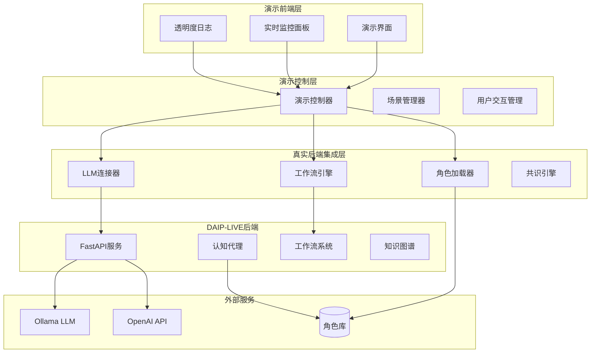

# 真实演示系统设计文档

## 设计概述

基于需求分析，设计一个真正调用大模型和角色库的演示系统，确保所有展示的功能都是真实的系统能力，而非模拟数据。

## 架构设计

### 整体架构



### 核心组件设计

#### 1. 真实演示控制器 (RealDemoController)

**职责**: 统一管理演示流程，确保所有调用都是真实的

**核心方法**:
```python
class RealDemoController:
    async def start_real_demo(self, scenario: DemoScenario) -> DemoSession
    async def execute_real_workflow(self, workflow_type: str, inputs: Dict) -> WorkflowResult
    async def call_real_llm(self, prompt: str, model: str) -> LLMResponse
    async def load_real_roles(self, role_ids: List[str]) -> List[CognitiveAgent]
    async def verify_authenticity(self) -> AuthenticityReport
```

#### 2. 真实LLM集成器 (RealLLMIntegrator)

**职责**: 管理与真实LLM服务的连接和调用

**核心功能**:
- 支持多种LLM后端（Ollama、OpenAI、Claude等）
- 实时显示调用过程和性能指标
- 处理连接错误和服务降级
- 记录所有调用的详细日志

```python
class RealLLMIntegrator:
    async def connect_to_llm_service(self, service_type: str) -> ConnectionStatus
    async def make_real_llm_call(self, prompt: str, params: Dict) -> LLMCallResult
    async def get_call_metrics(self) -> CallMetrics
    async def handle_llm_errors(self, error: Exception) -> ErrorHandlingResult
```

#### 3. 真实角色管理器 (RealRoleManager)

**职责**: 从真实角色库加载和管理AI角色

**核心功能**:
- 从roles/目录加载真实角色定义
- 基于角色JSON文件创建认知代理
- 展示角色的真实认知特征
- 管理角色间的交互

```python
class RealRoleManager:
    async def load_roles_from_filesystem(self, role_path: str) -> List[RoleDefinition]
    async def create_cognitive_agents(self, roles: List[RoleDefinition]) -> List[CognitiveAgent]
    async def demonstrate_role_uniqueness(self, agents: List[CognitiveAgent]) -> UniquenessReport
    async def execute_role_interaction(self, agents: List[CognitiveAgent], topic: str) -> InteractionResult
```

#### 4. 真实工作流执行器 (RealWorkflowExecutor)

**职责**: 执行真实的DAIP-LIVE工作流

**核心功能**:
- 调用真实的CriticalReviewWorkflow
- 执行真实的MultiPerspectiveWorkflow
- 运行真实的共识算法
- 检测真实的涌现洞察

```python
class RealWorkflowExecutor:
    async def execute_critical_review(self, topic: str, agents: List[CognitiveAgent]) -> ReviewResult
    async def execute_multi_perspective(self, topic: str, agents: List[CognitiveAgent]) -> SynthesisResult
    async def run_consensus_algorithm(self, inputs: List[ConsensusInput]) -> ConsensusResult
    async def detect_emergent_insights(self, session_data: SessionData) -> List[EmergentInsight]
```

#### 5. 透明度监控器 (TransparencyMonitor)

**职责**: 实时监控和展示所有系统调用的真实性

**核心功能**:
- 实时显示LLM调用状态
- 监控工作流执行过程
- 记录性能指标和错误
- 生成可验证的执行报告

```python
class TransparencyMonitor:
    async def monitor_llm_calls(self) -> LLMMonitoringData
    async def track_workflow_execution(self, workflow_id: str) -> WorkflowTrackingData
    async def record_performance_metrics(self, metrics: PerformanceMetrics) -> None
    async def generate_authenticity_report(self) -> AuthenticityReport
```

## 数据模型设计

### 演示会话模型

```python
@dataclass
class RealDemoSession:
    session_id: str
    scenario: DemoScenario
    participants: List[CognitiveAgent]
    llm_calls: List[LLMCallRecord]
    workflow_executions: List[WorkflowExecution]
    user_interactions: List[UserInteraction]
    authenticity_proofs: List[AuthenticityProof]
    start_time: datetime
    end_time: Optional[datetime] = None
```

### LLM调用记录模型

```python
@dataclass
class LLMCallRecord:
    call_id: str
    model_name: str
    prompt: str
    response: str
    input_tokens: int
    output_tokens: int
    response_time: float
    cost: float
    timestamp: datetime
    success: bool
    error_message: Optional[str] = None
```

### 角色真实性证明模型

```python
@dataclass
class RoleAuthenticityProof:
    role_id: str
    role_file_path: str
    file_hash: str
    loaded_attributes: Dict[str, Any]
    cognitive_profile: CognitiveProfile
    uniqueness_metrics: Dict[str, float]
    verification_timestamp: datetime
```

### 工作流执行记录模型

```python
@dataclass
class WorkflowExecutionRecord:
    execution_id: str
    workflow_type: str
    input_data: Dict[str, Any]
    execution_steps: List[ExecutionStep]
    output_data: Dict[str, Any]
    performance_metrics: PerformanceMetrics
    authenticity_proof: AuthenticityProof
    execution_time: float
    success: bool
```

## 用户界面设计

### 主演示界面

```
┌─────────────────────────────────────────────────────────────┐
│                🎭 DAIP-LIVE 真实演示系统                     │
├─────────────────────────────────────────────────────────────┤
│ 🔴 LIVE  📊 真实调用  ⚡ 实时监控  🔍 完全透明              │
├─────────────────────────────────────────────────────────────┤
│                                                             │
│  📋 演示场景选择:                                           │
│  ○ AI伦理决策分析 (15分钟)                                  │
│  ○ 产品策略评估 (20分钟)                                    │
│  ○ 技术风险评估 (25分钟)                                    │
│  ○ 自定义场景 (用户输入)                                    │
│                                                             │
│  🤖 LLM服务状态:                                           │
│  ✅ Ollama (localhost:11434) - 响应时间: 1.2s              │
│  ✅ 角色库 (127个角色已加载)                                │
│  ✅ 工作流引擎 (所有原语就绪)                               │
│                                                             │
│  👥 参与角色预览:                                           │
│  🧬 Dr. 理性分析师 (科学推理)                               │
│  🎨 创意直觉师 (直觉思维)                                   │
│  💼 实用策略师 (商业逻辑)                                   │
│  ⚖️ 伦理思辨师 (道德推理)                                   │
│                                                             │
│              [开始真实演示]  [系统检查]                      │
└─────────────────────────────────────────────────────────────┘
```

### 实时监控面板

```
┌─────────────────────────────────────────────────────────────┐
│                    🔍 实时透明度监控                         │
├─────────────────────────────────────────────────────────────┤
│                                                             │
│  📡 LLM调用监控:                                           │
│  ┌─────────────────────────────────────────────────────┐   │
│  │ [14:32:15] 调用 llama3:instruct                     │   │
│  │ 输入: 152 tokens | 输出: 287 tokens                │   │
│  │ 响应时间: 2.3s | 成本: $0.0023                     │   │
│  │ 状态: ✅ 成功                                       │   │
│  └─────────────────────────────────────────────────────┘   │
│                                                             │
│  🧠 角色活动监控:                                           │
│  • Dr. 理性分析师: 🤔 分析中... (置信度: 0.87)             │
│  • 创意直觉师: ✍️ 生成回应... (创新度: 0.92)               │
│  • 实用策略师: 📊 评估中... (可行性: 0.78)                 │
│  • 伦理思辨师: ⚖️ 思辨中... (道德性: 0.94)                │
│                                                             │
│  🔄 工作流执行:                                             │
│  ├─ ✅ 事实提取节点 (1.2s)                                 │
│  ├─ 🔄 证据聚合节点 (进行中...)                            │
│  ├─ ⏳ 共识计算节点 (等待中)                               │
│  └─ ⏳ 洞察检测节点 (等待中)                               │
│                                                             │
│  📊 性能指标:                                               │
│  CPU: 23% | 内存: 1.2GB | 网络: 45KB/s                    │
└─────────────────────────────────────────────────────────────┘
```

## 演示场景设计

### 场景1: AI伦理决策分析

**背景**: 某医院考虑使用AI辅助诊断系统，需要评估伦理风险

**用户输入**: "我们医院想引入AI诊断系统，但担心伦理问题"

**真实执行流程**:
1. 从roles/目录加载医疗伦理专家、AI技术专家、法律顾问、患者权益代表
2. 调用真实LLM为每个角色生成基于其认知框架的分析
3. 执行真实的批判性审查工作流
4. 运行真实的多视角综合工作流
5. 应用真实的共识算法
6. 检测真实的涌现洞察
7. 保存结果到真实的Wiki系统

## 智能上下文优化系统设计

### 多面嵌入上下文模型

基于多面嵌入技术的自动上下文优化系统，能够智能分析用户历史对话、当前任务和环境上下文，自动生成最优的LLM调用上下文。

#### 上下文经验编码

每个上下文经验E被编码为多面嵌入：

```
E = (E_pattern, E_goal, E_solution, E_context)
```

其中：
- `E_pattern`: 问题模式嵌入 - 识别用户问题的类型和特征
- `E_goal`: 目标嵌入 - 理解用户的意图和期望结果
- `E_solution`: 解决方案步骤嵌入 - 记录成功的处理方式和步骤
- `E_context`: 上下文嵌入 - 捕获环境信息和相关背景

#### 自动上下文优化流程

```python
@dataclass
class ContextOptimizationRequest:
    user_id: str
    current_query: str
    conversation_history: List[ConversationTurn]
    current_task: Optional[str]
    available_context: Dict[str, Any]
    optimization_strategy: str = "adaptive"

@dataclass
class OptimizedContext:
    optimized_prompt: str
    context_elements: List[ContextElement]
    relevance_scores: Dict[str, float]
    optimization_reasoning: str
    confidence_score: float
    original_context_size: int
    optimized_context_size: int
```

#### 上下文优化算法

1. **历史分析阶段**
   - 分析用户历史对话记录
   - 提取成功的交互模式
   - 识别用户偏好和专业领域

2. **任务理解阶段**
   - 解析当前任务类型和复杂度
   - 匹配相关的解决方案模板
   - 确定所需的角色和工作流

3. **上下文聚合阶段**
   - 收集可用的环境上下文信息
   - 评估上下文元素的相关性
   - 过滤冗余和无关信息

4. **智能优化阶段**
   - 基于多面嵌入计算相似度
   - 选择最相关的上下文元素
   - 生成优化后的提示模板

### 上下文优化引擎架构

```python
class ContextOptimizationEngine:
    def __init__(self):
        self.history_analyzer = ConversationHistoryAnalyzer()
        self.task_analyzer = TaskAnalyzer()
        self.context_aggregator = ContextAggregator()
        self.embedding_model = MultiAspectEmbeddingModel()
        self.optimization_strategies = {
            "adaptive": AdaptiveOptimizationStrategy(),
            "focused": FocusedOptimizationStrategy(),
            "comprehensive": ComprehensiveOptimizationStrategy()
        }
    
    async def optimize_context(
        self, 
        request: ContextOptimizationRequest
    ) -> OptimizedContext:
        # 分析历史对话
        history_insights = await self.history_analyzer.analyze(
            request.conversation_history
        )
        
        # 分析当前任务
        task_insights = await self.task_analyzer.analyze(
            request.current_query, 
            request.current_task
        )
        
        # 聚合可用上下文
        aggregated_context = await self.context_aggregator.aggregate(
            request.available_context,
            history_insights,
            task_insights
        )
        
        # 执行优化策略
        strategy = self.optimization_strategies[request.optimization_strategy]
        optimized_context = await strategy.optimize(
            aggregated_context,
            self.embedding_model
        )
        
        return optimized_context
```

### 上下文元素评分系统

```python
@dataclass
class ContextElement:
    element_id: str
    content: str
    element_type: str  # "history", "task", "environment", "role", "knowledge"
    relevance_score: float
    confidence_score: float
    source: str
    timestamp: datetime
    embedding: Optional[np.ndarray] = None

class ContextRelevanceScorer:
    def calculate_relevance(
        self,
        element: ContextElement,
        query_embedding: np.ndarray,
        history_pattern: np.ndarray,
        task_goal: np.ndarray
    ) -> float:
        # 多维度相似度计算
        query_similarity = cosine_similarity(element.embedding, query_embedding)
        pattern_similarity = cosine_similarity(element.embedding, history_pattern)
        goal_similarity = cosine_similarity(element.embedding, task_goal)
        
        # 加权综合评分
        relevance_score = (
            query_similarity * 0.4 +
            pattern_similarity * 0.3 +
            goal_similarity * 0.3
        )
        
        # 时间衰减因子
        time_decay = self._calculate_time_decay(element.timestamp)
        
        return relevance_score * time_decay
```

### 优化策略设计

#### 自适应优化策略
- 根据用户历史行为动态调整优化参数
- 平衡上下文的完整性和相关性
- 适用于大多数常规对话场景

#### 聚焦优化策略
- 专注于当前任务最相关的上下文
- 最大化上下文的精准度
- 适用于专业技术问题和复杂分析

#### 综合优化策略
- 保留更多的背景信息和历史上下文
- 支持复杂的多轮对话和深度分析
- 适用于长期项目和复杂决策场景

基于经验集合的层次化知识结构，每个上下文片段被编码为多面嵌入：

```python
@dataclass
class ContextEmbedding:
    problem_pattern: np.ndarray  # 问题模式嵌入
    goal_embedding: np.ndarray   # 目标嵌入  
    solution_steps: np.ndarray   # 解决方案步骤嵌入
    context_embedding: np.ndarray # 上下文嵌入（可选）
    
    def similarity(self, other: 'ContextEmbedding') -> float:
        """计算多维相似度"""
        pattern_sim = cosine_similarity(self.problem_pattern, other.problem_pattern)
        goal_sim = cosine_similarity(self.goal_embedding, other.goal_embedding)
        solution_sim = cosine_similarity(self.solution_steps, other.solution_steps)
        context_sim = cosine_similarity(self.context_embedding, other.context_embedding)
        
        return (pattern_sim * 0.3 + goal_sim * 0.3 + 
                solution_sim * 0.25 + context_sim * 0.15)
```

### 上下文优化架构

```
┌─────────────────────────────────────────────────────────────┐
│                   智能上下文优化器                           │
├─────────────────────────────────────────────────────────────┤
│                                                             │
│  📚 历史对话分析器                                          │
│  ├─ 对话历史提取                                            │
│  ├─ 主题识别与聚类                                          │
│  ├─ 用户意图演化追踪                                        │
│  └─ 关键信息提取                                            │
│                                                             │
│  🎯 当前任务分析器                                          │
│  ├─ 任务类型识别                                            │
│  ├─ 复杂度评估                                              │
│  ├─ 所需角色分析                                            │
│  └─ 预期输出格式                                            │
│                                                             │
│  🧠 多面嵌入处理器                                          │
│  ├─ 问题模式嵌入生成                                        │
│  ├─ 目标嵌入计算                                            │
│  ├─ 解决方案步骤嵌入                                        │
│  └─ 上下文嵌入优化                                          │
│                                                             │
│  ⚡ 上下文合成器                                            │
│  ├─ 相关历史筛选                                            │
│  ├─ 上下文权重计算                                          │
│  ├─ 信息密度优化                                            │
│  └─ 最终上下文生成                                          │
│                                                             │
└─────────────────────────────────────────────────────────────┘
```

### 上下文优化流程

```python
class ContextOptimizer:
    def optimize_context(self, 
                        user_history: List[Conversation],
                        current_task: Task,
                        available_context: Dict[str, Any]) -> OptimizedContext:
        
        # 1. 分析历史对话模式
        history_patterns = self.analyze_conversation_history(user_history)
        
        # 2. 提取当前任务特征
        task_features = self.extract_task_features(current_task)
        
        # 3. 生成多面嵌入
        embeddings = self.generate_multifaceted_embeddings(
            history_patterns, task_features, available_context
        )
        
        # 4. 计算上下文相关性
        relevance_scores = self.calculate_context_relevance(embeddings)
        
        # 5. 合成优化上下文
        optimized_context = self.synthesize_context(
            relevance_scores, available_context
        )
        
        return optimized_context
```

### 场景2: 产品策略评估

**背景**: 科技公司需要决定是否进入新的市场领域

**用户输入**: "我们公司考虑进入AR/VR市场，请帮助分析"

**真实执行流程**:
1. 加载市场分析师、技术专家、财务顾问、用户体验专家角色
2. 真实LLM调用生成各角色的专业分析
3. 执行真实的风险评估工作流
4. 运行真实的机会分析工作流
5. 应用真实的决策支持算法
6. 生成真实的策略建议报告

### 场景3: 技术风险评估

**背景**: 企业需要评估采用新技术的风险和收益

**用户输入**: "我们考虑全面采用云原生架构，请评估风险"

**真实执行流程**:
1. 加载系统架构师、安全专家、运维专家、业务分析师角色
2. 真实LLM调用分析技术风险和机遇
3. 执行真实的风险量化工作流
4. 运行真实的成本效益分析工作流
5. 应用真实的风险缓解策略算法
6. 生成真实的技术决策报告

## 技术实现细节

### LLM集成实现

```python
class RealLLMIntegrator:
    def __init__(self):
        self.ollama_client = OllamaClient()
        self.openai_client = OpenAIClient()
        self.call_history = []
        self.performance_metrics = PerformanceMetrics()
    
    async def make_authenticated_call(self, prompt: str, model: str) -> LLMResponse:
        """确保LLM调用的真实性和可追溯性"""
        call_id = str(uuid.uuid4())
        start_time = time.time()
        
        try:
            # 记录调用开始
            self.log_call_start(call_id, prompt, model)
            
            # 执行真实调用
            if model.startswith('llama'):
                response = await self.ollama_client.generate(model, prompt)
            elif model.startswith('gpt'):
                response = await self.openai_client.chat_completion(model, prompt)
            else:
                raise UnsupportedModelError(f"Model {model} not supported")
            
            # 记录调用结果
            end_time = time.time()
            call_record = LLMCallRecord(
                call_id=call_id,
                model_name=model,
                prompt=prompt,
                response=response.content,
                input_tokens=response.input_tokens,
                output_tokens=response.output_tokens,
                response_time=end_time - start_time,
                cost=self.calculate_cost(response),
                timestamp=datetime.now(),
                success=True
            )
            
            self.call_history.append(call_record)
            return response
            
        except Exception as e:
            # 记录错误
            error_record = LLMCallRecord(
                call_id=call_id,
                model_name=model,
                prompt=prompt,
                response="",
                input_tokens=0,
                output_tokens=0,
                response_time=time.time() - start_time,
                cost=0.0,
                timestamp=datetime.now(),
                success=False,
                error_message=str(e)
            )
            
            self.call_history.append(error_record)
            raise
```

### 角色真实性验证

```python
class RoleAuthenticityVerifier:
    async def verify_role_authenticity(self, role_path: str) -> RoleAuthenticityProof:
        """验证角色的真实性和完整性"""
        
        # 读取角色文件
        with open(role_path, 'r', encoding='utf-8') as f:
            role_data = json.load(f)
        
        # 计算文件哈希
        file_hash = self.calculate_file_hash(role_path)
        
        # 验证必需字段
        required_fields = ['name', 'description', 'expertise', 'reasoning_style', 'values']
        missing_fields = [field for field in required_fields if field not in role_data]
        
        if missing_fields:
            raise RoleValidationError(f"Missing required fields: {missing_fields}")
        
        # 创建认知档案
        cognitive_profile = CognitiveProfile.from_dict(role_data)
        
        # 计算唯一性指标
        uniqueness_metrics = self.calculate_uniqueness_metrics(cognitive_profile)
        
        return RoleAuthenticityProof(
            role_id=role_data['name'],
            role_file_path=role_path,
            file_hash=file_hash,
            loaded_attributes=role_data,
            cognitive_profile=cognitive_profile,
            uniqueness_metrics=uniqueness_metrics,
            verification_timestamp=datetime.now()
        )
```

### 工作流真实性保证

```python
class AuthenticWorkflowExecutor:
    async def execute_with_proof(self, workflow_type: str, inputs: Dict) -> WorkflowExecutionRecord:
        """执行工作流并生成真实性证明"""
        
        execution_id = str(uuid.uuid4())
        start_time = time.time()
        
        # 记录执行开始
        execution_steps = []
        
        try:
            if workflow_type == "critical_review":
                workflow = CriticalReviewWorkflow()
                result = await workflow.execute(inputs)
                
                # 记录每个步骤
                for step in workflow.execution_steps:
                    execution_steps.append(ExecutionStep(
                        step_name=step.name,
                        input_data=step.input_data,
                        output_data=step.output_data,
                        execution_time=step.execution_time,
                        success=step.success
                    ))
            
            elif workflow_type == "multi_perspective":
                workflow = MultiPerspectiveWorkflow()
                result = await workflow.execute(inputs)
                
                # 记录执行步骤
                for step in workflow.execution_steps:
                    execution_steps.append(ExecutionStep(
                        step_name=step.name,
                        input_data=step.input_data,
                        output_data=step.output_data,
                        execution_time=step.execution_time,
                        success=step.success
                    ))
            
            else:
                raise UnsupportedWorkflowError(f"Workflow {workflow_type} not supported")
            
            # 生成真实性证明
            authenticity_proof = AuthenticityProof(
                proof_type="workflow_execution",
                proof_data={
                    "workflow_class": workflow.__class__.__name__,
                    "execution_hash": self.calculate_execution_hash(execution_steps),
                    "timestamp": datetime.now().isoformat(),
                    "verification_signature": self.generate_verification_signature(execution_steps)
                }
            )
            
            return WorkflowExecutionRecord(
                execution_id=execution_id,
                workflow_type=workflow_type,
                input_data=inputs,
                execution_steps=execution_steps,
                output_data=result,
                performance_metrics=self.calculate_performance_metrics(execution_steps),
                authenticity_proof=authenticity_proof,
                execution_time=time.time() - start_time,
                success=True
            )
            
        except Exception as e:
            return WorkflowExecutionRecord(
                execution_id=execution_id,
                workflow_type=workflow_type,
                input_data=inputs,
                execution_steps=execution_steps,
                output_data={},
                performance_metrics=PerformanceMetrics(),
                authenticity_proof=AuthenticityProof(proof_type="error", proof_data={"error": str(e)}),
                execution_time=time.time() - start_time,
                success=False
            )
```

## 质量保证

### 真实性验证机制

1. **LLM调用验证**: 每次调用都记录完整的请求和响应
2. **角色文件验证**: 计算文件哈希确保角色定义未被篡改
3. **工作流执行验证**: 记录每个执行步骤的详细信息
4. **结果可重现性**: 提供足够信息以重现演示结果

### 错误处理策略

1. **LLM服务不可用**: 显示真实错误信息，提供备用方案
2. **角色加载失败**: 显示具体错误原因，提供修复建议
3. **工作流执行错误**: 记录错误详情，展示系统恢复过程
4. **网络连接问题**: 实时显示连接状态，提供离线模式

### 性能监控

1. **响应时间监控**: 实时显示每个组件的响应时间
2. **资源使用监控**: 监控CPU、内存、网络使用情况
3. **错误率统计**: 统计和显示各类错误的发生率
4. **用户体验指标**: 测量和优化用户交互体验

## 部署和配置

### 环境要求

- Python 3.10+
- 至少8GB内存
- 稳定的网络连接
- Ollama服务（用于本地LLM）
- 完整的DAIP-LIVE后端环境

### 配置文件

```yaml
# real_demo_config.yaml
demo:
  name: "DAIP-LIVE真实演示系统"
  version: "1.0.0"
  
llm_services:
  primary: "ollama"
  fallback: "openai"
  
  ollama:
    host: "http://localhost:11434"
    models: ["llama3:instruct", "llama3:70b"]
    timeout: 30
  
  openai:
    api_key: "${OPENAI_API_KEY}"
    models: ["gpt-4", "gpt-3.5-turbo"]
    timeout: 30

roles:
  directory: "./roles"
  required_roles: ["scientist", "artist", "consultant", "philosopher"]
  validation: true

workflows:
  critical_review: true
  multi_perspective: true
  consensus_algorithms: ["weighted_vote", "bayesian_consensus"]

monitoring:
  real_time: true
  detailed_logging: true
  performance_tracking: true
  authenticity_verification: true

demo_scenarios:
  - name: "AI伦理决策分析"
    duration: 15
    complexity: "medium"
  - name: "产品策略评估"
    duration: 20
    complexity: "high"
  - name: "技术风险评估"
    duration: 25
    complexity: "high"
```

### 启动脚本

```bash
#!/bin/bash
# start_real_demo.sh

echo "🚀 启动DAIP-LIVE真实演示系统..."

# 检查环境
python -c "import sys; print(f'Python版本: {sys.version}')"

# 检查依赖
echo "📦 检查依赖..."
pip install -r requirements.txt

# 启动Ollama服务
echo "🤖 启动Ollama服务..."
ollama serve &

# 等待服务就绪
sleep 5

# 拉取必需模型
echo "📥 拉取LLM模型..."
ollama pull llama3:instruct

# 验证角色库
echo "👥 验证角色库..."
python -c "from src.real_demo.role_verifier import verify_all_roles; verify_all_roles()"

# 启动演示系统
echo "🎭 启动演示系统..."
python src/real_demo/main.py

echo "✅ 演示系统已启动！"
echo "📍 访问地址: http://localhost:8080"
```