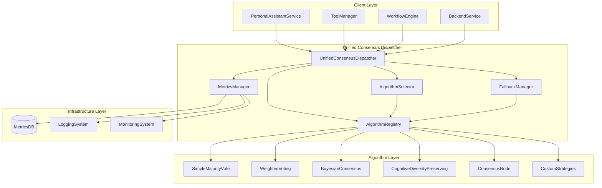

# Design Document

## Overview

统一共识调度器（Unified Consensus Dispatcher）是一个中央化的共识算法管理和调度系统，旨在解决当前系统中分散的共识实现、调用关系混乱和重复代码的问题。该系统将提供统一的接口、智能的算法选择、优雅的降级机制和完整的监控能力。

## Architecture

### 核心架构原则

1. **单一入口点**：所有共识计算都通过统一调度器进行
2. **算法抽象**：统一的算法接口，支持动态注册和发现
3. **智能调度**：基于输入特征和上下文自动选择最优算法
4. **优雅降级**：算法失败时自动切换到备选方案
5. **可观测性**：完整的监控、日志和性能分析

### 系统架构图



## Components and Interfaces

### 1. UnifiedConsensusDispatcher (核心调度器)

**职责**：
- 提供统一的共识计算入口
- 协调算法选择和执行
- 管理降级策略
- 收集和报告指标

**接口**：
```python
class UnifiedConsensusDispatcher:
    async def calculate_consensus(
        self,
        request: ConsensusRequest
    ) -> ConsensusResponse
    
    def register_algorithm(
        self,
        algorithm_id: str,
        algorithm: ConsensusAlgorithm
    ) -> bool
    
    def get_available_algorithms(self) -> List[AlgorithmInfo]
    
    def get_metrics(self) -> DispatcherMetrics
```

### 2. AlgorithmRegistry (算法注册表)

**职责**：
- 管理所有可用的共识算法
- 提供算法发现和验证
- 支持动态注册和注销

**接口**：
```python
class AlgorithmRegistry:
    def register(
        self,
        algorithm_id: str,
        algorithm: ConsensusAlgorithm,
        metadata: AlgorithmMetadata
    ) -> bool
    
    def get_algorithm(self, algorithm_id: str) -> Optional[ConsensusAlgorithm]
    
    def list_algorithms(self) -> List[AlgorithmInfo]
    
    def validate_algorithm(self, algorithm: ConsensusAlgorithm) -> ValidationResult
```

### 3. AlgorithmSelector (算法选择器)

**职责**：
- 基于输入特征选择最优算法
- 考虑性能、准确性和可用性
- 支持用户偏好和策略配置

**接口**：
```python
class AlgorithmSelector:
    def select_algorithm(
        self,
        request: ConsensusRequest,
        available_algorithms: List[str]
    ) -> AlgorithmSelection
    
    def update_selection_strategy(
        self,
        strategy: SelectionStrategy
    ) -> bool
    
    def get_selection_reasoning(
        self,
        selection: AlgorithmSelection
    ) -> str
```

### 4. FallbackManager (降级管理器)

**职责**：
- 管理算法失败时的降级策略
- 提供多级降级方案
- 记录降级事件和原因

**接口**：
```python
class FallbackManager:
    def get_fallback_chain(
        self,
        failed_algorithm: str,
        request: ConsensusRequest
    ) -> List[str]
    
    def execute_fallback(
        self,
        fallback_algorithm: str,
        request: ConsensusRequest,
        failure_context: FailureContext
    ) -> ConsensusResponse
    
    def update_fallback_strategy(
        self,
        strategy: FallbackStrategy
    ) -> bool
```

### 5. ConsensusAlgorithm (统一算法接口)

**职责**：
- 定义所有共识算法的统一接口
- 确保输入输出格式一致性
- 支持算法元数据和配置

**接口**：
```python
class ConsensusAlgorithm(ABC):
    @abstractmethod
    async def calculate(
        self,
        inputs: List[ConsensusInput],
        context: ConsensusContext
    ) -> ConsensusResult
    
    @abstractmethod
    def get_metadata(self) -> AlgorithmMetadata
    
    @abstractmethod
    def validate_inputs(
        self,
        inputs: List[ConsensusInput]
    ) -> ValidationResult
    
    def get_configuration(self) -> Dict[str, Any]
    
    def set_configuration(self, config: Dict[str, Any]) -> bool
```

## Data Models

### 核心数据模型

```python
@dataclass
class ConsensusRequest:
    """统一的共识计算请求"""
    inputs: List[ConsensusInput]
    algorithm_preference: Optional[str] = None
    context: Optional[Dict[str, Any]] = None
    session_id: Optional[str] = None
    timeout: float = 30.0
    quality_requirements: Optional[QualityRequirements] = None

@dataclass
class ConsensusInput:
    """标准化的共识输入"""
    agent_id: str
    position: Union[str, float, Dict[str, Any]]
    confidence: float
    reasoning: Optional[str] = None
    evidence: Optional[List[str]] = None
    metadata: Optional[Dict[str, Any]] = None
    timestamp: datetime

@dataclass
class ConsensusResponse:
    """统一的共识计算响应"""
    success: bool
    consensus_value: Any
    confidence: float
    algorithm_used: str
    participants: List[str]
    execution_time: float
    metadata: Dict[str, Any]
    error: Optional[str] = None
    fallback_used: bool = False

@dataclass
class AlgorithmMetadata:
    """算法元数据"""
    name: str
    version: str
    description: str
    input_types: List[str]
    output_types: List[str]
    complexity: str  # "low", "medium", "high"
    accuracy: float  # 0.0 - 1.0
    performance: str  # "fast", "medium", "slow"
    requirements: List[str]
```

### 选择策略模型

```python
@dataclass
class SelectionCriteria:
    """算法选择标准"""
    input_count: int
    input_complexity: str
    has_confidence: bool
    has_reasoning: bool
    has_evidence: bool
    domain: Optional[str] = None
    quality_priority: str = "balanced"  # "speed", "accuracy", "balanced"

@dataclass
class AlgorithmSelection:
    """算法选择结果"""
    algorithm_id: str
    confidence: float
    reasoning: str
    alternatives: List[str]
    selection_time: float
```

## Error Handling

### 错误分类和处理策略

1. **输入验证错误**
   - 空输入列表
   - 格式不正确的输入
   - 缺少必需字段
   - **处理**：立即返回错误，不进行降级

2. **算法执行错误**
   - 算法内部异常
   - 超时错误
   - 资源不足
   - **处理**：触发降级机制，尝试备选算法

3. **系统级错误**
   - 注册表不可用
   - 网络连接问题
   - 配置错误
   - **处理**：使用本地缓存和最简单的算法

### 降级策略

```python
class FallbackStrategy:
    """降级策略配置"""
    
    # 算法优先级链
    ALGORITHM_PRIORITY_CHAINS = {
        "high_accuracy": [
            "bayesian_consensus",
            "cognitive_diversity_preserving", 
            "weighted_voting",
            "simple_majority",
            "local_simple"
        ],
        "high_performance": [
            "simple_majority",
            "weighted_voting",
            "local_simple"
        ],
        "balanced": [
            "weighted_voting",
            "simple_majority",
            "bayesian_consensus",
            "local_simple"
        ]
    }
    
    # 失败阈值配置
    MAX_RETRIES = 3
    TIMEOUT_ESCALATION = [10, 20, 30]  # 秒
    FALLBACK_CONFIDENCE_PENALTY = 0.1  # 每次降级减少的置信度
```

## Testing Strategy

### 测试层次

1. **单元测试**
   - 每个算法的独立测试
   - 调度器核心逻辑测试
   - 数据模型验证测试

2. **集成测试**
   - 算法注册和发现测试
   - 端到端共识计算测试
   - 降级机制测试

3. **性能测试**
   - 算法选择性能测试
   - 并发处理能力测试
   - 内存和CPU使用测试

4. **兼容性测试**
   - 现有客户端集成测试
   - 数据格式兼容性测试
   - 版本升级测试

### 测试数据策略

```python
class TestDataGenerator:
    """测试数据生成器"""
    
    @staticmethod
    def generate_simple_inputs(count: int) -> List[ConsensusInput]:
        """生成简单的测试输入"""
        pass
    
    @staticmethod
    def generate_complex_inputs(count: int) -> List[ConsensusInput]:
        """生成复杂的测试输入"""
        pass
    
    @staticmethod
    def generate_edge_case_inputs() -> List[List[ConsensusInput]]:
        """生成边界情况测试数据"""
        pass
```

## Migration Strategy

### 现有系统迁移计划

#### 阶段1：基础设施建设
1. 创建统一调度器核心框架
2. 实现算法注册表和基础接口
3. 创建数据模型和验证逻辑

#### 阶段2：算法适配
1. 将现有算法适配到统一接口
   - `SimpleMajorityVoteStrategy` → `SimpleMajorityAlgorithm`
   - `WeightedVotingConsensus` → `WeightedVotingAlgorithm`
   - `BayesianConsensus` → `BayesianAlgorithm`
   - `ConsensusNode` → `WorkflowConsensusAlgorithm`

2. 实现算法包装器确保向后兼容

#### 阶段3：客户端迁移
1. 更新`PersonalAssistantService`使用统一调度器
2. 更新`ToolManager`的共识工具
3. 更新工作流引擎的共识节点
4. 更新后端服务的共识端点

#### 阶段4：清理和优化
1. 移除冗余的共识实现
2. 优化性能和内存使用
3. 完善监控和日志
4. 更新文档和测试

### 兼容性保证

```python
class LegacyCompatibilityLayer:
    """遗留系统兼容层"""
    
    def __init__(self, dispatcher: UnifiedConsensusDispatcher):
        self.dispatcher = dispatcher
    
    # 为PersonalAssistantService提供的兼容接口
    async def calculate_consensus_legacy(
        self,
        inputs: List[Dict[str, Any]]
    ) -> str:
        """兼容PersonalAssistantService的原始接口"""
        pass
    
    # 为ToolManager提供的兼容接口
    async def execute_consensus_tool(
        self,
        tool_name: str,
        parameters: Dict[str, Any]
    ) -> Dict[str, Any]:
        """兼容ToolManager的工具接口"""
        pass
```

## Performance Considerations

### 性能优化策略

1. **算法选择优化**
   - 缓存选择决策
   - 预计算算法适用性
   - 使用机器学习优化选择策略

2. **执行优化**
   - 异步并行处理
   - 结果缓存机制
   - 资源池管理

3. **内存优化**
   - 流式处理大数据集
   - 智能垃圾回收
   - 内存使用监控

### 性能指标

```python
@dataclass
class PerformanceMetrics:
    """性能指标"""
    algorithm_selection_time: float
    consensus_calculation_time: float
    total_processing_time: float
    memory_usage: int
    cpu_usage: float
    cache_hit_rate: float
    fallback_rate: float
    error_rate: float
```

## Security Considerations

### 安全措施

1. **输入验证**
   - 严格的输入格式验证
   - 防止注入攻击
   - 输入大小限制

2. **算法安全**
   - 算法签名验证
   - 沙箱执行环境
   - 资源使用限制

3. **数据保护**
   - 敏感数据脱敏
   - 传输加密
   - 访问控制

4. **审计和监控**
   - 完整的操作日志
   - 异常行为检测
   - 安全事件报告

## Monitoring and Observability

### 监控指标

1. **业务指标**
   - 共识计算成功率
   - 平均置信度
   - 算法使用分布

2. **技术指标**
   - 响应时间分布
   - 错误率和类型
   - 资源使用情况

3. **运营指标**
   - 降级事件频率
   - 算法性能对比
   - 用户满意度

### 监控实现

```python
class ConsensusMetricsCollector:
    """共识指标收集器"""
    
    def record_consensus_request(self, request: ConsensusRequest):
        """记录共识请求"""
        pass
    
    def record_algorithm_execution(
        self,
        algorithm_id: str,
        execution_time: float,
        success: bool
    ):
        """记录算法执行"""
        pass
    
    def record_fallback_event(
        self,
        original_algorithm: str,
        fallback_algorithm: str,
        reason: str
    ):
        """记录降级事件"""
        pass
    
    def generate_report(self, time_range: TimeRange) -> MetricsReport:
        """生成指标报告"""
        pass
```

## Configuration Management

### 配置结构

```yaml
# consensus_dispatcher_config.yaml
unified_consensus_dispatcher:
  # 核心配置
  core:
    default_timeout: 30.0
    max_concurrent_requests: 100
    enable_caching: true
    cache_ttl: 300
  
  # 算法配置
  algorithms:
    simple_majority:
      enabled: true
      priority: 4
      timeout: 5.0
    
    weighted_voting:
      enabled: true
      priority: 2
      timeout: 10.0
      config:
        expertise_weight: 0.3
        confidence_weight: 0.4
        diversity_weight: 0.3
    
    bayesian_consensus:
      enabled: true
      priority: 1
      timeout: 15.0
      config:
        prior_strength: 1.0
  
  # 选择策略配置
  selection:
    strategy: "adaptive"  # "fixed", "adaptive", "ml_based"
    quality_priority: "balanced"  # "speed", "accuracy", "balanced"
    
    # 自适应选择规则
    adaptive_rules:
      - condition: "input_count >= 10 and has_reasoning"
        algorithm: "bayesian_consensus"
      - condition: "input_count >= 5 and has_confidence"
        algorithm: "weighted_voting"
      - condition: "input_count >= 3"
        algorithm: "simple_majority"
      - condition: "true"  # 默认
        algorithm: "local_simple"
  
  # 降级配置
  fallback:
    strategy: "balanced"
    max_retries: 3
    confidence_penalty: 0.1
    
    chains:
      high_accuracy: ["bayesian_consensus", "weighted_voting", "simple_majority"]
      high_performance: ["simple_majority", "weighted_voting"]
      balanced: ["weighted_voting", "simple_majority", "bayesian_consensus"]
  
  # 监控配置
  monitoring:
    enabled: true
    metrics_retention_days: 30
    alert_thresholds:
      error_rate: 0.05
      fallback_rate: 0.20
      avg_response_time: 5.0
```

这个设计文档提供了一个完整的、可实施的统一共识调度器架构，解决了当前系统中的所有问题，并为未来的扩展和优化奠定了基础。