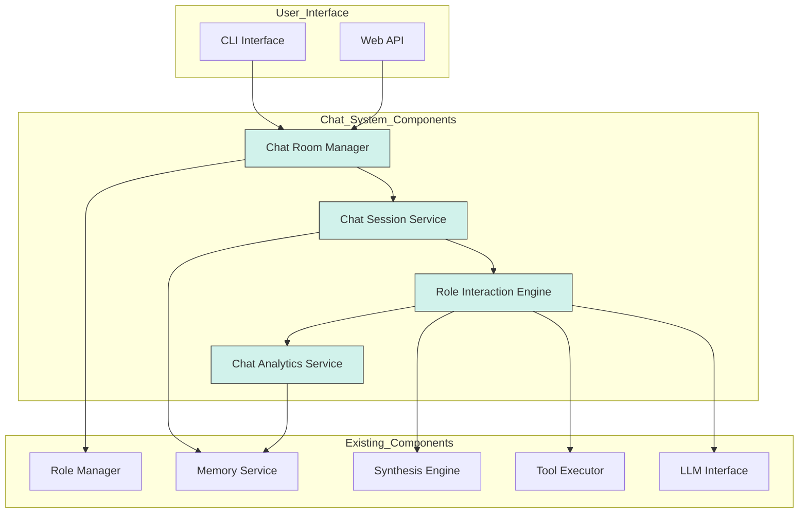

# Design Document: Virtual Role Chat System

## Overview

The Virtual Role Chat System is designed to enable users to create and manage dynamic chat environments with multiple AI roles. This feature builds upon the existing DAIP-LIVE architecture, leveraging its core capabilities for role management, interaction handling, and consensus building while extending them to support more flexible and interactive chat scenarios.

The system will showcase the project's technical strengths in hallucination suppression through social engineering, multi-role collaboration, and intelligent consensus building, while providing an intuitive interface for users to organize and interact with virtual roles.

## Architecture

The Virtual Role Chat System will be implemented as an extension of the existing architecture, with new components that integrate with the current system layers:



## Components and Interfaces

### 1. Chat Room Manager

**Purpose**: Manages the creation, configuration, and lifecycle of chat rooms.

**Key Interfaces**:
- `create_chat_room(config: ChatRoomConfig) -> ChatRoomID`
- `get_chat_room(room_id: ChatRoomID) -> ChatRoom`
- `update_chat_room(room_id: ChatRoomID, config: ChatRoomConfig) -> bool`
- `delete_chat_room(room_id: ChatRoomID) -> bool`
- `list_chat_rooms() -> List[ChatRoomSummary]`

**Data Models**:
```python
class ChatRoomConfig(BaseModel):
    name: str
    description: str = ""
    topic: str
    roles: List[str]  # Role IDs
    mode: Literal["free_form", "structured", "debate"] = "free_form"
    interaction_rules: Dict[str, Any] = {}  # Mode-specific configuration
    
class ChatRoom(BaseModel):
    id: str
    config: ChatRoomConfig
    created_at: datetime
    updated_at: datetime
    status: Literal["active", "paused", "archived"] = "active"
    
class ChatRoomSummary(BaseModel):
    id: str
    name: str
    topic: str
    role_count: int
    message_count: int
    status: str
    last_active: datetime
```

### 2. Chat Session Service

**Purpose**: Manages active chat sessions, including message history, turn-taking, and persistence.

**Key Interfaces**:
- `start_session(room_id: ChatRoomID) -> SessionID`
- `end_session(session_id: SessionID) -> bool`
- `pause_session(session_id: SessionID) -> bool`
- `resume_session(session_id: SessionID) -> bool`
- `add_message(session_id: SessionID, message: ChatMessage) -> bool`
- `get_messages(session_id: SessionID, limit: int = 50, offset: int = 0) -> List[ChatMessage]`
- `get_session_summary(session_id: SessionID) -> SessionSummary`
- `export_session(session_id: SessionID, format: Literal["json", "markdown", "pdf"]) -> bytes`

**Data Models**:
```python
class ChatMessage(BaseModel):
    id: str
    session_id: str
    sender_id: str  # Role ID or user ID
    sender_type: Literal["role", "user", "system"]
    content: str
    timestamp: datetime
    metadata: Dict[str, Any] = {}
    
class SessionSummary(BaseModel):
    id: str
    room_id: str
    start_time: datetime
    end_time: Optional[datetime]
    message_count: int
    participant_roles: List[str]
    topic: str
    key_points: List[str] = []
```

### 3. Role Interaction Engine

**Purpose**: Orchestrates intelligent interactions between roles, manages turn-taking, and applies hallucination suppression techniques.

**Key Interfaces**:
- `process_user_input(session_id: SessionID, user_input: str) -> None`
- `generate_role_response(session_id: SessionID, role_id: str) -> ChatMessage`
- `get_next_role(session_id: SessionID) -> str`
- `validate_statement(session_id: SessionID, statement: str) -> ValidationResult`
- `resolve_conflict(session_id: SessionID, conflicting_statements: List[str]) -> ResolutionResult`
- `suggest_topic_refocus(session_id: SessionID) -> str`

**Data Models**:
```python
class ValidationResult(BaseModel):
    is_valid: bool
    confidence: float
    reasoning: str
    suggested_correction: Optional[str] = None
    
class ResolutionResult(BaseModel):
    resolved_statement: str
    confidence: float
    reasoning: str
    supporting_facts: List[str] = []
```

### 4. Chat Analytics Service

**Purpose**: Provides real-time analytics and insights about chat sessions, role performance, and conversation quality.

**Key Interfaces**:
- `get_session_metrics(session_id: SessionID) -> SessionMetrics`
- `get_role_performance(session_id: SessionID, role_id: str) -> RolePerformance`
- `get_conversation_quality(session_id: SessionID) -> QualityMetrics`
- `detect_quality_issues(session_id: SessionID) -> List[QualityIssue]`
- `generate_analytics_report(session_id: SessionID) -> AnalyticsReport`

**Data Models**:
```python
class SessionMetrics(BaseModel):
    message_count: int
    average_response_time: float
    topic_coherence: float
    engagement_distribution: Dict[str, float]  # Role ID to engagement percentage
    
class RolePerformance(BaseModel):
    role_id: str
    message_count: int
    average_response_length: int
    topic_relevance: float
    influence_score: float
    
class QualityMetrics(BaseModel):
    coherence_score: float
    diversity_score: float
    depth_score: float
    factual_accuracy: float
    
class QualityIssue(BaseModel):
    issue_type: str
    severity: float
    description: str
    affected_messages: List[str]
    suggested_action: str
```

## Data Models

### Core Data Models

```python
class ChatRoomConfig(BaseModel):
    name: str
    description: str = ""
    topic: str
    roles: List[str]  # Role IDs
    mode: Literal["free_form", "structured", "debate"] = "free_form"
    interaction_rules: Dict[str, Any] = {}  # Mode-specific configuration

class ChatRoom(BaseModel):
    id: str
    config: ChatRoomConfig
    created_at: datetime
    updated_at: datetime
    status: Literal["active", "paused", "archived"] = "active"

class ChatSession(BaseModel):
    id: str
    room_id: str
    start_time: datetime
    end_time: Optional[datetime] = None
    status: Literal["active", "paused", "completed"] = "active"
    messages: List[ChatMessage] = []
    metadata: Dict[str, Any] = {}

class ChatMessage(BaseModel):
    id: str
    session_id: str
    sender_id: str  # Role ID or user ID
    sender_type: Literal["role", "user", "system"]
    content: str
    timestamp: datetime
    metadata: Dict[str, Any] = {}
```

## Error Handling

The system will implement comprehensive error handling to ensure robustness:

1. **Input Validation**: All user inputs will be validated against defined schemas before processing.
2. **LLM Failures**: The system will gracefully handle LLM failures by implementing retry mechanisms and fallback responses.
3. **Persistence Errors**: Data persistence errors will be handled with appropriate logging and user notifications.
4. **Role Availability**: The system will check role availability before starting sessions and provide clear error messages if roles are unavailable.
5. **Session Management**: Session state inconsistencies will be detected and resolved automatically when possible.

## Testing Strategy

The testing strategy for the Virtual Role Chat System will include:

1. **Unit Tests**:
   - Test individual components (ChatRoomManager, ChatSessionService, etc.)
   - Validate data models and their constraints
   - Test error handling mechanisms

2. **Integration Tests**:
   - Test interactions between new components and existing system services
   - Validate end-to-end flows for chat room creation and session management
   - Test persistence and retrieval of chat data

3. **System Tests**:
   - Test the complete chat system with multiple roles and users
   - Validate performance under load with multiple concurrent sessions
   - Test edge cases like very long conversations and complex role interactions

4. **Interactive Testing Framework**:
   - Implement automated scenarios that demonstrate specific capabilities
   - Create visualization tools for internal processes during testing
   - Develop performance benchmarks for key metrics

## Implementation Considerations

### Hallucination Suppression

The system will implement several techniques for hallucination suppression:

1. **Cross-Role Validation**: Statements from one role can be challenged by other roles with different expertise.
2. **Fact Extraction and Verification**: The system will extract factual claims and verify them using the existing FactExtractionService and FactValidationService.
3. **Confidence Scoring**: Roles will provide confidence scores for their statements, allowing the system to flag low-confidence information.
4. **Semantic Structured Knowledge Graph (SSKG)**: The system will leverage the SSKG to validate factual consistency across the conversation.

### Turn-Taking Algorithms

The system will implement intelligent turn-taking algorithms that consider:

1. **Role Expertise**: Roles with higher expertise in the current topic will be given priority.
2. **Conversation Flow**: The system will analyze the conversation to determine which role should respond next based on context.
3. **User Directives**: Users can explicitly direct questions to specific roles.
4. **Balanced Participation**: The system will ensure all roles have opportunities to contribute.

### Multi-modal Support

The system will support multiple interaction modalities:

1. **Text Input/Output**: The primary mode of interaction.
2. **Document Processing**: Ability to upload and analyze documents within the chat.
3. **Rich Formatting**: Support for tables, diagrams, and structured data in responses.
4. **Accessibility Features**: Screen reader support and keyboard navigation.

## Integration with Existing Components

The Virtual Role Chat System will integrate with existing components:

1. **RoleManager**: Used to load and manage role definitions.
2. **MemoryService**: Used to maintain conversation history and role memory.
3. **SynthesisEngine**: Used to generate summaries and consensus opinions.
4. **ToolExecutor**: Used to execute tools and consensus strategies.
5. **LLMInterface**: Used to generate role responses.

## Performance Considerations

To ensure optimal performance, the system will:

1. **Implement Caching**: Cache frequently accessed data like role definitions and recent messages.
2. **Use Asynchronous Processing**: Process non-blocking operations asynchronously.
3. **Implement Pagination**: Use pagination for retrieving large message histories.
4. **Optimize LLM Usage**: Batch LLM requests when possible and optimize prompt engineering.
5. **Monitor Resource Usage**: Track memory, CPU, and LLM token usage to identify bottlenecks.