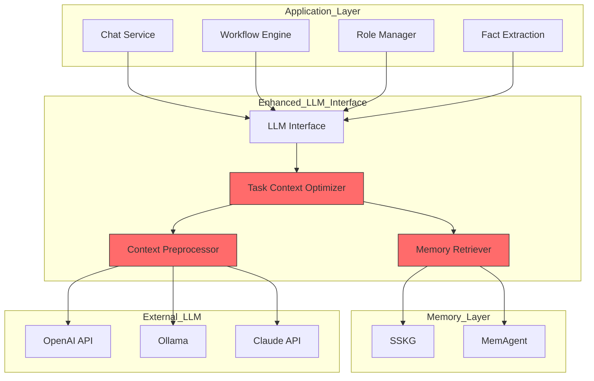
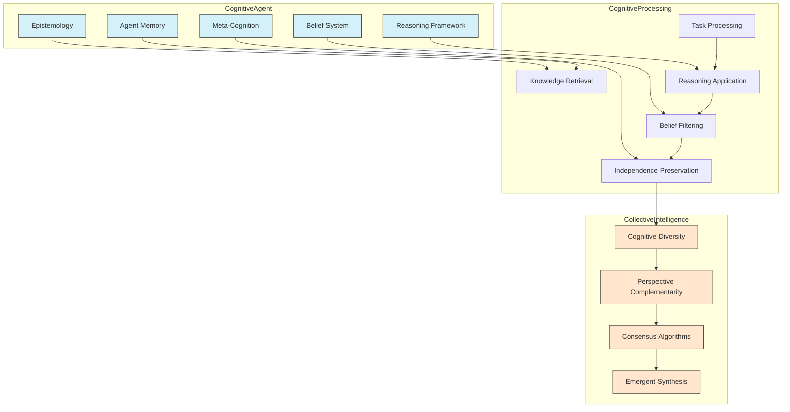

# Design Document: Virtual Role Chat System

## Overview

The Institutional Primitives System is designed to implement "制度原语 (Institutional Primitives)" - standardized workflow nodes that encapsulate atomic capabilities and serve as the fundamental building blocks for complex social institutions within AI collaboration systems.

The system implements two core social institutions as concrete demonstrations of social engineering approaches to AI reliability:

1. **批判性审查工作流 (Critical Review Workflow)**: A systematic multi-role fact validation process that combats LLM hallucinations through evidence-based review and revision cycles.

2. **多视角综合工作流 (Multi-perspective Synthesis Workflow)**: A comprehensive knowledge synthesis process that overcomes single-LLM limitations by orchestrating diverse expert perspectives into unified insights.

The architecture leverages existing DAIP-LIVE services (FactExtractionService, SynthesisEngine, WikiService, etc.) as institutional primitives while introducing a workflow orchestration layer that enables complex, auditable, and transparent AI collaboration processes. This approach transforms individual AI capabilities into structured social institutions that can be composed, reused, and optimized for various knowledge work scenarios.

Additionally, the system implements a unified Semantic Structured Knowledge Graph (SSKG) as the central memory interface for all components, ensuring consistent knowledge representation and efficient retrieval across the entire system. The architecture also incorporates a MemAgent-based memory management system inspired by recent research from ByteDance and Tsinghua University, which optimizes long-context interactions through reinforcement learning-based memory selection and multi-conversation retrieval strategies.

## Architecture

The Institutional Primitives System is built as a workflow orchestration layer that transforms existing DAIP-LIVE services into composable institutional primitives. The architecture enables complex social engineering workflows through standardized node interfaces and sophisticated orchestration capabilities:

```mermaid
graph TD
    subgraph User_Interface
        CLI[CLI Interface]
        API[Web API]
        WebUI[Web Dashboard]
    end

    subgraph Workflow_Orchestration_Layer
        WorkflowEngine[Workflow Engine]
        PrimitiveRegistry[Primitive Registry]
        ExecutionManager[Execution Manager]
        StateManager[State Manager]
    end

    subgraph Memory_Management_Layer
        SSKG[Semantic Structured Knowledge Graph]
        MemAgent[Memory Agent]
        MemorySelector[Memory Selector]
        MemoryConsolidator[Memory Consolidator]
        TaskContextOptimizer[Task Context Optimizer]
    end

    subgraph Institutional_Primitives
        GenerationNode[生成节点]
        FactExtractionNode[事实提取节点]
        ParallelReviewNode[并行审查节点]
        EvidenceAggregationNode[证据汇总节点]
        ConsensusNode[共识计算节点]
        RevisionNode[修订节点]
        TaskDecompositionNode[任务分解节点]
        ParallelExplorationNode[并行探索节点]
        SynthesisNode[观点综合节点]
    end

    subgraph Core_Workflows
        CriticalReviewWorkflow[批判性审查工作流]
        MultiPerspectiveSynthesisWorkflow[多视角综合工作流]
    end

    subgraph Existing_DAIP_Services
        FactExtractionService[Fact Extraction Service]
        FactValidationService[Fact Validation Service]
        SynthesisEngine[Synthesis Engine]
        WikiService[Wiki Service]
        RoleManager[Role Manager]
        MemoryService[Memory Service]
        LLMInterface[LLM Interface]
        ToolExecutor[Tool Executor]
    end

    CLI --> WorkflowEngine
    API --> WorkflowEngine
    WebUI --> WorkflowEngine
    
    WorkflowEngine --> PrimitiveRegistry
    WorkflowEngine --> ExecutionManager
    WorkflowEngine --> StateManager
    
    ExecutionManager --> GenerationNode
    ExecutionManager --> FactExtractionNode
    ExecutionManager --> ParallelReviewNode
    ExecutionManager --> EvidenceAggregationNode
    ExecutionManager --> ConsensusNode
    ExecutionManager --> RevisionNode
    ExecutionManager --> TaskDecompositionNode
    ExecutionManager --> ParallelExplorationNode
    ExecutionManager --> SynthesisNode
    
    CriticalReviewWorkflow --> GenerationNode
    CriticalReviewWorkflow --> FactExtractionNode
    CriticalReviewWorkflow --> ParallelReviewNode
    CriticalReviewWorkflow --> EvidenceAggregationNode
    CriticalReviewWorkflow --> ConsensusNode
    CriticalReviewWorkflow --> RevisionNode
    
    MultiPerspectiveSynthesisWorkflow --> TaskDecompositionNode
    MultiPerspectiveSynthesisWorkflow --> ParallelExplorationNode
    MultiPerspectiveSynthesisWorkflow --> SynthesisNode
    
    GenerationNode --> LLMInterface
    FactExtractionNode --> FactExtractionService
    ParallelReviewNode --> FactValidationService
    EvidenceAggregationNode --> WikiService
    ConsensusNode --> SynthesisEngine
    RevisionNode --> LLMInterface
    TaskDecompositionNode --> RoleManager
    ParallelExplorationNode --> ToolExecutor
    SynthesisNode --> SynthesisEngine
    
    % Memory Management Connections
    SSKG --> FactExtractionService
    SSKG --> WikiService
    SSKG --> MemoryService
    
    MemAgent --> SSKG
    MemAgent --> MemorySelector
    MemAgent --> MemoryConsolidator
    MemAgent --> TaskContextOptimizer
    
    WorkflowEngine --> MemAgent
    Institutional_Primitives --> MemAgent
    
    % Service connections to SSKG
    FactExtractionService --> SSKG
    FactValidationService --> SSKG
    WikiService --> SSKG
    MemoryService --> SSKG
    RoleManager --> SSKG
    
    % Task Context Optimizer connections
    TaskContextOptimizer --> LLMInterface
    TaskContextOptimizer --> WorkflowEngine

    style WorkflowEngine fill:#FFE6CC,stroke:#333
    style PrimitiveRegistry fill:#FFE6CC,stroke:#333
    style ExecutionManager fill:#FFE6CC,stroke:#333
    style StateManager fill:#FFE6CC,stroke:#333
    style CriticalReviewWorkflow fill:#D1F2EB,stroke:#333
    style MultiPerspectiveSynthesisWorkflow fill:#D1F2EB,stroke:#333
    style SSKG fill:#E6B8AF,stroke:#333
    style MemAgent fill:#E6B8AF,stroke:#333
    style MemorySelector fill:#E6B8AF,stroke:#333
    style MemoryConsolidator fill:#E6B8AF,stroke:#333
    style TaskContextOptimizer fill:#E6B8AF,stroke:#333
```

## Components and Interfaces

### 1. Workflow Engine

**Purpose**: Orchestrates the execution of institutional workflows by coordinating primitive nodes and managing execution state.

**Key Interfaces**:

- `execute_workflow(workflow_def: WorkflowDefinition, params: Dict[str, Any]) -> WorkflowResult`
- `get_workflow_status(execution_id: str) -> WorkflowStatus`
- `pause_workflow(execution_id: str) -> bool`
- `resume_workflow(execution_id: str) -> bool`
- `cancel_workflow(execution_id: str) -> bool`

**Data Models**:

```python
class WorkflowDefinition(BaseModel):
    id: str
    name: str
    description: str
    nodes: List[WorkflowNode]
    edges: List[WorkflowEdge]
    parameters: Dict[str, Any] = {}
    
class WorkflowNode(BaseModel):
    id: str
    type: str  # Primitive type (e.g., "generation", "fact_extraction")
    config: Dict[str, Any]
    inputs: List[str]
    outputs: List[str]
    
class WorkflowEdge(BaseModel):
    from_node: str
    to_node: str
    condition: Optional[str] = None  # Conditional execution
    
class WorkflowResult(BaseModel):
    execution_id: str
    status: Literal["completed", "failed", "cancelled"]
    outputs: Dict[str, Any]
    execution_trace: List[ExecutionStep]
    metrics: ExecutionMetrics
```

### 2. Primitive Registry

**Purpose**: Manages the registration, discovery, and instantiation of institutional primitive nodes.

**Key Interfaces**:

- `register_primitive(primitive_type: str, primitive_class: Type[InstitutionalPrimitive]) -> bool`
- `get_primitive(primitive_type: str) -> Type[InstitutionalPrimitive]`
- `list_primitives() -> List[PrimitiveInfo]`
- `validate_primitive(primitive_def: Dict[str, Any]) -> ValidationResult`

**Data Models**:

```python
class InstitutionalPrimitive(ABC):
    """Base class for all institutional primitives."""
    
    @abstractmethod
    async def execute(self, inputs: Dict[str, Any], context: ExecutionContext) -> Dict[str, Any]:
        """Execute the primitive with given inputs and context."""
        pass
    
    @abstractmethod
    def get_input_schema(self) -> Dict[str, Any]:
        """Return JSON schema for expected inputs."""
        pass
    
    @abstractmethod
    def get_output_schema(self) -> Dict[str, Any]:
        """Return JSON schema for produced outputs."""
        pass

class PrimitiveInfo(BaseModel):
    type: str
    name: str
    description: str
    input_schema: Dict[str, Any]
    output_schema: Dict[str, Any]
    version: str
    
class ExecutionContext(BaseModel):
    execution_id: str
    workflow_id: str
    node_id: str
    services: Dict[str, Any]  # Available DAIP-LIVE services
    state: Dict[str, Any]  # Workflow state
```

### 3. Critical Review Workflow

**Purpose**: Implements the 批判性审查工作流 to systematically eliminate LLM hallucinations through multi-role fact validation.

**Workflow Nodes**:

1. **生成节点 (Generation Node)**: Captures initial AI role output
2. **事实提取节点 (Fact Extraction Node)**: Extracts verifiable factual assertions
3. **并行审查节点 (Parallel Review Node)**: Fan-out to challenger and validator roles
4. **证据汇总节点 (Evidence Aggregation Node)**: Fan-in to collect all evidence
5. **共识计算节点 (Consensus Node)**: Calculates credibility scores
6. **修订节点 (Revision Node)**: Sends low-credibility content for revision

**Key Interfaces**:

- `execute_critical_review(content: str, topic: str, roles: List[str]) -> ReviewResult`
- `get_fact_credibility_scores(facts: List[str]) -> Dict[str, float]`
- `generate_evidence_report(fact: str) -> EvidenceReport`

**Data Models**:

```python
class ReviewResult(BaseModel):
    original_content: str
    extracted_facts: List[ExtractedFact]
    evidence_reports: List[EvidenceReport]
    credibility_scores: Dict[str, float]
    revised_content: Optional[str] = None
    validation_summary: str
    
class ExtractedFact(BaseModel):
    id: str
    content: str
    confidence: float
    source_location: str  # Location in original content
    
class EvidenceReport(BaseModel):
    fact_id: str
    supporting_evidence: List[Evidence]
    challenging_evidence: List[Evidence]
    overall_assessment: str
    
class Evidence(BaseModel):
    content: str
    source: str
    credibility: float
    type: Literal["supporting", "challenging", "neutral"]
```

### 4. Semantic Structured Knowledge Graph (SSKG)

**Purpose**: Provides a unified interface for knowledge representation, storage, and retrieval across all system components.

**Key Interfaces**:

- `store_fact(fact: KnowledgeFact) -> str`
- `retrieve_facts(query: KnowledgeQuery) -> List[KnowledgeFact]`
- `update_fact(fact_id: str, updates: Dict[str, Any]) -> bool`
- `delete_fact(fact_id: str) -> bool`
- `search_knowledge(query: str, filters: Dict[str, Any] = None, limit: int = 10) -> List[KnowledgeFact]`
- `get_related_facts(fact_id: str, relation_types: List[str] = None) -> List[KnowledgeFact]`
- `resolve_conflicts(conflicting_facts: List[str]) -> ConflictResolution`
- `store_memory(memory: Memory, memory_type: str) -> str`
- `retrieve_memories(query: MemoryQuery) -> List[Memory]`
- `store_session_state(session_id: str, state: Dict[str, Any]) -> bool`
- `retrieve_session_state(session_id: str) -> Dict[str, Any]`
- `store_project_state(project_id: str, state: Dict[str, Any]) -> bool`
- `retrieve_project_state(project_id: str) -> Dict[str, Any]`
- `store_wiki_content(page_id: str, content: str, metadata: Dict[str, Any]) -> bool`
- `retrieve_wiki_content(page_id: str) -> WikiPage`

**Data Models**:

```python
class KnowledgeFact(BaseModel):
    id: Optional[str] = None
    content: str
    source: str
    confidence: float = Field(ge=0.0, le=1.0)
    timestamp: datetime = Field(default_factory=datetime.now)
    metadata: Dict[str, Any] = {}
    relations: List[KnowledgeRelation] = []
    version: int = 1
    
class KnowledgeRelation(BaseModel):
    relation_type: str  # e.g., "supports", "contradicts", "elaborates"
    target_fact_id: str
    confidence: float = Field(ge=0.0, le=1.0)
    metadata: Dict[str, Any] = {}
    
class KnowledgeQuery(BaseModel):
    content: Optional[str] = None
    source: Optional[str] = None
    min_confidence: float = 0.0
    relation_filter: Optional[Dict[str, Any]] = None
    time_range: Optional[Tuple[datetime, datetime]] = None
    metadata_filter: Optional[Dict[str, Any]] = None
    limit: int = 10
    
class ConflictResolution(BaseModel):
    resolved_fact: KnowledgeFact
    conflicting_facts: List[KnowledgeFact]
    resolution_strategy: str
    confidence: float
    reasoning: str
    
class Memory(BaseModel):
    id: Optional[str] = None
    content: str
    memory_type: str  # "episodic", "semantic", "procedural"
    owner_id: str  # Role ID or user ID
    importance: float = Field(ge=0.0, le=1.0)
    timestamp: datetime = Field(default_factory=datetime.now)
    metadata: Dict[str, Any] = {}
    
class MemoryQuery(BaseModel):
    content: Optional[str] = None
    memory_type: Optional[str] = None
    owner_id: Optional[str] = None
    min_importance: float = 0.0
    time_range: Optional[Tuple[datetime, datetime]] = None
    metadata_filter: Optional[Dict[str, Any]] = None
    limit: int = 10
    
class WikiPage(BaseModel):
    id: str
    content: str
    version: int
    last_updated: datetime
    contributors: List[str]
    metadata: Dict[str, Any] = {}
```

### 5. Memory Agent System

**Purpose**: Implements intelligent memory management for long-context interactions across multiple conversations using reinforcement learning techniques.

**Key Interfaces**:

- `store_memory(memory: Memory) -> str`
- `retrieve_memories(context: str, limit: int = 5) -> List[Memory]`
- `consolidate_memories(session_id: str) -> List[Memory]`
- `train_memory_selector(training_data: List[MemorySelectorTrainingExample]) -> TrainingResult`
- `get_memory_importance(memory: Memory, context: str) -> float`
- `organize_memories(memories: List[Memory]) -> Dict[str, List[Memory]]`
- `share_memories(source_role: str, target_role: str, memories: List[str]) -> bool`
- `optimize_context(context: str, task: str, max_tokens: int) -> OptimizedContext`

**Data Models**:

```python
class Memory(BaseModel):
    id: Optional[str] = None
    content: str
    source_role: str
    memory_type: Literal["episodic", "semantic", "procedural"]
    importance: float = Field(ge=0.0, le=1.0)
    recency: float = Field(ge=0.0, le=1.0)
    creation_time: datetime = Field(default_factory=datetime.now)
    last_accessed: datetime = Field(default_factory=datetime.now)
    access_count: int = 0
    related_memories: List[str] = []
    metadata: Dict[str, Any] = {}
    
class MemorySelectorTrainingExample(BaseModel):
    context: str
    candidate_memories: List[Memory]
    selected_memories: List[str]  # IDs of memories that were useful
    reward: float
    
class TrainingResult(BaseModel):
    model_version: str
    performance_metrics: Dict[str, float]
    training_examples_count: int
    convergence_status: str
    
class MemoryConsolidationResult(BaseModel):
    original_memories: List[str]
    consolidated_memories: List[Memory]
    compression_ratio: float
    information_retention: float
    
class OptimizedContext(BaseModel):
    original_context: str
    optimized_context: str
    task_focus: str
    included_memories: List[str]
    excluded_memories: List[str]
    optimization_metrics: Dict[str, float]
```

### 6. Task Context Optimizer

**Purpose**: Enhances context preparation by focusing on current task requirements and essential background information.

**Key Interfaces**:

- `optimize_context_for_task(context: List[Dict[str, Any]], task: str, max_tokens: int) -> OptimizedContext`
- `extract_task_requirements(task: str) -> List[TaskRequirement]`
- `prioritize_context_elements(context_elements: List[Dict[str, Any]], task_requirements: List[TaskRequirement]) -> List[Dict[str, Any]]`
- `blend_context_sources(task_instructions: str, background_knowledge: List[str], conversation_history: List[Dict[str, Any]], max_tokens: int) -> OptimizedContext`
- `maintain_task_coherence(context: List[Dict[str, Any]], task: str) -> List[Dict[str, Any]]`
- `delineate_task_boundaries(context: List[Dict[str, Any]], current_task: str) -> List[Dict[str, Any]]`

**Data Models**:

```python
class TaskRequirement(BaseModel):
    requirement_type: str  # "knowledge", "instruction", "context", "example"
    content: str
    importance: float = Field(ge=0.0, le=1.0)
    
class ContextElement(BaseModel):
    content: str
    element_type: str  # "instruction", "knowledge", "conversation", "example"
    relevance_score: float = Field(ge=0.0, le=1.0)
    token_count: int
    metadata: Dict[str, Any] = {}
    
class OptimizedContext(BaseModel):
    elements: List[ContextElement]
    total_tokens: int
    task_focus: str
    optimization_metrics: Dict[str, float]
    excluded_elements: List[ContextElement] = []
```

### 7. Chat Analytics Service

**Purpose**: Provides real-time analytics and insights about chat sessions, role performance, and conversation quality.

**Key Interfaces**:

- `get_session_metrics(session_id: SessionID) -> SessionMetrics`
- `get_role_performance(session_id: SessionID, role_id: str) -> RolePerformance`
- `get_conversation_quality(session_id: SessionID) -> QualityMetrics`
- `detect_quality_issues(session_id: SessionID) -> List[QualityIssue]`
- `generate_analytics_report(session_id: SessionID) -> AnalyticsReport`

**Data Models**:

```python
class SessionMetrics(BaseModel):
    message_count: int
    average_response_time: float
    topic_coherence: float
    engagement_distribution: Dict[str, float]  # Role ID to engagement percentage
    
class RolePerformance(BaseModel):
    role_id: str
    message_count: int
    average_response_length: int
    topic_relevance: float
    influence_score: float
    
class QualityMetrics(BaseModel):
    coherence_score: float
    diversity_score: float
    depth_score: float
    factual_accuracy: float
    
class QualityIssue(BaseModel):
    issue_type: str
    severity: float
    description: str
    affected_messages: List[str]
    suggested_action: str
```

## Implementation Considerations

### Hallucination Suppression

The system will implement several techniques for hallucination suppression:

1. **Cross-Role Validation**: Statements from one role can be challenged by other roles with different expertise.
2. **Fact Extraction and Verification**: The system will extract factual claims and verify them using the existing FactExtractionService and FactValidationService.
3. **Confidence Scoring**: Roles will provide confidence scores for their statements, allowing the system to flag low-confidence information.
4. **Semantic Structured Knowledge Graph (SSKG)**: The system will leverage the unified SSKG to validate factual consistency across conversations and sessions.

### Turn-Taking Algorithms

The system will implement intelligent turn-taking algorithms that consider:

1. **Role Expertise**: Roles with higher expertise in the current topic will be given priority.
2. **Conversation Flow**: The system will analyze the conversation to determine which role should respond next based on context.
3. **User Directives**: Users can explicitly direct questions to specific roles.
4. **Balanced Participation**: The system will ensure all roles have opportunities to contribute.
5. **Debate Protocol Rules**: When in debate mode, the system will follow structured turn-taking rules from the existing DebateProtocol.

### Task Decomposition and Processing

The system will implement advanced task decomposition and processing strategies:

1. **Automatic Topic Decomposition**: Complex topics will be automatically broken down into simpler sub-topics that can be addressed individually.
2. **Expertise-Based Assignment**: Sub-topics will be assigned to roles based on their expertise and specialization.
3. **Processing Chain Management**: The system will manage chains of processing tasks, ensuring proper sequencing and information flow.
4. **Adaptive Processing Strategies**: Processing approaches will adapt based on topic complexity, role capabilities, and conversation context.
5. **Knowledge Persistence**: Validated information and consensus outcomes will be persisted to the unified SSKG for future reference and cross-session retrieval.

### Transparency Control

The system will provide configurable transparency levels:

1. **Minimal**: Shows only final outputs without revealing processing details.
2. **Moderate**: Shows key reasoning steps and confidence scores.
3. **Detailed**: Shows complete processing chains, all reasoning steps, and detailed confidence metrics.

### Multi-modal Support

The system will support multiple interaction modalities:

1. **Text Input/Output**: The primary mode of interaction.
2. **Document Processing**: Ability to upload and analyze documents within the chat.
3. **Rich Formatting**: Support for tables, diagrams, and structured data in responses.
4. **Accessibility Features**: Screen reader support and keyboard navigation.

### Unified Semantic Structured Knowledge Graph (SSKG) Integration

The SSKG will serve as a unified knowledge and memory interface that integrates with all system components:

1. **Unified Storage System**: SSKG will provide a single storage mechanism for all system memory types including:
   - Virtual role memories and identities
   - Wiki content and validated knowledge
   - User memories and preferences
   - Session states and conversation history
   - Project states and configurations
   - Memory banks and consolidated knowledge
   
2. **Standardized Access Patterns**: All components will interact with knowledge through consistent SSKG interfaces.

3. **Rich Semantic Relationships**: Knowledge will be stored with semantic relationships that enable complex queries and reasoning:
   - Entity-relationship-entity triples for factual knowledge
   - Hierarchical taxonomies for categorization
   - Temporal relationships for event sequences
   - Causal relationships for reasoning chains
   - Attribution relationships for source tracking

4. **Advanced Metadata Management**: All knowledge will include comprehensive metadata:
   - Confidence scores and uncertainty measures
   - Source attribution and provenance tracking
   - Temporal information (creation, modification, expiration)
   - Access control and visibility settings
   - Validation status and verification history

5. **Conflict Resolution**: SSKG will implement sophisticated strategies to detect and resolve conflicting information:
   - Temporal resolution (newer information may supersede older)
   - Source-based resolution (prioritize more reliable sources)
   - Confidence-based resolution (higher confidence information prevails)
   - Consensus-based resolution (majority agreement among sources)
   - Human-in-the-loop resolution for critical conflicts

6. **Efficient Storage and Retrieval**: Knowledge will be optimized for performance:
   - Graph-based storage for relationship traversal
   - Vector embeddings for semantic similarity search
   - Hierarchical indexing for fast navigation
   - Caching mechanisms for frequently accessed knowledge
   - Distributed storage for scalability

7. **Domain-Specific Adapters**: SSKG will provide adapters for specialized knowledge types:
   - Role memory adapter for virtual role identities
   - Wiki adapter for structured documentation
   - Session adapter for conversation states
   - Project adapter for configuration management
   - Memory bank adapter for consolidated knowledge

### Memory Agent System Integration

The MemAgent system will enhance memory management across the platform, based on the ByteDance/Tsinghua research:

1. **Multi-Conversation Memory Management**: MemAgent will maintain coherent memory across conversation boundaries:
   - Cross-session memory continuity
   - Conversation thread tracking
   - Topic-based memory organization
   - Context-aware memory retrieval

2. **Reinforcement Learning-Based Selection**: Memory selection will be optimized through sophisticated RL techniques:
   - Multi-conversation RL policy for memory selection
   - Reward modeling based on conversation outcomes
   - Exploration-exploitation balance for memory retrieval
   - Online learning from user feedback
   - Adaptive policy updates based on interaction patterns

3. **Memory Consolidation and Optimization**: Background processes will enhance memory quality:
   - Automatic summarization of conversation threads
   - Extraction of key insights and decisions
   - Redundancy elimination and deduplication
   - Contradiction resolution and consistency maintenance
   - Progressive abstraction for long-term storage

4. **Hierarchical Memory Organization**: Memories will be structured in a cognitive-inspired hierarchy:
   - Episodic memories (specific conversations and events)
   - Semantic memories (facts, concepts, and knowledge)
   - Procedural memories (processes, methods, and approaches)
   - Meta-memories (insights about memory usage patterns)

5. **Context-Aware Memory Retrieval**: Memory retrieval will adapt to interaction context:
   - Task-specific memory prioritization
   - Recency-weighted retrieval for time-sensitive contexts
   - Importance-weighted retrieval for critical information
   - Relevance-weighted retrieval for topic coherence
   - Diversity-weighted retrieval for comprehensive perspective

6. **Controlled Memory Sharing**: Sophisticated memory sharing mechanisms:
   - Role-specific memory access controls
   - Selective memory visibility based on context
   - Graduated memory sharing based on trust levels
   - Memory attribution preservation during sharing
   - Cross-role memory synthesis for collaborative insights

7. **Memory Evolution Tracking**: Comprehensive tracking of memory changes:
   - Version history for evolving knowledge
   - Confidence evolution over time
   - Source attribution for memory modifications
   - Temporal decay modeling for outdated information
   - Learning curve modeling for skill acquisition

8. **SSKG Integration**: Seamless integration with the unified knowledge store:
   - Memory-to-knowledge transformation pipeline
   - Knowledge-to-memory activation mechanisms
   - Unified query interface across memory types
   - Cross-referencing between memory systems
   - Consistent metadata management

### Enhanced LLM Interface with Bottom-Layer Task Context Optimization

The Task Context Optimizer is integrated at the lowest level of all LLM interactions, making it the foundational layer for AI communication optimization:

#### Architecture Integration



#### Implementation Details

1. **Transparent Bottom-Layer Integration**:
   ```python
   class EnhancedLLMInterface:
       def __init__(self, sskg_manager, mem_agent, task_optimizer):
           self.sskg_manager = sskg_manager
           self.mem_agent = mem_agent
           self.task_optimizer = task_optimizer
           
       async def generate(self, messages, participant_id=None, **kwargs):
           # AUTOMATIC task context optimization happens here
           optimized_messages = await self._optimize_context(messages, participant_id)
           
           # Standard LLM call with optimized context
           response = await self._call_llm(optimized_messages, **kwargs)
           
           # Return response with optimization metadata
           return self._add_optimization_metadata(response)
   ```

2. **Automatic Task Detection and Context Preparation**:
   - **Task Analysis**: Every incoming message set is analyzed for task indicators
   - **Context Retrieval**: Relevant memories and knowledge are automatically fetched
   - **Priority Optimization**: Context elements are prioritized based on task relevance
   - **Token Management**: Context is compressed to fit within model limits
   - **Coherence Preservation**: Task-critical relationships are maintained

3. **Zero-Configuration Operation**:
   - **No API Changes**: Existing LLMInterface calls work unchanged
   - **Automatic Optimization**: All LLM interactions benefit without modification
   - **Transparent Performance**: Higher-level services see improved results automatically
   - **Backward Compatibility**: Existing code continues to work with enhanced performance

4. **Real-Time Context Adaptation**:
   - **Dynamic Task Detection**: Task focus changes are detected mid-conversation
   - **Context Rebalancing**: Memory and knowledge priorities adjust automatically
   - **State Preservation**: Essential task context persists across conversation turns
   - **Multi-Session Continuity**: Task state is maintained across session boundaries

5. **Intelligent Memory Integration**:
   - **Proactive Retrieval**: Relevant memories are fetched before they're needed
   - **Contextual Filtering**: Only task-relevant memories are included
   - **Importance Weighting**: Memory selection uses MemAgent's RL-based scoring
   - **Cross-Context Synthesis**: Related memories from different contexts are combined

6. **Performance Monitoring and Optimization**:
   - **Context Utilization Metrics**: Track how effectively context space is used
   - **Task Completion Rates**: Monitor success rates for different task types
   - **Response Quality Scoring**: Measure relevance and accuracy of responses
   - **Optimization Effectiveness**: Track improvements from context optimization

7. **Metadata and Transparency**:
   ```python
   # Response includes optimization metadata
   {
       "content": "LLM response content",
       "optimization_metadata": {
           "original_context_tokens": 2048,
           "optimized_context_tokens": 1536,
           "compression_ratio": 0.75,
           "included_memories": ["mem_001", "mem_002"],
           "excluded_memories": ["mem_003", "mem_004"],
           "task_focus": "code_implementation",
           "optimization_strategy": "task_focused_compression"
       }
   }
   ```

#### Benefits of Bottom-Layer Integration

1. **Universal Optimization**: Every LLM interaction in the system benefits automatically
2. **Consistent Performance**: All components get the same high-quality context optimization
3. **Reduced Complexity**: Higher-level components don't need to manage context optimization
4. **Centralized Intelligence**: All task detection and context optimization logic is in one place
5. **Easy Maintenance**: Updates to optimization algorithms benefit the entire system
6. **Performance Transparency**: Optimization happens without changing existing APIs
7. **Scalable Architecture**: New components automatically inherit context optimization capabilities

## Integration with Existing Components

The Virtual Role Chat System will integrate with existing components:

1. **RoleManager**: Used to load and manage role definitions.
2. **MemoryService**: Used to maintain conversation history and role memory, now enhanced with MemAgent capabilities.
3. **SynthesisEngine**: Used to generate summaries and consensus opinions.
4. **ToolExecutor**: Used to execute tools and consensus strategies.
5. **LLMInterface**: Used to generate role responses.
6. **WikiService**: Used to persist and retrieve validated knowledge, now integrated with the unified SSKG.
7. **DebateProtocol**: Used as a template for structured debate workflows and consensus mechanisms.

## Performance Considerations

To ensure optimal performance, the system will:

1. **Implement Caching**: Cache frequently accessed data like role definitions and recent messages.
2. **Use Asynchronous Processing**: Process non-blocking operations asynchronously.
3. **Implement Pagination**: Use pagination for retrieving large message histories.
4. **Optimize LLM Usage**: Batch LLM requests when possible and optimize prompt engineering.
5. **Monitor Resource Usage**: Track memory, CPU, and LLM token usage to identify bottlenecks.
6. **Optimize Graph Operations**: Use efficient graph algorithms for SSKG traversal and querying.
7. **Implement Memory Tiering**: Store frequently accessed memories in faster storage tiers.
8. **Use Incremental Updates**: Apply incremental updates to large data structures rather than full replacements.
9. **Implement Lazy Loading**: Load data on demand rather than preloading everything.
10. **Optimize Context Size**: Minimize context size through intelligent selection and compression.
##
 Cognitive Independence and Collective Intelligence Framework

### Cognitive Agent Architecture

The system implements a sophisticated Cognitive Agent architecture that transcends traditional role-playing approaches to create truly independent cognitive entities:



**Key Components**:

### 1. Cognitive Agent

**Purpose**: Provides the foundation for true cognitive independence in virtual roles.

**Key Interfaces**:

- `process_input(input_data: Dict[str, Any], context: Context) -> Response`
- `update_beliefs(new_evidence: List[Evidence]) -> List[BeliefUpdate]`
- `retrieve_perspective(topic: str, task_context: TaskContext) -> Perspective`
- `evaluate_consistency(perspective: Perspective, historical_perspectives: List[Perspective]) -> ConsistencyScore`

**Data Models**:

```python
class CognitiveAgent(BaseModel):
    agent_id: str
    domain_expertise: List[str]
    reasoning_framework: ReasoningFramework
    belief_system: BeliefSystem
    epistemology: Epistemology
    meta_cognition: MetaCognition
    memory: AgentMemory
    
class ReasoningFramework(BaseModel):
    framework_type: str  # "deductive", "inductive", "abductive", "analogical", etc.
    inference_rules: List[InferenceRule]
    heuristics: List[Heuristic]
    biases: List[CognitiveBias]  # Explicitly modeled to enable meta-cognitive correction
    
class BeliefSystem(BaseModel):
    core_beliefs: List[Belief]
    belief_network: Dict[str, List[str]]  # Belief relationships
    confidence_levels: Dict[str, float]
    updating_mechanism: BeliefUpdateMechanism
    
class Epistemology(BaseModel):
    knowledge_criteria: List[EpistemicCriterion]
    validation_methods: List[ValidationMethod]
    uncertainty_handling: UncertaintyHandling
    
class MetaCognition(BaseModel):
    self_monitoring: SelfMonitoring
    bias_detection: BiasDetection
    independence_preservation: IndependencePreservation
    task_focus_maintenance: TaskFocusMaintenance
```

### 2. Collective Intelligence Framework

**Purpose**: Enables the emergence of collective intelligence that transcends individual capabilities.

**Key Interfaces**:

- `evaluate_cognitive_diversity(perspectives: List[Perspective]) -> DiversityMetrics`
- `analyze_perspective_complementarity(perspectives: List[Perspective]) -> ComplementarityMatrix`
- `select_consensus_algorithm(perspectives: List[Perspective], task: Task) -> ConsensusAlgorithm`
- `synthesize_perspectives(perspectives: List[Perspective], algorithm: ConsensusAlgorithm) -> EmergentSynthesis`
- `evaluate_emergence(synthesis: EmergentSynthesis, perspectives: List[Perspective]) -> EmergenceMetrics`

**Data Models**:

```python
class CollectiveIntelligenceFramework(BaseModel):
    consensus_algorithms: Dict[str, ConsensusAlgorithm]
    diversity_evaluation: DiversityEvaluation
    complementarity_analysis: ComplementarityAnalysis
    emergence_detection: EmergenceDetection
    
class ConsensusAlgorithm(ABC):
    @abstractmethod
    def execute(self, perspectives: List[Perspective], complementarity_matrix: ComplementarityMatrix) -> EmergentSynthesis:
        pass
        
class WeightedVotingConsensus(ConsensusAlgorithm):
    weights: Dict[str, float]
    
class BayesianAggregation(ConsensusAlgorithm):
    prior_beliefs: Dict[str, float]
    
class DialecticalSynthesis(ConsensusAlgorithm):
    thesis_antithesis_detection: ThesisAntithesisDetection
    
class EmergentConsensus(ConsensusAlgorithm):
    emergence_patterns: List[EmergencePattern]
    
class DiversityEvaluation(BaseModel):
    cognitive_distance_metrics: List[CognitiveDistanceMetric]
    diversity_indices: List[DiversityIndex]
    
class ComplementarityAnalysis(BaseModel):
    knowledge_gap_detection: KnowledgeGapDetection
    perspective_overlap_analysis: PerspectiveOverlapAnalysis
    synergy_potential_estimation: SynergyPotentialEstimation
```

### 3. Enhanced Context Refinement System

**Purpose**: Provides sophisticated context management to ensure task focus while preserving cognitive independence.

**Key Interfaces**:

- `decompose_context(context: Context) -> List[ContextElement]`
- `align_with_cognitive_framework(elements: List[ContextElement], framework: ReasoningFramework) -> List[AlignedElement]`
- `optimize_for_task(elements: List[AlignedElement], task: Task) -> List[OptimizedElement]`
- `inject_metacognitive_guidance(elements: List[OptimizedElement], agent: CognitiveAgent) -> EnhancedContext`

**Data Models**:

```python
class ContextRefinementSystem(BaseModel):
    refinement_strategies: Dict[str, RefinementStrategy]
    
class RefinementStrategy(ABC):
    @abstractmethod
    def refine(self, elements: List[ContextElement], agent: CognitiveAgent, task: Task) -> List[RefinedElement]:
        pass
        
class TaskFocusedRefinement(RefinementStrategy):
    task_relevance_threshold: float
    
class CognitiveAlignmentRefinement(RefinementStrategy):
    alignment_methods: List[AlignmentMethod]
    
class EpistemologicalRefinement(RefinementStrategy):
    knowledge_validation_methods: List[ValidationMethod]
    
class DialecticalRefinement(RefinementStrategy):
    dialectical_patterns: List[DialecticalPattern]
```

### Implementation Considerations

#### 1. Cognitive Independence Preservation

The system employs several mechanisms to ensure true cognitive independence:

1. **Explicit Cognitive Frameworks**: Each agent has explicitly defined reasoning frameworks, belief systems, and epistemologies that govern how they process information.

2. **Meta-Cognitive Monitoring**: Agents continuously monitor their own cognitive processes to detect and correct for unintended cognitive alignment with other agents.

3. **Independent Knowledge Processing**: Even when accessing shared knowledge, each agent processes and interprets that knowledge through its unique cognitive lens.

4. **Longitudinal Consistency**: The system maintains cognitive consistency over time while allowing for natural belief updating based on new evidence.

5. **Cognitive Diversity Generation**: The system actively promotes cognitive diversity through varied reasoning frameworks, epistemologies, and belief systems.

#### 2. Collective Intelligence Emergence

The system facilitates the emergence of collective intelligence through:

1. **Cognitive Diversity Evaluation**: Quantitative assessment of cognitive diversity among perspectives to ensure sufficient variety for emergence.

2. **Perspective Complementarity Analysis**: Identification of how different perspectives complement each other to fill knowledge gaps.

3. **Dynamic Consensus Algorithm Selection**: Selection of the optimal consensus mechanism based on the specific task and available perspectives.

4. **Emergence Detection and Amplification**: Recognition and enhancement of emergent patterns that transcend individual contributions.

5. **Synergy Potential Estimation**: Prediction of potential synergies between cognitive agents to optimize group composition.

#### 3. Context Refinement for Task Focus

The system ensures high task focus through:

1. **Multi-dimensional Context Decomposition**: Breaking down context into atomic elements for fine-grained optimization.

2. **Cognitive Framework Alignment**: Aligning context elements with each agent's cognitive framework for optimal processing.

3. **Task-Specific Relevance Optimization**: Prioritizing context elements based on their relevance to the current task.

4. **Meta-Cognitive Guidance Injection**: Adding explicit guidance to maintain task focus and cognitive independence.

5. **Dynamic Context Restructuring**: Reorganizing context elements to optimize for both task focus and cognitive processing.