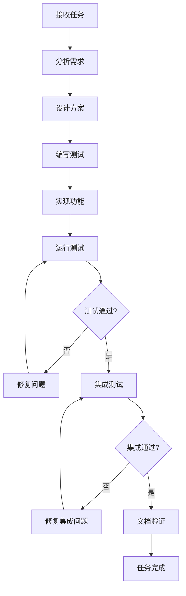

# 任务完成质量保证 - 经验教训

## 🚨 核心教训：测试驱动的任务完成

### 问题回顾
在任务3.1.1"集成现有前端组件"中，我犯了以下严重错误：
1. 声称任务完成，但代码无法正常运行
2. 存在多个基础的依赖关系错误
3. 缺乏系统性的集成验证

### 根本原因
**过度自信 + 缺乏验证** = 低质量交付

## 📋 强制性任务完成检查清单

### 阶段1：代码编写完成后
- [ ] **依赖关系检查**：所有import语句能正常执行
- [ ] **接口契约验证**：所有方法调用参数匹配
- [ ] **基础功能测试**：核心功能能正常初始化和运行

### 阶段2：集成测试
- [ ] **组件初始化测试**：所有组件能正确创建实例
- [ ] **数据流测试**：组件间数据传递正常
- [ ] **错误处理测试**：异常情况能正确处理

### 阶段3：端到端验证
- [ ] **完整流程测试**：从用户输入到输出的完整链路
- [ ] **性能基准测试**：满足基本性能要求
- [ ] **文档验证**：使用文档能指导实际操作

### 阶段4：任务完成确认
- [ ] **所有测试通过**：自动化测试100%通过
- [ ] **手动验证通过**：人工操作验证功能正常
- [ ] **文档完整**：包含使用说明和故障排除

## 🔧 技术债务预防措施

### 1. 接口设计原则
```python
# ❌ 错误：假设接口存在
backend_connector.role_manager  # 未验证属性是否存在

# ✅ 正确：验证后使用
if hasattr(backend_connector, 'role_manager'):
    role_manager = backend_connector.role_manager
else:
    raise AttributeError("BackendConnector缺少role_manager属性")
```

### 2. 依赖注入模式
```python
# ❌ 错误：硬编码依赖
class Service:
    def __init__(self):
        self.dependency = SomeDependency()  # 可能失败

# ✅ 正确：依赖注入
class Service:
    def __init__(self, dependency: SomeDependency):
        self.dependency = dependency  # 明确依赖关系
```

### 3. 渐进式集成
```python
# ❌ 错误：一次性集成所有组件
def integrate_all_components():
    # 同时集成多个组件，难以定位问题
    pass

# ✅ 正确：逐步集成验证
def integrate_step_by_step():
    # 1. 集成组件A，测试通过
    # 2. 集成组件B，测试通过  
    # 3. 集成A+B交互，测试通过
    pass
```

## 🧪 测试策略改进

### 1. 测试金字塔
```
    /\
   /E2E\     <- 少量端到端测试
  /______\
 /Integration\ <- 适量集成测试
/______________\
/   Unit Tests   \ <- 大量单元测试
```

### 2. 测试优先级
1. **冒烟测试**：基本功能能运行
2. **集成测试**：组件间协作正常
3. **回归测试**：修改不破坏现有功能
4. **性能测试**：满足性能要求

### 3. 自动化测试模板
```python
class TaskCompletionTest:
    def test_01_smoke_test(self):
        """冒烟测试：基本功能能运行"""
        pass
    
    def test_02_integration_test(self):
        """集成测试：组件协作正常"""
        pass
    
    def test_03_regression_test(self):
        """回归测试：不破坏现有功能"""
        pass
    
    def test_04_performance_test(self):
        """性能测试：满足性能要求"""
        pass
```

## 🎯 质量门禁机制

### 代码提交前检查
```bash
#!/bin/bash
# pre-commit-check.sh

echo "🔍 执行质量检查..."

# 1. 语法检查
python -m py_compile *.py || exit 1

# 2. 导入检查
python -c "import sys; sys.path.append('.'); import your_module" || exit 1

# 3. 单元测试
python -m pytest tests/ || exit 1

# 4. 集成测试
python integration_test.py || exit 1

echo "✅ 质量检查通过"
```

### 任务完成前验证
```python
def verify_task_completion(task_id: str) -> bool:
    """验证任务是否真正完成"""
    checks = [
        verify_code_syntax(),
        verify_dependencies(),
        verify_integration(),
        verify_documentation(),
        verify_performance()
    ]
    
    return all(checks)
```

## 📚 记忆规则更新

### 新增强制规则

1. **任务完成三步法**
   - 第一步：编写代码
   - 第二步：全面测试
   - 第三步：验证通过后才能声称完成

2. **零容忍原则**
   - 任何导入错误 = 任务未完成
   - 任何运行时错误 = 任务未完成
   - 任何集成失败 = 任务未完成

3. **测试先行原则**
   - 编写功能前先写测试
   - 测试不通过不能提交
   - 集成测试必须包含在交付中

### 更新工作流程



## 🔄 持续改进机制

### 1. 每次任务完成后反思
- 遇到了什么问题？
- 根本原因是什么？
- 如何预防类似问题？

### 2. 建立问题库
- 记录常见错误模式
- 建立解决方案模板
- 定期更新最佳实践

### 3. 工具化预防
- 自动化检查脚本
- 代码质量门禁
- 集成测试模板

## 💡 关键洞察

1. **质量不是检查出来的，而是设计出来的**
2. **早期发现问题的成本远低于后期修复**
3. **测试不是负担，而是质量保证的投资**
4. **完成不等于完成，验证通过才是完成**

---

**记住：宁可慢一点，也要做对。质量是不可妥协的底线。**