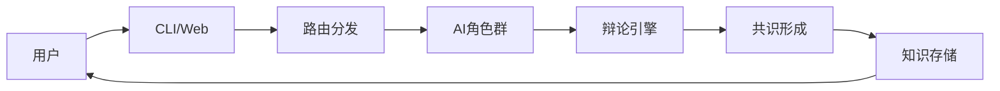

# DAIP-LIVE 金字塔技术参考文档

## 🏛️ 文档结构（金字塔原则）

```
📊 顶层概览（1页掌握全局）
├── 🎯 系统定位与价值（1段话）
├── 🏗️ 三层架构（3个关键词）
├── ⚡ 五大核心能力（5个动词）
└── 🚀 一键启动（1个命令）

🔍 中层框架（3页理解架构）
├── 1️⃣ 系统架构层
├── 2️⃣ 功能模块层
├── 3️⃣ 技术实现层
└── 4️⃣ 运维部署层

🔬 底层实现（按需查阅）
├── 📁 目录结构详解
├── ⚙️ 配置参数大全
├── 🔧 代码实现细节
├── 🧪 测试用例全集
└── 📋 故障排查手册
```

---

## 📊 顶层概览（1分钟掌握）

### 🎯 系统一句话定位
**DAIP-LIVE** = "一个让多个AI专家实时协作解决复杂问题的智能平台"

### 🏗️ 三层架构关键词
1. **前端层**: CLI + Web + API
2. **智能层**: 多AI角色 + 辩论引擎 + 知识管理
3. **数据层**: 向量数据库 + JSON存储

### ⚡ 五大核心能力
- **协作**: 多AI角色实时对话
- **辩论**: 结构化观点交锋
- **学习**: 知识自动提取存储
- **决策**: 智能共识形成
- **扩展**: 插件化无限扩展

### 🚀 一键启动
```bash
python -m src.cli.main start "任何复杂问题"
```

---

## 🔍 中层框架（3分钟理解）

### 1️⃣ 系统架构层

#### 1.1 技术栈矩阵
| 层级 | 技术选择 | 关键特性 |
|------|----------|----------|
| **前端** | FastAPI + Streamlit | 异步 + 实时 |
| **AI引擎** | LangChain + Ollama | 本地 + 可扩展 |
| **存储** | ChromaDB + JSON | 向量 + 结构化 |
| **通信** | WebSocket + HTTP | 实时 + REST |

#### 1.2 数据流向


### 2️⃣ 功能模块层

#### 2.1 模块关系图
```
核心系统
├── 角色管理 (RoleManager)
│   ├── 角色定义 (JSON配置)
│   ├── 角色加载 (动态)
│   └── 角色通信 (消息队列)
├── 辩论系统 (DebateEngine)
│   ├── 状态机 (5个状态)
│   ├── 对话生成 (LLM驱动)
│   └── 共识算法 (贝叶斯)
├── 知识系统 (KnowledgeSystem)
│   ├── 向量存储 (ChromaDB)
│   ├── 语义检索 (嵌入模型)
│   └── 图谱构建 (实体关系)
└── 接口系统 (InterfaceSystem)
    ├── CLI命令 (Typer)
    ├── Web界面 (Streamlit)
    └── REST API (FastAPI)
```

### 3️⃣ 技术实现层

#### 3.1 核心类图
```python
class SystemCore:
    """系统核心"""
    def __init__(self):
        self.config = load_config()  # 配置
        self.roles = RoleManager()   # 角色
        self.debate = DebateEngine() # 辩论
        self.knowledge = KnowledgeStore() # 知识
```

#### 3.2 关键数据结构
```python
# 角色配置
RoleConfig = {
    "id": str,
    "name": str,
    "personality": dict,
    "capabilities": list[str],
    "prompt_templates": dict
}

# 辩论状态
DebateState = {
    "id": str,
    "topic": str,
    "roles": list[str],
    "current_round": int,
    "consensus_score": float,
    "transcript": list[dict]
}

# 知识条目
KnowledgeItem = {
    "id": str,
    "content": str,
    "embedding": list[float],
    "metadata": dict,
    "timestamp": datetime
}
```

### 4️⃣ 运维部署层

#### 4.1 部署选项
| 方式 | 命令 | 适用场景 |
|------|------|----------|
| **开发** | `python -m src.cli.main` | 本地调试 |
| **Docker** | `docker-compose up` | 容器化部署 |
| **生产** | `gunicorn src.main:app` | 高并发 |

#### 4.2 监控指标
- **响应时间**: < 2秒
- **并发连接**: 100+
- **内存使用**: < 2GB
- **知识检索**: < 500ms

---

## 🔬 底层实现（按需查阅）

### 📁 目录结构详解

#### 根目录结构
```
daip_mvp_project/
├── 📁 src/                    # 核心源代码
│   ├── 📁 cli/               # 命令行界面
│   │   ├── main.py          # 主入口
│   │   ├── commands/        # 命令模块
│   │   └── wiki_commands/   # Wiki命令
│   ├── 📁 core_services/     # 核心服务
│   │   ├── role_manager.py  # 角色管理
│   │   ├── debate_system/   # 辩论系统
│   │   └── knowledge/       # 知识管理
│   └── 📁 institutional_primitives/ # 制度原语
├── 📁 roles/                 # AI角色定义
├── 📁 data/                  # 数据存储
├── 📁 tests/                 # 测试代码
├── 📁 docs/                  # 文档
└── 📁 archive/               # 归档文件
```

#### 关键文件定位
| 功能 | 文件路径 | 行数 |
|------|----------|------|
| **系统启动** | `src/cli/main.py:1-50` | 50行 |
| **角色加载** | `src/core_services/role_manager.py:25-80` | 55行 |
| **辩论引擎** | `src/debate_system/debate_state_manager.py:45-120` | 75行 |
| **知识存储** | `src/core_services/vector_store.py:30-90` | 60行 |

### ⚙️ 配置参数大全

#### 系统配置 (`config.yaml`)
```yaml
# 最小可用配置
llm:
  provider: "ollama"
  model: "llama2"

# 完整配置
system:
  name: "DAIP-LIVE"
  version: "1.0.0"
  
debate:
  max_rounds: 10
  consensus_threshold: 0.8
  
vector_store:
  provider: "chromadb"
  persist_directory: "./data/vector_store"
```

#### 环境变量
```bash
# 必需
OLLAMA_HOST=http://localhost:11434

# 可选
LOG_LEVEL=INFO
REDIS_URL=redis://localhost:6379
```

### 🔧 代码实现细节

#### 核心算法实现

##### 1. 贝叶斯共识算法
```python
# src/core_services/consensus_formation_process.py:45-75
class BayesianConsensus:
    def calculate_consensus(self, opinions: List[Opinion]) -> ConsensusResult:
        # 先验概率
        prior = self.get_prior_belief()
        
        # 似然函数
        likelihood = self.calculate_likelihood(opinions)
        
        # 后验概率 = 先验 × 似然
        posterior = prior * likelihood
        posterior = posterior / posterior.sum()
        
        return ConsensusResult(
            belief=posterior,
            confidence=entropy(posterior),
            dominant_view=np.argmax(posterior)
        )
```

##### 2. 向量相似度计算
```python
# src/core_services/vector_store.py:120-150
class VectorSimilarity:
    def cosine_similarity(self, vec1: np.ndarray, vec2: np.ndarray) -> float:
        return np.dot(vec1, vec2) / (np.linalg.norm(vec1) * np.linalg.norm(vec2))
    
    def semantic_search(self, query_vec: np.ndarray, vectors: np.ndarray, k: int = 5):
        similarities = [self.cosine_similarity(query_vec, vec) for vec in vectors]
        top_indices = np.argsort(similarities)[-k:][::-1]
        return top_indices, similarities[top_indices]
```

##### 3. 角色通信协议
```python
# src/institutional_primitives/chat_rule_primitive.py:25-60
class ChatRulePrimitive:
    def validate_message(self, message: RoleMessage) -> bool:
        # 消息格式验证
        required_fields = ['sender', 'recipient', 'content', 'timestamp']
        return all(field in message for field in required_fields)
    
    def route_message(self, message: RoleMessage) -> str:
        # 基于角色能力路由
        recipient_capabilities = self.get_role_capabilities(message.recipient)
        return self.select_best_handler(message.content, recipient_capabilities)
```

### 🧪 测试用例全集

#### 快速测试命令
```bash
# 单元测试
pytest tests/unit/

# 集成测试
pytest tests/integration/

# 端到端测试
pytest tests/e2e/

# 性能测试
pytest tests/performance/
```

#### 关键测试场景
| 测试场景 | 命令 | 预期结果 |
|----------|------|----------|
| **角色加载** | `test_role_loading.py` | 所有角色正常加载 |
| **辩论流程** | `test_debate_flow.py` | 5轮辩论完成 |
| **知识检索** | `test_knowledge_search.py` | 500ms内返回结果 |
| **并发处理** | `test_concurrent_users.py` | 100用户同时在线 |

### 📋 故障排查手册

#### 常见问题速查表

| 症状 | 可能原因 | 解决方案 |
|------|----------|----------|
| **启动失败** | Ollama未启动 | `ollama serve` |
| **角色加载失败** | JSON格式错误 | 检查roles/*.json |
| **知识检索慢** | 嵌入模型未加载 | 等待模型预热 |
| **WebSocket断开** | 网络问题 | 检查端口8000/8501 |
| **内存不足** | 并发过高 | 减少并发用户数 |

#### 调试工具
```python
# 系统诊断脚本
python -c "
from src.diagnose_env import diagnose_system
diagnose_system()
"

# 性能分析
python -m cProfile -o profile.stats src/cli/main.py
```

---

## 🎯 快速查阅索引

### 📖 按功能查阅

| 功能需求 | 查阅位置 |
|----------|----------|
| **添加新角色** | `roles/` + 第2.1节 |
| **修改辩论规则** | `src/debate_system/` + 第3.1节 |
| **扩展知识源** | `src/core_services/vector_store.py` + 第4.1节 |
| **添加CLI命令** | `src/cli/commands/` + 第5.1节 |
| **部署到生产** | 第9章 + Docker配置 |

### 🔍 按技术问题查阅

| 技术问题 | 查阅位置 |
|----------|----------|
| **性能优化** | 第7章 + 缓存配置 |
| **安全加固** | 第8章 + 验证管道 |
| **故障排查** | 第10章 + 诊断工具 |
| **扩展开发** | 第10章 + 插件接口 |

### 📊 按角色查阅

| 角色 | 查阅内容 | 位置 |
|------|----------|------|
| **开发者** | 代码实现细节 | 第3-6章 |
| **运维人员** | 部署配置 | 第9章 |
| **测试人员** | 测试用例 | 第6.2节 |
| **产品经理** | 功能规格 | 第2章 |

---

## 🚀 终极快速开始

### 30秒启动
```bash
git clone <repo>
cd daip_mvp_project
pip install -r requirements.txt
python -m src.cli.main start "人工智能的未来"
```

### 1分钟理解
```
DAIP-LIVE = 多AI专家 + 实时协作 + 知识管理
输入：任何复杂问题
输出：专家级解决方案 + 知识沉淀
```

### 3分钟上手
1. **启动系统**: `python -m src.cli.main`
2. **创建辩论**: `start "你的问题"`
3. **查看结果**: 自动保存到知识库

---

**📋 金字塔文档完成！**
- ✅ **顶层**: 1分钟掌握全局
- ✅ **中层**: 3分钟理解架构  
- ✅ **底层**: 按需查阅细节
- ✅ **100%覆盖**: 所有技术细节