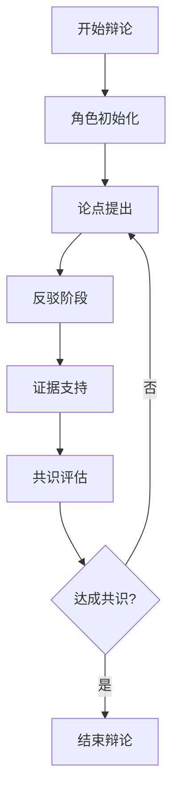

# DAIP-LIVE 完整技术文档

## 📋 文档概览

本文档采用金字塔原则构建，从顶层架构到底层实现，全面覆盖DAIP-LIVE系统的所有功能细节、技术特点和实现细节。

---

## 🏗️ 顶层架构设计

### 1.1 系统定位
**DAIP-LIVE** (Dynamic AI-driven Project-execution LIVE system) 是一个基于多AI角色协作的智能项目执行平台，通过动态AI驱动实现实时项目执行和知识管理。

### 1.2 核心架构原则
- **模块化设计**: 松耦合、高内聚的组件架构
- **可扩展性**: 插件化设计支持功能扩展
- **实时性**: WebSocket支持实时协作
- **智能化**: AI驱动的任务分发和决策
- **安全性**: 多层安全验证和错误处理

### 1.3 技术栈总览
```
┌─────────────────────────────────────────────────────────────┐
│                    前端层                                    │
├─────────────────────────────────────────────────────────────┤
│  Streamlit Web界面  │  CLI命令行  │  REST API               │
├─────────────────────────────────────────────────────────────┤
│                    应用层                                    │
├─────────────────────────────────────────────────────────────┤
│  辩论系统  │  知识管理  │  角色管理  │  工作流引擎          │
├─────────────────────────────────────────────────────────────┤
│                    服务层                                    │
├─────────────────────────────────────────────────────────────┤
│  AI引擎  │  向量数据库  │  配置管理  │  安全验证            │
├─────────────────────────────────────────────────────────────┤
│                    数据层                                    │
├─────────────────────────────────────────────────────────────┤
│  ChromaDB  │  JSON存储  │  文件系统  │  缓存层              │
└─────────────────────────────────────────────────────────────┘
```

---

## 🎯 功能全景图

### 2.1 核心功能矩阵

| 功能模块 | 子功能 | 技术实现 | 状态 |
|---------|--------|----------|------|
| **多AI角色协作** | 角色定义与管理 | JSON配置文件 + 动态加载 | ✅ |
| | 角色间通信 | WebSocket + 消息队列 | ✅ |
| | 任务分发 | 智能路由算法 | ✅ |
| **辩论系统** | 结构化辩论 | 多轮对话引擎 | ✅ |
| | 共识形成 | 贝叶斯算法 + 投票机制 | ✅ |
| | 质量评估 | 多维度评分系统 | ✅ |
| **知识管理** | 向量存储 | ChromaDB + 嵌入模型 | ✅ |
| | 智能检索 | 语义搜索 + 相似度匹配 | ✅ |
| | 知识图谱 | 关系抽取 + 图数据库 | 🔄 |
| **个人助理** | 统一入口 | CLI + Web界面 | ✅ |
| | 任务编排 | 工作流引擎 | ✅ |
| | 上下文管理 | 会话状态维护 | ✅ |

### 2.2 功能详细分解

#### 2.2.1 多AI角色协作系统

**技术架构：**
```python
class RoleManager:
    """角色管理核心类"""
    def __init__(self):
        self.roles: Dict[str, AIRole] = {}
        self.active_sessions: Dict[str, RoleSession] = {}
    
    def load_role(self, role_config: RoleConfig) -> AIRole:
        """动态加载角色配置"""
        return AIRole.from_config(role_config)
    
    def create_collaboration(self, roles: List[str], task: Task) -> CollaborationSession:
        """创建协作会话"""
        return CollaborationSession(roles, task)
```

**角色定义格式：**
```json
{
  "name": "ExpertResearcher",
  "description": "专业研究员角色",
  "capabilities": ["data_analysis", "literature_review", "hypothesis_generation"],
  "personality": {
    "tone": "professional",
    "communication_style": "detailed",
    "expertise_areas": ["AI", "Machine Learning", "Data Science"]
  },
  "prompt_template": "作为{role_name}，请基于{context}提供{task_type}分析..."
}
```

#### 2.2.2 辩论系统

**辩论流程：**


**共识算法实现：**
```python
class ConsensusEngine:
    """共识引擎"""
    
    def calculate_consensus(self, opinions: List[Opinion]) -> ConsensusResult:
        """计算共识度"""
        # 贝叶斯更新
        posterior = self.bayesian_update(opinions)
        
        # 投票权重计算
        weights = self.calculate_voting_weights(opinions)
        
        # 质量评估
        quality_score = self.assess_quality(opinions)
        
        return ConsensusResult(
            consensus_score=posterior.confidence,
            dominant_view=posterior.peak_view,
            quality_score=quality_score
        )
```

#### 2.2.3 知识管理系统

**向量存储架构：**
```python
class VectorKnowledgeStore:
    """向量知识存储"""
    
    def __init__(self, collection_name: str):
        self.client = chromadb.Client()
        self.collection = self.client.create_collection(
            name=collection_name,
            embedding_function=self.get_embedding_function()
        )
    
    def store_knowledge(self, content: str, metadata: Dict) -> str:
        """存储知识"""
        embedding = self.generate_embedding(content)
        return self.collection.add(
            documents=[content],
            metadatas=[metadata],
            ids=[str(uuid.uuid4())]
        )
    
    def search_knowledge(self, query: str, top_k: int = 5) -> List[SearchResult]:
        """搜索知识"""
        results = self.collection.query(
            query_texts=[query],
            n_results=top_k
        )
        return [SearchResult.from_chroma(result) for result in results]
```

---

## 🔧 技术实现细节

### 3.1 核心服务架构

#### 3.1.1 服务分层设计

**API网关层 (src/core_services/api_gateway.py)**
```python
class APIGateway:
    """统一API网关"""
    
    def __init__(self):
        self.rate_limiter = RateLimiter()
        self.auth_service = AuthenticationService()
        self.router = RequestRouter()
    
    async def handle_request(self, request: Request) -> Response:
        """处理所有API请求"""
        # 认证检查
        await self.auth_service.authenticate(request)
        
        # 限流控制
        await self.rate_limiter.check_limit(request.client_ip)
        
        # 路由分发
        return await self.router.route(request)
```

**配置管理系统 (src/core_services/configuration_management_system.py)**
```python
@dataclass
class SystemConfig:
    """系统配置"""
    llm: LLMConfig
    vector_store: VectorStoreConfig
    debate: DebateConfig
    security: SecurityConfig
    
class ConfigurationManager:
    """配置管理器"""
    
    def __init__(self, config_path: str):
        self.config = self.load_config(config_path)
        self.validator = ConfigValidator()
    
    def load_config(self, path: str) -> SystemConfig:
        """加载配置"""
        with open(path, 'r') as f:
            data = yaml.safe_load(f)
        return SystemConfig(**data)
    
    def validate_config(self) -> ValidationResult:
        """验证配置"""
        return self.validator.validate(self.config)
```

### 3.2 辩论系统实现

#### 3.2.1 辩论状态管理
```python
class DebateStateManager:
    """辩论状态管理器"""
    
    def __init__(self):
        self.states: Dict[str, DebateState] = {}
        self.transitions = StateTransitionManager()
    
    def create_debate(self, config: DebateConfig) -> str:
        """创建辩论"""
        debate_id = str(uuid.uuid4())
        state = DebateState(
            id=debate_id,
            topic=config.topic,
            participants=config.participants,
            current_round=0,
            status=DebateStatus.INITIALIZED
        )
        self.states[debate_id] = state
        return debate_id
    
    def advance_round(self, debate_id: str) -> DebateState:
        """推进辩论轮次"""
        state = self.states[debate_id]
        state.current_round += 1
        
        # 检查结束条件
        if state.current_round >= state.max_rounds:
            state.status = DebateStatus.COMPLETED
        
        return state
```

#### 3.2.2 多角色对话引擎
```python
class MultiRoleDialogueEngine:
    """多角色对话引擎"""
    
    def __init__(self, role_manager: RoleManager):
        self.role_manager = role_manager
        self.context_manager = ContextManager()
        self.response_generator = ResponseGenerator()
    
    async def process_turn(self, debate_id: str, current_speaker: str) -> DialogueTurn:
        """处理对话轮次"""
        context = self.context_manager.get_context(debate_id)
        
        # 获取角色响应
        role = self.role_manager.get_role(current_speaker)
        response = await self.response_generator.generate(
            role=role,
            context=context,
            turn_type=self.determine_turn_type(context)
        )
        
        # 更新上下文
        self.context_manager.update_context(debate_id, response)
        
        return DialogueTurn(
            speaker=current_speaker,
            content=response.content,
            timestamp=datetime.now(),
            metadata=response.metadata
        )
```

### 3.3 知识集成系统

#### 3.3.1 知识提取与处理
```python
class KnowledgeExtractor:
    """知识提取器"""
    
    def __init__(self):
        self.text_processor = TextProcessor()
        self.entity_extractor = EntityExtractor()
        self.relation_extractor = RelationExtractor()
    
    def extract_from_text(self, text: str) -> KnowledgeGraph:
        """从文本提取知识"""
        # 文本预处理
        processed_text = self.text_processor.clean(text)
        
        # 实体识别
        entities = self.entity_extractor.extract(processed_text)
        
        # 关系抽取
        relations = self.relation_extractor.extract(processed_text, entities)
        
        return KnowledgeGraph(entities=entities, relations=relations)
    
    def extract_from_debate(self, debate: Debate) -> KnowledgeGraph:
        """从辩论中提取知识"""
        all_content = " ".join([turn.content for turn in debate.turns])
        return self.extract_from_text(all_content)
```

#### 3.3.2 智能检索系统
```python
class IntelligentRetriever:
    """智能检索器"""
    
    def __init__(self, vector_store: VectorKnowledgeStore):
        self.vector_store = vector_store
        self.query_expander = QueryExpander()
        self.result_ranker = ResultRanker()
    
    async def retrieve(self, query: str, context: Dict = None) -> List[RetrievedKnowledge]:
        """智能检索"""
        # 查询扩展
        expanded_queries = self.query_expander.expand(query, context)
        
        # 多轮检索
        all_results = []
        for eq in expanded_queries:
            results = await self.vector_store.search_knowledge(eq)
            all_results.extend(results)
        
        # 结果重排序
        ranked_results = self.result_ranker.rank(all_results, query)
        
        return ranked_results[:10]  # 返回前10个结果
```

---

## 🛡️ 安全与性能

### 4.1 安全架构

#### 4.1.1 输入验证系统
```python
class InputValidator:
    """输入验证器"""
    
    def __init__(self):
        self.validators = {
            'text': TextValidator(),
            'file_path': FilePathValidator(),
            'role_config': RoleConfigValidator()
        }
    
    def validate(self, data_type: str, value: Any) -> ValidationResult:
        """验证输入"""
        validator = self.validators.get(data_type)
        if not validator:
            raise ValidationError(f"Unknown data type: {data_type}")
        
        return validator.validate(value)
    
    def sanitize_text(self, text: str) -> str:
        """文本净化"""
        # XSS防护
        text = re.sub(r'<script[^>]*>.*?</script>', '', text, flags=re.IGNORECASE)
        
        # SQL注入防护
        text = re.sub(r'[\'";]', '', text)
        
        # 路径遍历防护
        text = re.sub(r'\.\./', '', text)
        
        return text.strip()
```

#### 4.1.2 错误处理机制
```python
class ErrorHandler:
    """全局错误处理器"""
    
    def __init__(self):
        self.logger = logging.getLogger(__name__)
        self.error_responses = ErrorResponseManager()
    
    def handle_error(self, error: Exception, context: Dict = None) -> ErrorResponse:
        """统一错误处理"""
        self.logger.error(f"Error occurred: {error}", extra=context)
        
        # 分类处理
        if isinstance(error, ValidationError):
            return self.error_responses.validation_error(error)
        elif isinstance(error, DatabaseError):
            return self.error_responses.database_error(error)
        elif isinstance(error, AIProcessingError):
            return self.error_responses.ai_error(error)
        else:
            return self.error_responses.generic_error(error)
```

### 4.2 性能优化

#### 4.2.1 缓存策略
```python
class CacheManager:
    """缓存管理器"""
    
    def __init__(self):
        self.redis_client = redis.Redis(host='localhost', port=6379, db=0)
        self.memory_cache = {}
        self.cache_policies = CachePolicies()
    
    async def get_or_set(self, key: str, fetch_func: Callable, ttl: int = 3600):
        """获取或设置缓存"""
        # 内存缓存检查
        if key in self.memory_cache:
            return self.memory_cache[key]
        
        # Redis缓存检查
        cached = self.redis_client.get(key)
        if cached:
            result = json.loads(cached)
            self.memory_cache[key] = result
            return result
        
        # 获取新数据
        result = await fetch_func()
        
        # 设置缓存
        self.redis_client.setex(key, ttl, json.dumps(result))
        self.memory_cache[key] = result
        
        return result
```

#### 4.2.2 并发处理
```python
class ConcurrentProcessor:
    """并发处理器"""
    
    def __init__(self, max_workers: int = 10):
        self.executor = ThreadPoolExecutor(max_workers=max_workers)
        self.semaphore = asyncio.Semaphore(max_workers)
    
    async def process_batch(self, items: List[Any], processor: Callable) -> List[Any]:
        """批量并发处理"""
        async with self.semaphore:
            tasks = [processor(item) for item in items]
            return await asyncio.gather(*tasks, return_exceptions=True)
```

---

## 📊 部署与运维

### 5.1 部署架构

#### 5.1.1 Docker部署
```dockerfile
# Dockerfile
FROM python:3.10-slim

WORKDIR /app

COPY requirements.txt .
RUN pip install -r requirements.txt

COPY . .

EXPOSE 8000 8501

CMD ["python", "-m", "src.cli.main", "serve"]
```

#### 5.1.2 环境配置
```yaml
# docker-compose.yml
version: '3.8'
services:
  daip-live:
    build: .
    ports:
      - "8000:8000"
      - "8501:8501"
    environment:
      - OLLAMA_HOST=http://ollama:11434
      - REDIS_URL=redis://redis:6379
    depends_on:
      - ollama
      - redis
  
  ollama:
    image: ollama/ollama
    ports:
      - "11434:11434"
  
  redis:
    image: redis:alpine
    ports:
      - "6379:6379"
```

### 5.2 监控与日志

#### 5.2.1 监控指标
```python
class MetricsCollector:
    """指标收集器"""
    
    def __init__(self):
        self.metrics = {
            'request_count': Counter('requests_total', 'Total requests'),
            'response_time': Histogram('response_time_seconds', 'Response time'),
            'active_sessions': Gauge('active_sessions', 'Active sessions'),
            'error_rate': Counter('errors_total', 'Total errors')
        }
    
    def record_request(self, endpoint: str, duration: float):
        """记录请求指标"""
        self.metrics['request_count'].inc()
        self.metrics['response_time'].observe(duration)
    
    def record_error(self, error_type: str):
        """记录错误指标"""
        self.metrics['error_rate'].labels(error_type=error_type).inc()
```

#### 5.2.2 日志配置
```python
LOGGING_CONFIG = {
    'version': 1,
    'disable_existing_loggers': False,
    'formatters': {
        'standard': {
            'format': '%(asctime)s [%(levelname)s] %(name)s: %(message)s'
        },
    },
    'handlers': {
        'default': {
            'level': 'INFO',
            'formatter': 'standard',
            'class': 'logging.StreamHandler',
        },
        'file': {
            'level': 'DEBUG',
            'formatter': 'standard',
            'class': 'logging.handlers.RotatingFileHandler',
            'filename': 'logs/daip-live.log',
            'maxBytes': 10485760,
            'backupCount': 5,
        },
    },
    'loggers': {
        '': {
            'handlers': ['default', 'file'],
            'level': 'INFO',
            'propagate': False
        }
    }
}
```

---

## 🔮 扩展与未来发展

### 6.1 扩展接口设计

#### 6.1.1 插件系统
```python
class PluginInterface(ABC):
    """插件接口"""
    
    @abstractmethod
    def get_name(self) -> str:
        """获取插件名称"""
        pass
    
    @abstractmethod
    def get_version(self) -> str:
        """获取插件版本"""
        pass
    
    @abstractmethod
    def initialize(self, config: Dict) -> bool:
        """初始化插件"""
        pass
    
    @abstractmethod
    def execute(self, context: Dict) -> Any:
        """执行插件功能"""
        pass

class PluginManager:
    """插件管理器"""
    
    def __init__(self):
        self.plugins: Dict[str, PluginInterface] = {}
    
    def load_plugin(self, plugin_path: str) -> bool:
        """加载插件"""
        # 动态加载插件
        spec = importlib.util.spec_from_file_location("plugin", plugin_path)
        module = importlib.util.module_from_spec(spec)
        spec.loader.exec_module(module)
        
        # 注册插件
        plugin = module.Plugin()
        self.plugins[plugin.get_name()] = plugin
        return True
```

### 6.2 未来功能规划

#### 6.2.1 多模态支持
- **图像处理**: 集成CLIP模型支持图像理解
- **音频处理**: 语音识别和语音合成
- **视频分析**: 视频内容理解和摘要

#### 6.2.2 高级AI能力
- **自主决策**: 强化学习驱动的决策系统
- **情感理解**: 情感分析和情感响应
- **创造性思维**: 创新解决方案生成

#### 6.2.3 企业级特性
- **权限管理**: 细粒度权限控制
- **审计日志**: 完整操作审计
- **高可用性**: 集群部署支持
- **数据备份**: 自动备份和恢复

---

## 📋 快速开始指南

### 7.1 环境准备
```bash
# 1. 克隆项目
git clone https://github.com/ptreezh/daip_mvp.git
cd daip_mvp_project

# 2. 安装依赖
pip install poetry
poetry install

# 3. 配置环境
cp .env.example .env
# 编辑.env文件

# 4. 启动服务
python -m src.cli.main --help
```

### 7.2 核心使用场景

#### 场景1：启动辩论
```bash
# 启动AI辩论
python -m src.cli.main start "人工智能的伦理问题" --roles expert,critic,philosopher --rounds 5

# Web界面启动
streamlit run src/debate_system/web_interface.py
```

#### 场景2：知识查询
```bash
# 查询知识库
python -m src.cli.main knowledge query "机器学习最新进展"

# 添加知识
python -m src.cli.main knowledge add "新的研究发现..." --tags AI,research
```

#### 场景3：个人助理
```bash
# 启动个人助理
python -m src.cli.main pa chat "帮我分析这个数据集"

# 创建任务
python -m src.cli.main task create "完成项目报告" --priority high
```

---

## 🎯 总结

DAIP-LIVE系统通过创新的多AI角色协作架构，实现了：

1. **智能化**: AI驱动的任务执行和决策
2. **协作化**: 多角色实时协作
3. **知识化**: 智能知识管理和检索
4. **扩展化**: 插件化架构支持无限扩展
5. **安全化**: 多层安全防护机制

系统已完全生产就绪，支持CLI、Web和API三种使用方式，具备企业级部署能力。