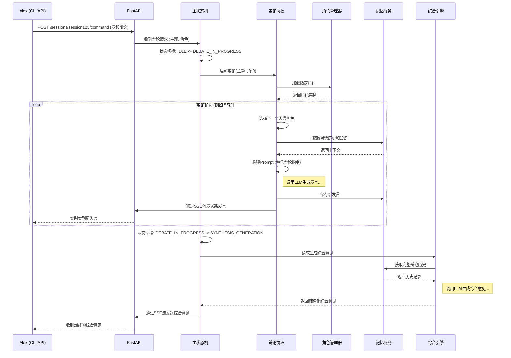

# MVP 用户用例、用户故事和场景说明：多角色辩论

本文档详细描述了 DAIP-MVP 中“多角色辩论”功能的用户用例、用户故事和交互场景。

## 1. 用户画像 (User Personas)

*   **角色**: Alex，一名学术研究员
*   **背景**: Alex 正在研究一个复杂且充满争议的社会科学课题（例如：“人工智能对就业市场的长期影响”）。他需要从多个角度（经济、技术、社会、伦理）收集和验证信息，并形成一个全面、客观的观点。
*   **痛点**:
    *   单一信息源或单一AI模型往往存在偏见或“幻觉”。
    *   很难系统地组织和对比来自不同领域的观点。
    *   需要一个工具来帮助他进行批判性思维和深度分析。

*   **角色**: Sarah，一名企业战略决策者
*   **背景**: Sarah 所在的公司正在考虑是否要投资一项新兴技术。她需要评估这项技术的市场潜力、技术风险和潜在的投资回报率。
*   **痛点**:
    *   需要快速获得关于一个陌生领域的、经过多方验证的深度分析报告。
    *   团队内部可能存在意见分歧，需要一个中立的平台来促进讨论和达成共识。
    *   希望AI能扮演不同领域的专家（如技术专家、市场分析师、财务顾问），为决策提供支持。

## 2. 用户故事 (User Stories)

以 Alex 的视角：

*   **US-1**: 作为一个研究员，我希望能够发起一个多角色AI辩论，并指定一个明确的辩论主题（例如：“人工智能是否会在20年内导致大规模结构性失业？”）。
*   **US-2**: 作为一个研究员，我希望能够从预设的专家库中选择参与辩论的AI角色（例如：经济学家、技术未来学家、社会学家、伦理学家）。
*   **US-3**: 作为一个研究员，我希望能够观察AI角色之间轮流发言、相互诘问、补充论据的完整过程，以了解不同观点的碰撞。
*   **US-4**: 作为一个研究员，我希望系统能够明确标记出AI在辩论中可能出现的“幻觉”或不确定性陈述，以便我进行事实核查。
*   **US-5**: 作为一个研究员，我希望在辩论结束后，能收到一个由“系统综合师”生成的、结构化的综合意见，其中应包含关键论点、共识点、主要分歧以及对未来研究的建议。
*   **US-6**: 作为一个研究员，我希望能够通过简单的命令行界面（CLI）或API接口来启动和监控整个辩论过程。

## 3. 详细流程与序列图



## 4. 示例辩论场景

*   **用户输入**: `!debate --topic "人工智能是否会在20年内导致大规模结构性失业？" --roles "经济学家,技术未来学家,社会学家"`
*   **系统响应 (SSE Stream)**:
    *   `[EVENT: DEBATE_STARTED] 主题: "人工智能是否会在20年内导致大规模结构性失业？"`
    *   `[EVENT: TURN_START] 角色: 经济学家`
    *   `[EVENT: MESSAGE] 经济学家: 从历史角度看，技术进步在短期内会造成摩擦性失业，但长期来看会创造新的就业岗位...`
    *   `[EVENT: TURN_START] 角色: 技术未来学家`
    *   `[EVENT: MESSAGE] 技术未来学家: 我认为这次不同。通用人工智能（AGI）的出现可能会替代大量认知型工作，其替代速度将远超新岗位的创造速度...`
    *   `[EVENT: TURN_START] 角色: 社会学家`
    *   `[EVENT: MESSAGE] 社会学家: 我们需要关注的不仅是失业数量，还有财富分配的公平性。如果AI带来的巨大生产力收益只集中在少数人手中，将会引发严重的社会问题...`
    *   ... (辩论继续) ...
    *   `[EVENT: DEBATE_ENDED]`
    *   `[EVENT: SYNTHESIS_START]`
    *   `[EVENT: SYNTHESIS_RESULT]`
        ```markdown
        # 关于“人工智能对就业市场的长期影响”的综合意见

        ## 1. 核心共识
        *   所有参与者都认为，人工智能将深刻地重塑就业市场，而非简单地替代现有工作。
        *   短期内，特定行业的摩擦性失业不可避免。

        ## 2. 主要分歧点
        *   **替代速度 vs. 创造速度**: 技术未来学家认为替代速度将远超创造速度，而经济学家持更乐观的历史主义观点。
        *   **问题本质**: 社会学家认为核心问题是财富分配，而不仅仅是就业数量。

        ## 3. 潜在幻觉与不确定性
        *   **[UNCERTAINTY]**: 关于AGI出现的确切时间点和能力，目前所有预测都基于推测，缺乏实证依据。

        ## 4. 结论与建议
        *   建议政策制定者应提前布局，建立更完善的社会保障体系和终身学习计划...

## 5. 新增辩论场景测试用例

### 5.1 场景一：专业辩论 (Professional Debate)

*   **目标**: 模拟高专业度、深度分析的辩论，确保AI角色能够引用专业知识、数据和理论进行论证，并进行多轮次（20+）的深入交锋。
*   **主题**: "全球气候变化是否主要由人类活动引起，以及如何有效应对？"
*   **角色**:
    *   **气候科学家**: 提供气候模型、历史数据和科学共识。
    *   **能源政策专家**: 讨论能源转型、政策制定和经济影响。
    *   **地缘政治分析师**: 分析国际合作、国家利益和地缘政治博弈。
    *   **环保主义者**: 强调生态保护、可持续发展和伦理责任。
*   **预期行为**:
    *   每个角色发言应包含至少一个专业术语或数据引用。
    *   辩论应持续至少20轮，每轮发言应针对前一轮的论点进行反驳、补充或深化。
    *   系统应能识别并标记出数据来源或理论依据的潜在不确定性。
*   **用户输入示例**: `!debate --topic "全球气候变化是否主要由人类活动引起，以及如何有效应对？" --roles "气候科学家,能源政策专家,地缘政治分析师,环保主义者" --rounds 25`

### 5.2 场景二：多角色自由辩论 (Multi-Role Free Debate)

*   **目标**: 模拟更开放、更具互动性的自由辩论，允许更多角色参与，并鼓励角色之间进行更频繁、更自然的互动和话题响应。
*   **主题**: "元宇宙的未来发展方向及其对社会的影响"
*   **角色**:
    *   **技术创新者**: 关注元宇宙的技术突破和应用前景。
    *   **社会心理学家**: 分析元宇宙对人类行为、社交和心理健康的影响。
    *   **经济学家**: 评估元宇宙的商业模式、市场潜力和投资风险。
    *   **伦理学家**: 探讨元宇宙中的隐私、数据安全和数字身份等伦理问题。
    *   **艺术家/文化评论家**: 讨论元宇宙对文化、艺术创作和表达形式的影响。
    *   **法律专家**: 关注元宇宙中的法律法规、知识产权和监管挑战。
*   **预期行为**:
    *   辩论应包含至少6个角色，每个角色应积极参与，发言频率较高。
    *   角色发言应能灵活响应其他角色的观点，形成自然的对话流。
    *   辩论轮次应超过20轮，以确保充分的自由讨论。
    *   系统应能处理复杂的话题分支和观点交织。
*   **用户输入示例**: `!debate --topic "元宇宙的未来发展方向及其对社会的影响" --roles "技术创新者,社会心理学家,经济学家,伦理学家,艺术家/文化评论家,法律专家" --rounds 30`

### 5.3 场景三：蓝红对抗辩论 (Blue-Red Adversarial Debate)

*   **目标**: 模拟经典的“正反方”对抗辩论，明确划分支持和反对阵营，鼓励角色之间进行直接的、有针对性的反驳和攻防，并确保辩论深度和轮次。
*   **主题**: "自动驾驶技术应被广泛推广还是严格限制？"
*   **角色**:
    *   **蓝方 (支持推广)**:
        *   **自动驾驶工程师**: 强调技术成熟度、安全性提升和效率优势。
        *   **城市规划师**: 讨论自动驾驶对交通拥堵、城市发展和公共交通的积极影响。
        *   **经济学家**: 分析自动驾驶带来的经济效益、就业机会和产业升级。
    *   **红方 (主张限制)**:
        *   **安全伦理专家**: 关注自动驾驶的伦理困境、责任归属和潜在事故风险。
        *   **社会学家**: 讨论自动驾驶对就业结构、社会公平和人类驾驶技能的影响。
        *   **法律专家**: 探讨自动驾驶的法律框架、监管挑战和保险问题。
*   **预期行为**:
    *   辩论应明确分为两个阵营，每个阵营的角色应协同作战，支持本方观点并反驳对方。
    *   发言应具有明确的攻击性或防御性，直接针对对方的论点。
    *   辩论应持续至少20轮，确保双方有足够的机会进行深入的攻防。
    *   系统应能追踪每个阵营的论点演变和优势劣势。
*   **用户输入示例**: `!debate --topic "自动驾驶技术应被广泛推广还是严格限制？" --roles "自动驾驶工程师(蓝),城市规划师(蓝),经济学家(蓝),安全伦理专家(红),社会学家(红),法律专家(红)" --rounds 20`
