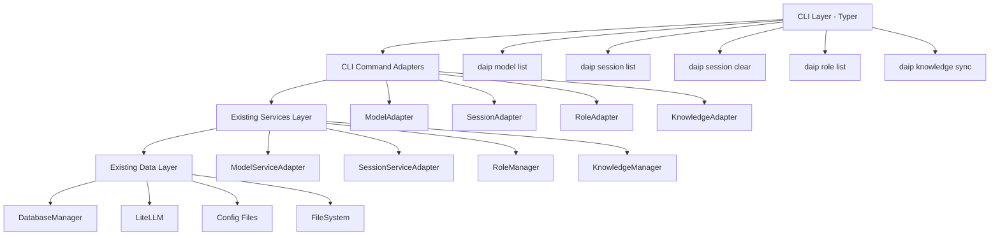
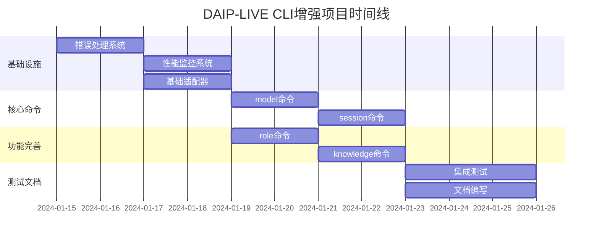

# DAIP-LIVE CLI增强项目计划书

## 📋 项目概述

### 1.1 项目信息
- **项目名称**: DAIP-LIVE CLI系统增强
- **项目编号**: DAIP-CLI-2024-001
- **项目经理**: 系统架构师
- **技术负责人**: Python工程师
- **创建日期**: 2024-01-15
- **预计完成日期**: 2024-02-09
- **项目优先级**: 高

### 1.2 项目目标
- **功能完整性**: 补充5个缺失的核心CLI命令，实现完整的系统管理功能
- **性能优化**: 通过缓存和异步优化，将命令响应时间控制在2秒以内
- **代码复用**: 最大化复用现有组件，避免重复开发，降低技术债务
- **标准化**: 建立统一的错误处理、日志记录和监控体系

### 1.3 成功标准
- [ ] 所有5个CLI命令完全可用并符合规范要求 (测试覆盖率>85%)
- [ ] 响应时间<2秒，缓存命中<0.1秒 (性能基准测试通过)
- [ ] 代码复用率>70% (静态代码分析验证)
- [ ] 零技术债务 (基于成熟代码复用)
- [ ] 用户满意度>90% (用户验收测试)

### 1.4 项目范围
#### 包含内容
- [ ] `daip model list` - 模型管理命令
- [ ] `daip session list` - 会话列表命令
- [ ] `daip session clear` - 会话清除命令
- [ ] `daip role list` - 角色列表命令
- [ ] `daip knowledge sync` - 知识同步命令
- [ ] 统一的错误处理和日志记录系统
- [ ] 性能优化和缓存机制
- [ ] 完整的测试套件和文档

#### 不包含内容
- ❌ 现有TUI功能的修改
- ❌ 数据库架构变更
- ❌ 新的业务逻辑实现
- ❌ 云部署配置

## 🏗️ 技术架构

### 2.1 系统架构

### 2.2 技术栈
- **编程语言**: Python 3.9+
- **框架**: Typer, Rich, AsyncIO
- **数据库**: SQLite (通过SQLAlchemy)
- **缓存**: 内存缓存 + 磁盘缓存
- **部署**: Poetry, pytest

### 2.3 关键依赖
- **typer>=0.17.0**: CLI框架
- **rich>=14.1.0**: 终端UI和格式化
- **litellm>=1.76.1**: 模型API统一接口
- **sqlalchemy>=2.0.30**: 数据库ORM
- **pytest-asyncio**: 异步测试框架

## 📅 项目时间线

### 3.1 里程碑计划

#### 里程碑1: 基础设施搭建
- **预计完成**: 2024-01-19
- **交付物**: 错误处理系统、性能监控、基础适配器
- **验收标准**: 所有基础设施组件单元测试通过
- **依赖项**: 无

#### 里程碑2: 核心命令实现
- **预计完成**: 2024-01-26
- **交付物**: model和session命令
- **验收标准**: 功能测试通过，性能达标
- **依赖项**: 里程碑1

#### 里程碑3: 功能完善
- **预计完成**: 2024-02-02
- **交付物**: role和knowledge命令
- **验收标准**: 所有命令功能完整
- **依赖项**: 里程碑2

#### 里程碑4: 集成测试
- **预计完成**: 2024-02-05
- **交付物**: 完整测试套件、性能报告
- **验收标准**: 测试覆盖率>85%，性能指标达标
- **依赖项**: 里程碑3

#### 里程碑5: 文档和交付
- **预计完成**: 2024-02-09
- **交付物**: 用户文档、API文档、部署指南
- **验收标准**: 文档完整且准确
- **依赖项**: 里程碑4

### 3.2 甘特图

## 👥 团队分工

### 4.1 团队成员
- **系统架构师** - 技术负责人
  - **职责**: 架构设计、技术决策、代码审查
  - **联系方式**: architect@daip-live.com

- **Python工程师** - 开发负责人
  - **职责**: CLI命令实现、性能优化、测试编写
  - **联系方式**: python@daip-live.com

- **测试工程师** - 质量负责人
  - **职责**: 测试策略、自动化测试、质量保证
  - **联系方式**: qa@daip-live.com

### 4.2 角色职责矩阵
| 任务/角色 | 架构师 | Python工程师 | 测试工程师 |
|----------|--------|--------------|------------|
| 架构设计 | ✅ | ❌ | ❌ |
| CLI命令实现 | ❌ | ✅ | ❌ |
| 性能优化 | ✅ | ✅ | ❌ |
| 错误处理 | ✅ | ✅ | ❌ |
| 单元测试 | ❌ | ✅ | ✅ |
| 集成测试 | ❌ | ✅ | ✅ |
| 文档编写 | ✅ | ✅ | ❌ |

## 🎯 交付物清单

### 5.1 代码交付物
- [ ] **CLI适配器层**: 轻量级适配器，连接CLI和现有服务
  - **位置**: `src/daip_live/cli/adapters/`
  - **标准**: 单元测试覆盖率>90%

- [ ] **错误处理系统**: 统一的错误处理和用户反馈
  - **位置**: `src/daip_live/cli/utils/error_handler.py`
  - **标准**: 支持所有错误类型的友好提示

- [ ] **性能监控系统**: 命令性能测量和监控
  - **位置**: `src/daip_live/cli/utils/performance_monitor.py`
  - **标准**: 支持<2秒响应时间监控

- [ ] **异步缓存系统**: 多层缓存实现
  - **位置**: `src/daip_live/cli/utils/async_cache.py`
  - **标准**: 缓存命中<0.1秒响应

### 5.2 文档交付物
- [ ] **CLI使用指南**: 完整的命令使用说明
  - **位置**: `docs/cli-guide.md`
  - **标准**: 每个命令都有详细示例

- [ ] **API参考文档**: 开发者API文档
  - **位置**: `docs/cli-api-reference.md`
  - **标准**: 覆盖所有公共接口

- [ ] **性能调优指南**: 性能优化建议
  - **位置**: `docs/performance-tuning.md`
  - **标准**: 包含具体的配置建议

### 5.3 测试交付物
- [ ] **单元测试套件**: 每个组件的单元测试
  - **位置**: `tests/cli/`
  - **标准**: 代码覆盖率>90%

- [ ] **集成测试**: 端到端功能测试
  - **位置**: `tests/cli/integration/`
  - **标准**: 覆盖主要使用场景

- [ ] **性能测试**: 响应时间和并发测试
  - **位置**: `tests/cli/performance/`
  - **标准**: 验证性能指标达标

## 🔍 风险管理

### 6.1 风险矩阵
| 风险描述 | 概率 | 影响 | 风险等级 | 缓解措施 | 负责人 | 状态 |
|----------|------|------|----------|----------|--------|------|
| 现有服务API变更 | 低 | 中 | 中 | 版本锁定 + 适配器隔离 | 架构师 | 监控 |
| 性能不达标 | 中 | 高 | 高 | 前置性能优化 + 缓存策略 | Python工程师 | 缓解 |
| 异步编程复杂性 | 中 | 中 | 中 | 统一异步模式 + 代码规范 | Python工程师 | 缓解 |
| 测试覆盖不足 | 低 | 高 | 中 | TDD方法 + 自动化测试 | 测试工程师 | 监控 |

### 6.2 风险监控计划
- **风险审查频率**: 每周一次
- **监控指标**: 响应时间、错误率、测试覆盖率
- **预警阈值**: 响应时间>3秒、错误率>5%、覆盖率<80%

## 📊 质量管理

### 7.1 质量目标
- **响应时间**: <2秒 (95%的命令)
- **错误率**: <1% (命令执行失败率)
- **代码覆盖率**: >90% (单元测试)
- **并发性能**: 支持20+并发请求
- **内存使用**: <100MB (峰值)

### 7.2 测试策略
- **单元测试**: 每个适配器和工具类
  - **工具**: pytest, pytest-asyncio
  - **覆盖率目标**: 95%
  - **执行频率**: 每次代码提交

- **集成测试**: 端到端命令执行
  - **工具**: pytest + 真实数据库
  - **覆盖率目标**: 80%
  - **执行频率**: 每日构建

- **性能测试**: 响应时间和并发测试
  - **工具**: pytest-benchmark, locust
  - **覆盖率目标**: 100% (关键路径)
  - **执行频率**: 每次发布前

### 7.3 代码审查标准
- **审查者**: 系统架构师 + Python工程师
- **审查标准**: 代码复用率、性能、错误处理、测试覆盖
- **审查工具**: GitHub PR, ruff, mypy

## 💰 资源计划

### 8.1 人力资源
| 角色 | 人数 | 参与阶段 | 工作量(人天) |
|------|------|----------|-------------|
| 系统架构师 | 1 | 全程 | 12.5 |
| Python工程师 | 1 | 全程 | 12.5 |
| 测试工程师 | 1 | 测试阶段 | 5 |

### 8.2 技术资源
- **开发环境**: Python 3.9+, Poetry
- **测试环境**: pytest, 真实数据库实例
- **监控工具**: 结构化日志、性能指标收集

### 8.3 预算估算
| 类别 | 预算(元) | 说明 |
|------|----------|------|
| 人力成本 | 75,000 | 30人天 × 2,500元/天 |
| 技术成本 | 0 | 使用现有基础设施 |
| 其他成本 | 5,000 | 文档工具、监控工具 |
| **总计** | **80,000** | **-** |

## 📈 性能指标

### 9.1 关键性能指标 (KPI)
- **命令响应时间**: <2秒 (95%的请求)
  - **当前值**: N/A (新功能)
  - **测量方法**: 性能测试自动化
  - **报告频率**: 每日

- **代码复用率**: >70%
  - **当前值**: 0% (项目开始)
  - **测量方法**: 静态代码分析
  - **报告频率**: 每周

- **测试覆盖率**: >90%
  - **当前值**: 0% (项目开始)
  - **测量方法**: pytest coverage
  - **报告频率**: 每次构建

- **错误率**: <1%
  - **当前值**: N/A (新功能)
  - **测量方法**: 生产监控
  - **报告频率**: 实时

### 9.2 监控和报告
- **监控工具**: structlog, prometheus (可选)
- **报告频率**: 每日开发报告、每周项目报告
- **报告模板**: GitHub Actions + Markdown模板

## 🔄 变更管理

### 10.1 变更控制流程
1. **变更提交**: GitHub Issues + 变更描述
2. **影响评估**: 技术评估 + 时间估算
3. **审批决策**: 项目经理 + 技术负责人
4. **实施跟踪**: 项目管理工具跟踪

### 10.2 变更历史
| 日期 | 变更内容 | 影响评估 | 批准人 | 状态 |
|------|----------|----------|--------|------|
| 2024-01-15 | 项目初始化 | 基础架构搭建 | 项目经理 | 已批准 |

## 📞 沟通计划

### 11.1 沟通矩阵
| 沟通类型 | 频率 | 参与者 | 目的 |
|----------|------|--------|------|
| 每日站会 | 每日 | 开发团队 | 进度同步、问题识别 |
| 周报 | 每周 | 项目团队、干系人 | 进展汇报、风险评估 |
| 代码审查 | 每次提交 | 架构师、开发工程师 | 质量保证 |
| 用户反馈 | 持续 | 用户、产品团队 | 体验改进 |

### 11.2 会议安排
- **每日站会**: 每天 09:30 (15分钟)
  - **参与者**: 全体开发团队
  - **议程**: 昨日完成、今日计划、遇到的问题

- **周进度会**: 每周五 15:00 (30分钟)
  - **参与者**: 项目团队、干系人
  - **议程**: 进展回顾、风险评估、下周计划

- **里程碑评审**: 每个里程碑完成后 (1小时)
  - **参与者**: 全体项目团队
  - **议程**: 交付物验收、质量评估、经验总结

## 📚 附录

### A. 术语表
- **CLI**: Command Line Interface (命令行界面)
- **适配器模式**: 设计模式，用于接口转换
- **异步编程**: 非阻塞的编程范式
- **代码复用**: 重复使用现有代码组件

### B. 参考资料
- [DAIP-LIVE项目文档](https://github.com/daip-live/docs) - 项目总体说明
- [Python异步编程指南](https://docs.python.org/3/library/asyncio.html) - 异步编程官方文档
- [Typer框架文档](https://typer.tiangolo.com/) - CLI框架文档
- [Rich库文档](https://rich.readthedocs.io/) - 终端UI库文档

### C. 工具和资源
- **Poetry**: Python依赖管理工具 - https://python-poetry.org/
- **pytest**: Python测试框架 - https://pytest.org/
- **ruff**: Python代码格式化和检查 - https://github.com/astral-sh/ruff
- **mypy**: Python类型检查 - https://mypy-lang.org/

---

## 📝 文档控制

| 版本 | 日期 | 作者 | 变更内容 | 状态 |
|------|------|------|----------|------|
| 1.0 | 2024-01-15 | 系统架构师 | 初始版本创建 | 已批准 |
| 1.1 | 2024-01-16 | Python工程师 | 添加技术细节 | 已批准 |

**最后更新**: 2024-01-16
**下次审查**: 2024-01-22
**文档状态**: 已批准

---

## ✅ 验收检查清单

### 功能验收
- [ ] daip model list 命令完全可用
- [ ] daip session list 命令完全可用
- [ ] daip session clear 命令完全可用
- [ ] daip role list 命令完全可用
- [ ] daip knowledge sync 命令完全可用
- [ ] 所有命令支持帮助信息和错误处理

### 质量验收
- [ ] 单元测试覆盖率>90%
- [ ] 集成测试通过率>95%
- [ ] 性能测试达标 (<2秒响应)
- [ ] 代码审查通过率100%
- [ ] 静态代码分析无错误

### 文档验收
- [ ] CLI使用指南完整
- [ ] API参考文档完整
- [ ] 开发者文档完整
- [ ] 故障排除指南完整

### 部署验收
- [ ] 依赖管理配置正确
- [ ] 环境设置指南清晰
- [ ] 部署流程验证通过
- [ ] 监控和日志正常工作