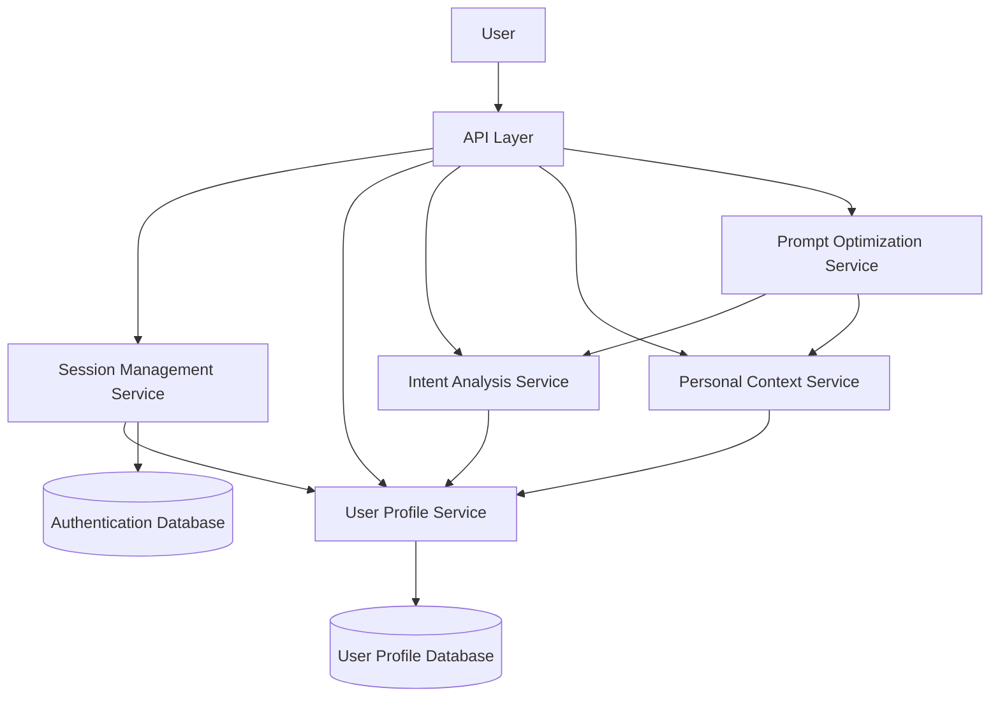
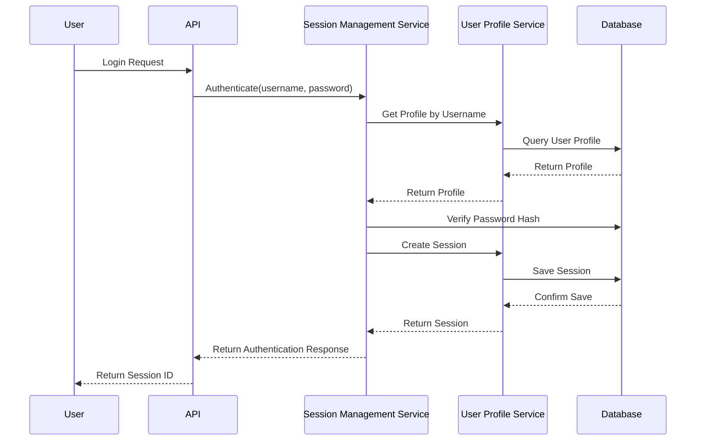

# Human User Intelligence Layer

## Overview

The Human User Intelligence Layer is a foundational component of the DAIP-LIVE project's three-tier intelligence design. It provides personalized experiences for human users by understanding their intent, maintaining context across interactions, and optimizing prompts based on user profiles.

This document describes the architecture and components of the Human User Intelligence Layer, focusing on the user profile and session management functionality that serves as the foundation for more advanced personalization features.

## Architecture

The Human User Intelligence Layer consists of the following components:

1. **User Profile Service**: Manages user profiles, preferences, and interaction history
2. **Session Management Service**: Handles user authentication, session tracking, and security
3. **Intent Analysis Service**: Analyzes user input to understand goals and motivations (placeholder for future implementation)
4. **Personal Context Service**: Maintains user-specific context and background knowledge (placeholder for future implementation)
5. **Prompt Optimization Service**: Enhances prompts based on user profile and intent (placeholder for future implementation)

### Component Diagram



## User Profile Service

The User Profile Service is responsible for creating, retrieving, and updating user profiles. It maintains a persistent store of user information, preferences, and interaction history.

### Key Features

- User profile creation and management
- Preference storage and retrieval
- Interaction history tracking
- Session management
- Intent pattern tracking

### Data Models

#### UserProfile

```python
class UserProfile(BaseModel):
    user_id: str
    username: str
    created_at: datetime
    last_active: datetime
    preferences: Dict[str, Any]
    background_knowledge: List[str]
    interaction_history: List[Dict[str, Any]]
    intent_patterns: Dict[str, float]
    sessions: List[str]
    metadata: Dict[str, Any]
```

#### UserSession

```python
class UserSession(BaseModel):
    session_id: str
    user_id: str
    created_at: datetime
    last_active: datetime
    expires_at: Optional[datetime]
    metadata: Dict[str, Any]
    context: Dict[str, Any]
    is_active: bool
```

## Session Management Service

The Session Management Service handles user authentication, session creation, and session validation. It works closely with the User Profile Service to provide a complete user management solution.

### Key Features

- User registration and authentication
- Session creation and validation
- Password management
- Token generation and validation
- Session expiration and cleanup

### Authentication Flow



## Intent Analysis Service (Future Implementation)

The Intent Analysis Service will analyze user input to understand goals and motivations. It will provide context requirements and personalization opportunities based on the user's intent.

### Planned Features

- Deep analysis of user input
- Context requirement identification
- Conversation flow prediction
- Personalization opportunity detection

## Personal Context Service (Future Implementation)

The Personal Context Service will maintain individual user profiles and preferences. It will track interaction patterns and learning preferences to provide personalized experiences.

### Planned Features

- User profile management
- Interaction pattern tracking
- Background knowledge storage
- Conversation history management

## Prompt Optimization Service (Future Implementation)

The Prompt Optimization Service will enhance prompts based on user profile and intent analysis. It will add relevant context and background information to optimize for the user's communication style and expertise level.

### Planned Features

- Prompt enhancement based on user profile
- Context addition based on intent analysis
- Communication style optimization
- Expertise level adaptation

## API Endpoints

The Human User Intelligence Layer exposes the following API endpoints:

### User Registration and Authentication

- `POST /api/users/register`: Register a new user
- `POST /api/users/login`: Authenticate a user and create a session
- `POST /api/users/logout`: End the current session
- `POST /api/users/token`: Create an authentication token

### User Profile Management

- `GET /api/users/profile`: Get the current user's profile
- `PUT /api/users/profile`: Update the current user's profile
- `POST /api/users/change-password`: Change the current user's password

### Session Management

- `GET /api/users/sessions`: Get all active sessions for the current user
- `POST /api/users/sessions/{session_id}/end`: End a specific session

## Configuration

The Human User Intelligence Layer is configured through the following settings in the application configuration:

```python
class UserProfileConfig(BaseModel):
    data_dir: str = "data/user_profiles"
    max_interaction_history: int = 100
    enable_intent_tracking: bool = True

class SessionConfig(BaseModel):
    auth_data_dir: str = "data/auth"
    session_expiry_minutes: int = 60
    token_expiry_minutes: int = 60
    enable_session_tracking: bool = True
```

## Integration with Other Components

The Human User Intelligence Layer integrates with other components of the DAIP-LIVE project in the following ways:

1. **Universal Services Layer**: The Human User Intelligence Layer uses the Universal Services Layer for token management and context optimization.

2. **Protocol Layer**: The Human User Intelligence Layer provides user context and intent information to the Protocol Layer for personalized debate experiences.

3. **Core Services Layer**: The Human User Intelligence Layer uses the Core Services Layer for memory management and role personalization.

## Future Extensions

The Human User Intelligence Layer is designed to be extensible for future enhancements:

1. **Advanced Intent Analysis**: Implement more sophisticated intent analysis using machine learning techniques.

2. **Personalized Learning**: Track user learning patterns and adapt content presentation accordingly.

3. **Multi-modal Context**: Support context from different modalities (text, images, audio) for richer personalization.

4. **Collaborative Filtering**: Implement collaborative filtering to provide recommendations based on similar users.

5. **Privacy Controls**: Add fine-grained privacy controls for user data and preferences.

## Security Considerations

The Human User Intelligence Layer implements the following security measures:

1. **Password Hashing**: Passwords are hashed using PBKDF2 with SHA-256 and a unique salt for each user.

2. **Session Expiration**: Sessions automatically expire after a configurable time period.

3. **Token Signing**: Authentication tokens are signed using HMAC-SHA256 to prevent tampering.

4. **Session Validation**: Sessions are validated on each request to ensure they are active and not expired.

5. **Password Change Security**: Changing a password invalidates all existing sessions for the user.

## Conclusion

The Human User Intelligence Layer provides a solid foundation for personalized user experiences in the DAIP-LIVE project. By managing user profiles, sessions, and intent, it enables the system to adapt to individual users and provide more relevant and effective interactions.

As the project evolves, the Human User Intelligence Layer will be extended with more advanced personalization features, making the DAIP-LIVE system even more powerful and user-friendly.