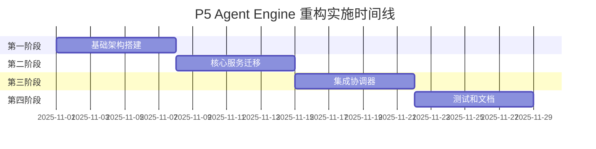

# P5 Agent Engine 实施计划

## 文档信息

- **计划版本**: v1.0
- **创建日期**: 2025-10-31
- **计划周期**: 4周
- **负责团队**: 系统架构团队
- **目标状态**: 成功交付

## 1. 实施概述

### 1.1 实施目标
基于DAIP-LIVE系统的现有规格文档，实施P5 Agent Engine的解耦重构。整个实施过程将采用隔离备份策略，确保不影响现有系统的正常使用。

### 1.2 实施原则
- **零影响**: 重构过程不影响现有系统的任何功能
- **渐进式**: 分阶段实施，每个阶段都可独立交付和验证
- **可回滚**: 任何阶段都可以安全回滚到之前的状态
- **高质量**: 每个交付物都必须达到高质量标准

### 1.3 成功标准
- 所有功能需求100%满足
- 所有性能指标达到或超过现有水平
- 所有代码质量指标达标
- 用户体验显著提升

## 2. 实施阶段规划

### 2.1 整体时间线



### 2.2 阶段概览

| 阶段 | 持续时间 | 主要目标 | 关键交付物 |
|------|----------|----------|------------|
| 第一阶段 | 1周 | 基础架构搭建 | 事件总线、服务容器、状态管理 |
| 第二阶段 | 1周 | 核心服务迁移 | 三大领域服务实现 |
| 第三阶段 | 1周 | 集成协调器 | 轻量级协调器和适配器 |
| 第四阶段 | 1周 | 测试和文档 | 完整测试和文档 |

## 3. 第一阶段：基础架构搭建 (Week 1)

### 3.1 Day 1-2: 事件总线系统

**负责人**: 核心架构师
**任务清单**:
- [ ] 创建`src/daip_live/agent_engine_v1/events/`目录结构
- [ ] 实现EventBus类基础架构
- [ ] 实现事件发布/订阅机制
- [ ] 定义核心事件类型和接口
- [ ] 创建事件处理器基类
- [ ] 实现事件持久化机制
- [ ] 编写事件总线单元测试

**交付物**:
- `src/daip_live/agent_engine_v1/events/event_bus.py`
- `src/daip_live/agent_engine_v1/events/event_types.py`
- `src/daip_live/agent_engine_v1/events/handlers.py`
- `tests/agent_engine/events/test_event_bus.py`

**验收标准**:
- [ ] 事件发布延迟≤10ms
- [ ] 支持1000+并发订阅者
- [ ] 事件持久化功能正常
- [ ] 单元测试覆盖率≥95%

### 3.2 Day 3-5: 服务容器配置

**负责人**: 核心架构师
**任务清单**:
- [ ] 实现ServiceContainer类
- [ ] 定义服务生命周期管理
- [ ] 实现依赖注入机制
- [ ] 创建服务注册配置
- [ ] 添加循环依赖检测
- [ ] 编写容器功能测试

**交付物**:
- `src/daip_live/agent_engine_v1/container.py`
- `src/daip_live/agent_engine_v1/service_registry.py`
- `tests/agent_engine/test_container.py`

**验收标准**:
- [ ] 服务解析时间≤5ms
- [ ] 循环依赖检测100%准确
- [ ] 支持3种生命周期
- [ ] 内存泄漏测试通过

### 3.3 Day 6-7: 状态管理服务

**负责人**: 后端开发工程师
**任务清单**:
- [ ] 创建StateManagementService类
- [ ] 实现状态持久化机制
- [ ] 添加状态变更事件发布
- [ ] 创建状态迁移工具
- [ ] 状态管理测试编写

**交付物**:
- `src/daip_live/agent_engine_v1/services/state_management.py`
- `src/daip_live/agent_engine_v1/models/agent_state.py`
- `tests/agent_engine/services/test_state_management.py`

**验收标准**:
- [ ] 状态读写延迟≤20ms
- [ ] 状态变更事件延迟≤10ms
- [ ] 支持状态版本管理
- [ ] 数据迁移工具正常

## 4. 第二阶段：核心服务迁移 (Week 2)

### 4.1 Day 8-10: 意图识别服务

**负责人**: AI算法工程师
**任务清单**:
- [ ] 创建IntentRecognitionService类
- [ ] 迁移现有意图识别逻辑
- [ ] 实现策略模式支持多种识别算法
- [ ] 添加意图缓存机制
- [ ] 实现意图置信度评分
- [ ] 创建意图识别测试

**交付物**:
- `src/daip_live/agent_engine_v1/services/intent_recognition.py`
- `src/daip_live/agent_engine_v1/services/strategies/intent_strategies.py`
- `tests/agent_engine/services/test_intent_recognition.py`

**验收标准**:
- [ ] 意图识别准确率≥95%
- [ ] 识别响应时间≤100ms
- [ ] 支持3种以上识别策略
- [ ] 缓存命中率≥80%

### 4.2 Day 11-12: 执行引擎服务

**负责人**: AI算法工程师
**任务清单**:
- [ ] 创建ExecutionEngineService类
- [ ] 迁移现有执行逻辑
- [ ] 实现引擎选择和负载均衡
- [ ] 添加执行监控和指标收集
- [ ] 实现执行结果缓存
- [ ] 执行引擎测试编写

**交付物**:
- `src/daip_live/agent_engine_v1/services/execution_engine.py`
- `src/daip_live/agent_engine_v1/services/engines/engine_factory.py`
- `tests/agent_engine/services/test_execution_engine.py`

**验收标准**:
- [ ] 执行成功率≥99%
- [ ] 平均执行时间≤原实现
- [ ] 支持动态引擎切换
- [ ] 监控指标完整准确

### 4.3 Day 13-14: 权限控制服务

**负责人**: 安全工程师
**任务清单**:
- [ ] 创建PermissionService类
- [ ] 集成现有权限系统逻辑
- [ ] 实现权限检查和验证机制
- [ ] 添加权限缓存和批量检查
- [ ] 实现权限审计日志
- [ ] 权限服务测试编写

**交付物**:
- `src/daip_live/agent_engine_v1/services/permission_service.py`
- `src/daip_live/agent_engine_v1/models/permission.py`
- `tests/agent_engine/services/test_permission_service.py`

**验收标准**:
- [ ] 权限检查准确率100%
- [ ] 权限检查延迟≤5ms
- [ ] 审计日志完整可追溯
- [ ] 支持权限批量验证

## 5. 第三阶段：集成协调器 (Week 3)

### 5.1 Day 15-18: 新协调器实现

**负责人**: 核心架构师
**任务清单**:
- [ ] 创建AgentOrchestrator类
- [ ] 实现事件驱动执行流程
- [ ] 集成所有领域服务
- [ ] 实现会话生命周期管理
- [ ] 添加执行监控和错误处理
- [ ] 协调器集成测试

**交付物**:
- `src/daip_live/agent_engine_v1/orchestrator.py`
- `src/daip_live/agent_engine_v1/session_manager.py`
- `tests/agent_engine/test_orchestrator.py`

**验收标准**:
- [ ] 会话创建时间≤50ms
- [ ] 支持并发会话≥100个
- [ ] 错误恢复时间≤10秒
- [ ] 端到端测试通过率100%

### 5.2 Day 19-21: 接口适配层

**负责人**: 核心架构师
**任务清单**:
- [ ] 创建兼容性适配器
- [ ] 保持现有接口签名不变
- [ ] 实现内部逻辑转换
- [ ] 添加接口版本管理
- [ ] 兼容性测试编写

**交付物**:
- `src/daip_live/agent_engine_v1/adapter.py`
- `src/daip_live/agent_engine_v1/interfaces/legacy_api.py`
- `tests/agent_engine/test_adapter.py`

**验收标准**:
- [ ] 所有现有API正常工作
- [ ] 接口性能不低于原实现
- [ ] 兼容性测试100%通过
- [ ] 接口文档完整准确

## 6. 第四阶段：测试和文档 (Week 4)

### 6.1 Day 22-24: 完整测试

**负责人**: 测试工程师
**任务清单**:
- [ ] 端到端功能测试
- [ ] 性能基准测试和对比
- [ ] 兼容性验证测试
- [ ] 压力测试和稳定性测试
- [ ] 安全测试和漏洞扫描
- [ ] 回归测试套件执行

**交付物**:
- `tests/integration/test_e2e.py`
- `tests/performance/test_benchmarks.py`
- `tests/security/test_security.py`
- 测试报告和性能对比报告

**验收标准**:
- [ ] 功能测试通过率100%
- [ ] 性能指标达到预期
- [ ] 安全扫描无高危漏洞
- [ ] 压力测试稳定性达标

### 6.2 Day 25-28: 文档和部署

**负责人**: 技术文档工程师
**任务清单**:
- [ ] API参考文档生成
- [ ] 架构设计文档更新
- [ ] 用户使用指南编写
- [ ] 部署指南和操作手册
- [ ] 迁移指南和最佳实践
- [ ] 开发者指南和扩展文档

**交付物**:
- `docs/api_reference.md`
- `docs/architecture.md`
- `docs/user_guide.md`
- `docs/deployment_guide.md`

**验收标准**:
- [ ] 文档覆盖率≥90%
- [ ] 文档准确性验证通过
- [ ] 用户反馈评分≥4.5/5
- [ ] 部署成功率100%

## 7. 关键里程碑

| 里程碑 | 日期 | 交付物 | 验收标准 |
|--------|------|--------|----------|
| M1: 基础架构完成 | Day 7 | 事件总线、服务容器、状态管理 | 单元测试通过率≥95% |
| M2: 核心服务完成 | Day 14 | 三大领域服务实现 | 功能测试通过率100% |
| M3: 协调器完成 | Day 21 | 轻量级协调器和适配器 | 集成测试通过率100% |
| M4: 测试文档完成 | Day 28 | 完整测试套件和文档 | 最终验收通过 |

## 8. 隔离备份实施方案

### 8.1 版本隔离策略

#### 目录结构设计
```
daip_live/
├── current/                    # 当前版本 (生产)
│   └── agent_engine/
├── v1_refactored/              # 重构版本 (开发)
│   └── agent_engine_v1/
└── backups/                    # 版本备份
    └── agent_engine_backup_20251101/
```

#### 配置隔离
- 重构版本使用独立配置文件: `config_v1.yaml`
- 原有版本配置保持不变: `config.yaml`
- 支持配置迁移和对比工具

#### 数据隔离
- 重构版本使用独立数据库: `data_v1/daip_live.db`
- 原有版本数据完全保留: `data/daip_live.db`
- 支持数据迁移和同步工具

### 8.2 并行运行配置

#### 端口配置
- 原有版本: 默认端口 (如8000)
- 重构版本: 端口+1 (如8001)

#### 数据目录配置
- 原有版本: `data/`
- 重构版本: `data_v1/`

## 9. 质量保障体系

### 9.1 代码质量标准

#### 代码规范
- 使用Black进行代码格式化
- 使用Ruff进行代码检查
- 使用MyPy进行类型检查
- 代码复杂度≤10

#### 测试标准
- 单元测试覆盖率≥90%
- 集成测试覆盖主要流程
- 性能测试建立基准
- 用户测试通过率100%

### 9.2 持续集成

#### CI/CD流程
```yaml
# .github/workflows/p5_refactoring.yml
name: P5 Agent Engine Refactoring CI/CD

on:
  push:
    branches: [main, refactor/p5-*]
  pull_request:
    branches: [main]

jobs:
  test:
    runs-on: ubuntu-latest
    steps:
      - name: 测试P5重构
        run: |
          python scripts/orchestrate_refactoring.py test --phase p5

  build:
    needs: test
    runs-on: ubuntu-latest
    steps:
      - name: 构建P5重构版本
        run: |
          python scripts/orchestrate_refactoring.py build --phase p5

  deploy:
    needs: build
    runs-on: ubuntu-latest
    environment: staging
    steps:
      - name: 部署P5重构版本
        run: |
          python scripts/orchestrate_refactoring.py deploy --phase p5
```

### 9.3 监控和报告

#### 性能监控
- 响应时间监控
- 内存使用监控
- 错误率监控
- 用户行为分析

#### 质量报告
- 每日进度报告
- 代码质量报告
- 测试覆盖率报告
- 性能基准报告

## 10. 风险管理

### 10.1 技术风险

| 风险 | 概率 | 影响 | 缓解措施 |
|------|------|------|----------|
| 性能下降 | 中 | 高 | 性能基准测试、优化策略 |
| 兼容性问题 | 中 | 高 | 兼容性测试、适配器模式 |
| 重构延期 | 高 | 高 | 并行开发、缓冲时间 |
| 团队适应 | 中 | 中 | 培训计划、技术支持 |

### 10.2 进度风险

#### 进度监控
- 每日进度更新
- 每周里程碑评估
- 偏差预警机制
- 调整和优化流程

#### 资源管理
- 人力资源备份计划
- 技术资源预申请
- 外部专家支持
- 时间缓冲安排

## 11. 验收标准

### 11.1 功能验收检查清单

#### P5 Agent Engine功能
- [ ] AgentStatus API返回正确的数据结构
- [ ] 任务导向模式 (`run`方法)功能完整
- [ ] 对话模式 (`chat_run`方法)功能完整
- [ ] 状态管理 (AgentState枚举)正常工作
- [ ] Token使用统计准确
- [ ] 模型名称管理正确
- [ ] 错误处理机制完善
- [ ] 性能指标达标

### 11.2 质量验收检查清单

#### 代码质量
- [ ] 代码规范检查通过率100%
- [ ] 代码复杂度指标达标
- [ ] 类型注解覆盖率≥95%
- [ ] 文档覆盖率≥90%

#### 测试质量
- [ ] 单元测试覆盖率≥90%
- [ ] 集成测试覆盖主要流程
- [ ] 性能测试建立基准
- [ ] 用户测试通过率100%

#### 性能质量
- [ ] 响应时间≥现有实现水平
- [ ] 内存使用≤120%现有实现
- [ ] 并发能力≥现有实现
- [ ] 启动时间≤5秒

### 11.3 用户体验验收检查清单

#### 易用性
- [ ] 界面直观易用
- [ ] 操作流程顺畅
- [ ] 错误处理友好
- [ ] 学习成本合理

#### 可靠性
- [ ] 系统稳定性良好
- [ ] 错误恢复机制完善
- [ ] 数据安全保护到位
- [ ] 备份恢复机制正常

#### 满意度
- [ ] 用户满意度调查得分≥4.5/5
- [ ] 用户反馈及时处理
- [ ] 持续改进机制建立
- [ ] 用户支持体系完善

## 12. 交付标准

### 12.1 交付物清单

#### 源代码交付物
- [ ] P5 Agent Engine重构后源代码
- [ ] 事件总线系统实现
- [ ] 领域服务实现
- [ ] 配置文件和脚本文件

#### 文档交付物
- [ ] 重构设计文档
- [ ] API参考文档
- [ ] 架构设计文档
- [ ] 用户使用指南
- [ ] 开发者指南
- [ ] 部署运维指南

#### 测试交付物
- [ ] 单元测试套件
- [ ] 集成测试套件
- [ ] 性能测试报告
- [ ] 兼容性测试报告
- [ ] 用户体验测试报告

#### 工具交付物
- [ ] 重构工具包
- [ ] 自动化部署脚本
- [ ] 备份恢复脚本
- [ ] 监控和报告工具

### 12.2 交付流程

#### 交付准备
- [ ] 所有交付物完整性检查
- [ ] 代码质量标准验证
- [ ] 功能验收标准验证
- [ ] 文档完整性检查

#### 交付验证
- [ ] 技术团队内部验收
- [ ] 产品团队功能验收
- [ ] 最终用户验收
- [ ] 管理层最终确认

#### 交付确认
- [ ] 交付物签署确认
- [ ] 版本发布准备
- [ ] 部署计划执行
- [ ] 后续支持安排

---

**文档状态**: 草稿
**审批状态**: 待审批
**生效日期**: 审批通过后生效
**最后修改**: 2025-10-31