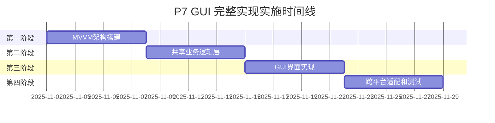

# P7 GUI 完整实现实施计划

## 文档信息

- **计划版本**: v1.0
- **创建日期**: 2025-10-31
- **计划周期**: 4周
- **负责团队**: GUI开发团队
- **目标状态**: 成功交付

## 1. 实施概述

### 1.1 实施目标
基于DAIP-LIVE系统的现有规格文档，实施P7 GUI的完整实现。整个实施过程将采用隔离备份策略，确保不影响现有系统的正常使用。

### 1.2 实施原则
- **零影响**: 实现过程不影响现有系统的任何功能
- **渐进式**: 分阶段实施，每个阶段都可独立交付和验证
- **可回滚**: 任何阶段都可以安全回滚到之前的状态
- **高质量**: 每个交付物都必须达到高质量标准

### 1.3 成功标准
- 所有功能需求100%满足
- GUI功能覆盖率从30%提升到100%
- 跨平台兼容性良好
- 用户体验显著提升

## 2. 实施阶段规划

### 2.1 整体时间线



### 2.2 阶段概览

| 阶段 | 持续时间 | 主要目标 | 关键交付物 |
|------|----------|----------|------------|
| 第一阶段 | 1周 | MVVM架构搭建 | ViewModel框架、命令系统、数据绑定 |
| 第二阶段 | 1周 | 共享业务逻辑层 | InteractionLayer抽象接口、共享逻辑实现 |
| 第三阶段 | 1周 | GUI界面实现 | 主窗口、功能界面、主题系统 |
| 第四阶段 | 1周 | 跨平台适配测试 | 平台测试、性能优化、文档完善 |

## 3. 第一阶段：MVVM架构搭建 (Week 1)

### 3.1 Day 1-3: ViewModel框架

**负责人**: GUI架构师
**任务清单**:
- [ ] 设计ViewModel基类
- [ ] 实现属性变更通知机制
- [ ] 创建命令注册和执行系统
- [ ] 实现ViewModel生命周期管理
- [ ] 创建ViewModel基类测试
- [ ] 设计ViewModel继承体系

**交付物**:
- `src/daip_live/p7_gui_v1/viewmodel/base.py`
- `src/daip_live/p7_gui_v1/viewmodel/lifecycle.py`
- `src/daip_live/p7_gui_v1/viewmodel/property_notifier.py`
- `tests/gui/viewmodel/test_base.py`

**验收标准**:
- [ ] ViewModel基类设计符合MVVM模式
- [ ] 属性变更通知延迟≤50ms
- [ ] 命令执行机制正常
- [ ] 单元测试覆盖率≥95%

### 3.2 Day 4-5: 命令系统

**负责人**: GUI架构师
**任务清单**:
- [ ] 实现Command基类
- [ ] 创建命令参数绑定机制
- [ ] 实现命令可用性检查
- [ ] 创建异步命令支持
- [ ] 命令系统测试编写
- [ ] 命令模式文档编写

**交付物**:
- `src/daip_live/p7_gui_v1/command/base.py`
- `src/daip_live/p7_gui_v1/command/async_command.py`
- `src/daip_live/p7_gui_v1/command/parameter_binding.py`
- `tests/gui/command/test_base.py`

**验收标准**:
- [ ] 命令执行正确无误
- [ ] 命令可用性检查准确
- [ ] 异步命令支持完整
- [ ] 命令系统测试覆盖率≥90%

### 3.3 Day 6-7: 数据绑定机制

**负责人**: GUI架构师
**任务清单**:
- [ ] 实现ObservableProperty类
- [ ] 创建数据绑定引擎
- [ ] 实现单向/双向数据绑定
- [ ] 添加绑定表达式支持
- [ ] 批量更新优化实现
- [ ] 数据绑定测试编写

**交付物**:
- `src/daip_live/p7_gui_v1/binding/observable.py`
- `src/daip_live/p7_gui_v1/binding/binder.py`
- `src/daip_live/p7_gui_v1/binding/expression.py`
- `tests/gui/binding/test_binder.py`

**验收标准**:
- [ ] 数据绑定响应延迟≤50ms
- [ ] 支持复杂的绑定表达式
- [ ] 批量更新性能优化有效
- [ ] 内存泄漏测试通过

## 4. 第二阶段：共享业务逻辑层 (Week 2)

### 4.1 Day 8-10: InteractionLayer抽象接口

**负责人**: 后端架构师
**任务清单**:
- [ ] 设计InteractionLayer抽象接口
- [ ] 定义统一的业务操作接口
- [ ] 创建事件类型定义
- [ ] 实现接口版本管理
- [ ] 编写接口文档和示例
- [ ] 接口测试框架搭建

**交付物**:
- `src/daip_live/shared/interaction_layer.py`
- `src/daip_live/shared/interfaces.py`
- `src/daip_live/shared/events.py`
- `tests/shared/test_interaction_layer.py`

**验收标准**:
- [ ] 接口设计覆盖所有业务需求
- [ ] 接口方法签名清晰准确
- [ ] 事件类型定义完整
- [ ] 接口文档完整准确

### 4.2 Day 11-12: TUI/GUI共享逻辑实现

**负责人**: 后端架构师
**任务清单**:
- [ ] 实现SharedBusinessLogic类
- [ ] 创建TUIInteractionLayer实现
- [ ] 创建GUIInteractionLayer实现
- [ ] 集成现有业务服务
- [ ] 共享逻辑测试编写
- [ ] 业务逻辑一致性验证

**交付物**:
- `src/daip_live/shared/business_logic.py`
- `src/daip_live/shared/tui_interaction.py`
- `src/daip_live/shared/gui_interaction.py`
- `tests/shared/test_business_logic.py`

**验收标准**:
- [ ] 共享逻辑代码复用率≥90%
- [ ] TUI和GUI行为一致性100%
- [ ] 业务逻辑集成测试通过
- [ ] 性能无明显下降

### 4.3 Day 13-14: 集成现有业务服务

**负责人**: 后端架构师
**任务清单**:
- [ ] 集成Agent Engine服务
- [ ] 集成角色管理服务
- [ ] 集成会话管理服务
- [ ] 集成权限管理服务
- [ ] 服务适配器实现
- [ ] 端到端集成测试

**交付物**:
- `src/daip_live/shared/service_adapters.py`
- `src/daip_live/shared/service_registry.py`
- `tests/shared/integration/test_services.py`
- `docs/shared/service_integration.md`

**验收标准**:
- [ ] 所有服务集成成功
- [ ] 服务调用性能正常
- [ ] 错误处理机制完善
- [ ] 集成测试覆盖率≥90%

## 5. 第三阶段：GUI界面实现 (Week 3)

### 5.1 Day 15-17: 主窗口和核心功能界面

**负责人**: GUI工程师
**任务清单**:
- [ ] 实现MainViewModel
- [ ] 创建主窗口布局
- [ ] 实现聊天界面
- [ ] 实现角色管理界面
- [ ] 实现会话管理界面
- [ ] 核心界面测试编写

**交付物**:
- `src/daip_live/p7_gui_v1/viewmodels/main_viewmodel.py`
- `src/daip_live/p7_gui_v1/views/main_window.py`
- `src/daip_live/p7_gui_v1/views/chat_view.py`
- `src/daip_live/p7_gui_v1/views/role_view.py`
- `src/daip_live/p7_gui_v1/views/session_view.py`
- `tests/gui/views/test_main_window.py`

**验收标准**:
- [ ] 主窗口布局合理美观
- [ ] 所有核心功能界面完整
- [ ] 界面响应性能达标
- [ ] 功能测试通过率100%

### 5.2 Day 18-19: 辩论和知识库界面

**负责人**: GUI工程师
**任务清单**:
- [ ] 实现辩论系统界面
- [ ] 实现知识库管理界面
- [ ] 实现权限管理界面
- [ ] 创建高级功能ViewModel
- [ ] 界面交互逻辑实现
- [ ] 高级界面测试编写

**交付物**:
- `src/daip_live/p7_gui_v1/views/debate_view.py`
- `src/daip_live/p7_gui_v1/views/knowledge_view.py`
- `src/daip_live/p7_gui_v1/views/permission_view.py`
- `src/daip_live/p7_gui_v1/viewmodels/debate_viewmodel.py`
- `tests/gui/views/test_debate_view.py`

**验收标准**:
- [ ] 所有高级功能界面完整
- [ ] 界面交互逻辑正确
- [ ] 数据展示格式美观
- [ ] 用户体验测试通过

### 5.3 Day 20-21: 主题和样式系统

**负责人**: UI/UX设计师
**任务清单**:
- [ ] 实现主题管理器
- [ ] 设计深色/浅色主题
- [ ] 创建响应式布局系统
- [ ] 添加快捷键支持
- [ ] 界面美化优化
- [ ] 主题系统测试编写

**交付物**:
- `src/daip_live/p7_gui_v1/theme/manager.py`
- `src/daip_live/p7_gui_v1/theme/styles.py`
- `src/daip_live/p7_gui_v1/theme/responsive.py`
- `src/daip_live/p7_gui_v1/shortcuts/manager.py`
- `src/daip_live/p7_gui_v1/assets/`
- `tests/gui/theme/test_manager.py`

**验收标准**:
- [ ] 主题切换流畅无闪烁
- [ ] 响应式布局适配正确
- [ ] 快捷键功能完整
- [ ] 视觉设计现代化

## 6. 第四阶段：跨平台适配和测试 (Week 4)

### 6.1 Day 22-24: 跨平台测试和优化

**负责人**: 测试工程师
**任务清单**:
- [ ] Windows平台测试和优化
- [ ] macOS平台测试和优化
- [ ] Linux平台测试和优化
- [ ] 跨平台兼容性验证
- [ ] 平台特定问题修复
- [ ] 跨平台测试报告编写

**交付物**:
- `tests/gui/platform/test_windows.py`
- `tests/gui/platform/test_macos.py`
- `tests/gui/platform/test_linux.py`
- `reports/gui/cross_platform_test_report.md`
- `src/daip_live/p7_gui_v1/platform/`

**验收标准**:
- [ ] 三大平台功能完全对等
- [ ] 平台特定功能正常
- [ ] 性能在各平台达标
- [ ] 跨平台测试通过率100%

### 6.2 Day 25-26: 性能优化

**负责人**: 性能工程师
**任务清单**:
- [ ] GUI性能优化
- [ ] 内存使用优化
- [ ] 启动时间优化
- [ ] 渲染性能优化
- [ ] 性能基准测试
- [ ] 性能优化报告编写

**交付物**:
- `src/daip_live/p7_gui_v1/performance/optimizations.py`
- `tests/gui/performance/test_benchmarks.py`
- `scripts/performance_profiler.py`
- `reports/gui/performance_optimization_report.md`

**验收标准**:
- [ ] 界面响应时间≤200ms
- [ ] 内存使用≤500MB
- [ ] 启动时间≤10秒
- [ ] 渲染帧率≥30 FPS

### 6.3 Day 27-28: 文档和最终测试

**负责人**: 技术文档工程师
**任务清单**:
- [ ] API参考文档生成
- [ ] 用户使用指南编写
- [ ] 跨平台部署指南
- [ ] 最终功能验收测试
- [ ] 用户验收测试
- [ ] 完整交付文档整理

**交付物**:
- `docs/gui/api_reference.md`
- `docs/gui/user_guide.md`
- `docs/gui/deployment_guide.md`
- `reports/gui/final_acceptance_report.md`
- `交付物清单和确认文档`

**验收标准**:
- [ ] 文档覆盖率≥90%
- [ ] 用户反馈评分≥4.5/5
- [ ] 最终验收通过率100%
- [ ] 交付物完整性确认

## 7. 关键里程碑

| 里程碑 | 日期 | 交付物 | 验收标准 |
|--------|------|--------|----------|
| M1: MVVM架构完成 | Day 7 | ViewModel框架、命令系统、数据绑定 | 单元测试通过率≥95% |
| M2: 共享逻辑完成 | Day 14 | InteractionLayer、共享业务逻辑 | 集成测试通过率100% |
| M3: GUI界面完成 | Day 21 | 完整GUI界面、主题系统 | 功能测试通过率100% |
| M4: 跨平台完成 | Day 28 | 跨平台适配、性能优化、文档 | 最终验收通过 |

## 8. 隔离备份实施方案

### 8.1 版本隔离策略

#### 目录结构设计
```
daip_live/
├── current/                    # 当前版本 (生产)
│   └── p7_gui/
├── v1_implemented/             # 完整实现版本 (开发)
│   └── p7_gui_v1/
│       ├── viewmodels/
│       ├── views/
│       ├── theme/
│       └── assets/
└── backups/                    # 版本备份
    └── p7_gui_backup_20251101/
```

#### 配置隔离
- 实现版本使用独立配置文件: `config_gui_v1.yaml`
- 原有版本配置保持不变: `config_gui.yaml`
- 主题配置独立管理: `themes_v1/`

#### 数据隔离
- 实现版本使用独立状态存储: `state_v1/gui/`
- 原有状态数据完全保留: `state/gui/`
- 用户配置数据独立: `user_config_v1/`

### 8.2 并行运行配置

#### 端口配置
- 原有版本: 默认端口 (如8020)
- 实现版本: 端口+1 (如8021)

#### 数据目录配置
- 原有版本: `data/gui/`
- 实现版本: `data_v1/gui/`

## 9. 功能对等性保证

### 9.1 核心功能对等性

#### 功能对等检查清单
```python
FUNCTION_PARITY_CHECKLIST = {
    'role_management': {
        'create_role': 'TUI和GUI功能完全对等',
        'edit_role': 'TUI和GUI功能完全对等',
        'delete_role': 'TUI和GUI功能完全对等',
        'role_permissions': 'TUI和GUI功能完全对等'
    },
    'session_management': {
        'create_session': 'TUI和GUI功能完全对等',
        'switch_session': 'TUI和GUI功能完全对等',
        'session_history': 'TUI和GUI功能完全对等',
        'session_export': 'TUI和GUI功能完全对等'
    },
    # ... 其他功能模块
}
```

### 9.2 用户体验对等性

#### 操作流程一致性
- 用户操作步骤数量相同
- 操作界面布局合理对应
- 操作反馈信息一致
- 错误处理方式一致

### 9.3 性能对等性

#### 性能基准对比
- 响应时间对比测试
- 内存使用对比测试
- 并发能力对比测试
- 稳定性对比测试

## 10. 跨平台支持策略

### 10.1 平台特定适配

#### Windows适配
```python
class WindowsPlatformAdapter:
    """Windows平台特定适配"""

    def setup_system_integration(self):
        # 系统托盘集成
        # 文件关联设置
        # Windows通知支持
        pass
```

#### macOS适配
```python
class MacOSPlatformAdapter:
    """macOS平台特定适配"""

    def setup_system_integration(self):
        # 菜单栏集成
        # 触控板手势支持
        # Retina显示优化
        pass
```

#### Linux适配
```python
class LinuxPlatformAdapter:
    """Linux平台特定适配"""

    def setup_system_integration(self):
        # GTK主题集成
        # 包管理器支持
        # 开源社区兼容
        pass
```

### 10.2 统一跨平台API

#### 平台抽象层
```python
class PlatformService(ABC):
    """平台服务抽象接口"""

    @abstractmethod
    def get_system_theme(self) -> str:
        """获取系统主题"""
        pass

    @abstractmethod
    def show_notification(self, title: str, message: str):
        """显示系统通知"""
        pass

    @abstractmethod
    def get_system_fonts(self) -> List[str]:
        """获取系统字体列表"""
        pass
```

## 11. 质量保障体系

### 11.1 代码质量标准

#### 代码规范
- 使用Black进行代码格式化
- 使用Ruff进行代码检查
- 使用MyPy进行类型检查
- 代码复杂度≤10

#### MVVM架构规范
- ViewModel职责单一明确
- View只负责界面展示
- Model只负责数据管理
- 数据绑定单向优先

### 11.2 测试策略

#### 测试金字塔
- **单元测试**: 60% - ViewModel和Command测试
- **集成测试**: 30% - 组件间交互测试
- **端到端测试**: 10% - 完整用户流程测试

#### 测试覆盖率要求
- ViewModel代码覆盖率≥95%
- Command代码覆盖率≥90%
- View代码覆盖率≥80%
- 跨平台兼容性测试=100%

### 11.3 性能监控

#### 关键性能指标
- 界面响应时间≤200ms
- 内存使用≤500MB
- 启动时间≤10秒
- 渲染帧率≥30 FPS

#### 监控工具
- GUI性能分析器
- 内存使用监控器
- 渲染性能监控器
- 跨平台性能对比工具

## 12. 风险管理

### 12.1 技术风险

| 风险 | 概率 | 影响 | 缓解措施 |
|------|------|------|----------|
| 跨平台兼容性问题 | 中 | 高 | 提前多平台测试、框架选择 |
| GUI性能不达预期 | 中 | 中 | 性能基准测试、优化策略 |
| MVVM架构复杂度 | 低 | 中 | 架构简化、文档完善 |
| 共享逻辑集成困难 | 低 | 高 | 接口设计、逐步集成 |

### 12.2 进度风险

#### 进度监控
- 每日进度更新
- 每周里程碑评估
- 偏差预警机制
- 调整和优化流程

#### 资源管理
- GUI开发人员备份计划
- UI/UX设计师资源预申请
- 跨平台测试环境准备
- 时间缓冲安排

## 13. 验收标准

### 13.1 功能验收检查清单

#### GUI功能完整性
- [ ] 角色管理功能与TUI完全对等
- [ ] 会话管理功能与TUI完全对等
- [ ] 辩论系统功能与TUI完全对等
- [ ] 知识库管理功能与TUI完全对等
- [ ] 权限管理功能与TUI完全对等

#### 界面质量
- [ ] GUI界面美观且现代化
- [ ] 跨平台兼容性良好
- [ ] 响应式布局适配正常
- [ ] 主题系统功能完整

### 13.2 架构验收检查清单

#### MVVM架构
- [ ] MVVM架构实现完整
- [ ] 数据绑定机制正常工作
- [ ] 命令模式实现正确
- [ ] ViewModel设计合理

#### 共享逻辑
- [ ] 共享业务逻辑有效
- [ ] TUI/GUI行为一致性100%
- [ ] 业务逻辑复用率≥90%
- [ ] 接口设计清晰合理

### 13.3 跨平台验收检查清单

#### 平台兼容性
- [ ] Windows平台功能完整
- [ ] macOS平台功能完整
- [ ] Linux平台功能完整
- [ ] 平台特定功能正常

#### 性能一致性
- [ ] 各平台响应时间一致
- [ ] 各平台内存使用合理
- [ ] 各平台渲染性能达标
- [ ] 各平台启动时间可接受

## 14. 交付标准

### 14.1 交付物清单

#### 源代码交付物
- [ ] P7 GUI完整实现源代码
- [ ] MVVM架构实现
- [ ] 共享业务逻辑层实现
- [ ] 跨平台适配代码
- [ ] 主题和样式系统
- [ ] 资源文件和配置

#### 文档交付物
- [ ] GUI设计文档
- [ ] MVVM架构文档
- [ ] API参考文档
- [ ] 用户使用指南
- [ ] 跨平台部署指南
- [ ] 开发者指南

#### 测试交付物
- [ ] GUI功能测试套件
- [ ] 跨平台兼容性测试报告
- [ ] 性能测试报告
- [ ] 用户体验测试报告
- [ ] 安全测试报告

#### 工具交付物
- [ ] GUI开发工具包
- [ ] 主题配置工具
- [ ] 跨平台构建工具
- [ ] 性能分析工具
- [ ] 部署自动化工具

### 14.2 交付流程

#### 交付准备
- [ ] 所有交付物完整性检查
- [ ] 代码质量标准验证
- [ ] 功能验收标准验证
- [ ] 跨平台兼容性验证
- [ ] 文档完整性检查

#### 交付验证
- [ ] 技术团队内部验收
- [ ] 产品团队功能验收
- [ ] 跨平台测试验收
- [ ] 最终用户验收
- [ ] 管理层最终确认

#### 交付确认
- [ ] 交付物签署确认
- [ ] 版本发布准备
- [ ] 部署计划执行
- [ ] 后续支持安排
- [ ] 培训计划实施

---

**文档状态**: 草稿
**审批状态**: 待审批
**生效日期**: 审批通过后生效
**最后修改**: 2025-10-31