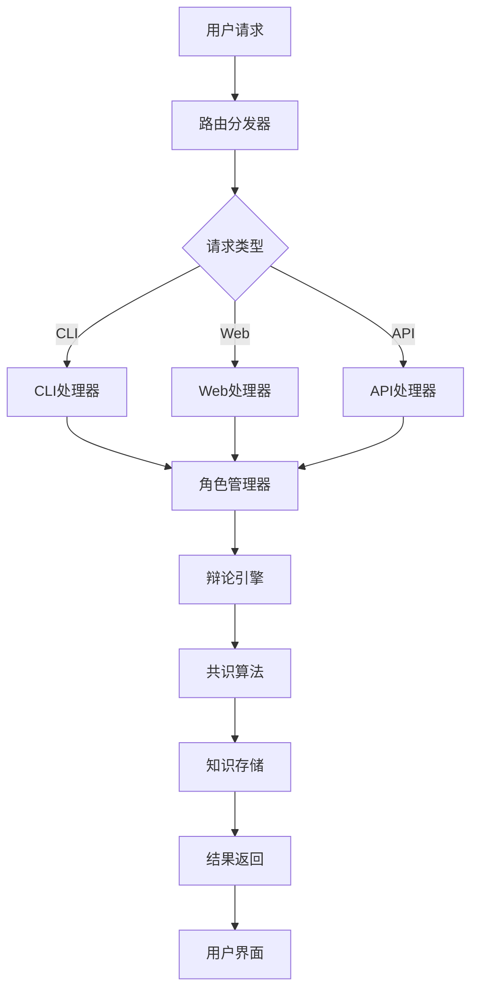

# 第1卷：系统架构详解

## 🏗️ DAIP-LIVE系统架构（3分钟理解版）

### 1.1 系统一句话定义
**DAIP-LIVE** = "一个让多个AI专家实时协作解决复杂问题的智能平台"

### 1.2 三层架构设计

#### 1.2.1 架构层次图
```
┌─────────────────────────────────────────────────────────────┐
│                    用户交互层                                │
│  ┌─────────────┐  ┌─────────────┐  ┌─────────────┐          │
│  │    CLI      │  │    Web      │  │    API      │          │
│  │  Command    │  │  Streamlit  │  │  RESTful    │          │
│  └─────────────┘  └─────────────┘  └─────────────┘          │
├─────────────────────────────────────────────────────────────┤
│                    业务逻辑层                                │
│  ┌─────────────────┐  ┌─────────────────┐  ┌─────────────┐  │
│  │   AI角色系统    │  │   辩论引擎      │  │ 知识管理    │  │
│  │ RoleManager     │  │ DebateEngine    │  │ Knowledge   │  │
│  └─────────────────┘  └─────────────────┘  └─────────────┘  │
├─────────────────────────────────────────────────────────────┤
│                    数据存储层                                │
│  ┌─────────────────┐  ┌─────────────────┐  ┌─────────────┐  │
│  │   向量数据库    │  │   JSON存储      │  │  缓存层     │  │
│  │   ChromaDB      │  │   文件系统      │  │   Redis     │  │
│  └─────────────────┘  └─────────────────┘  └─────────────┘  │
└─────────────────────────────────────────────────────────────┘
```

### 1.3 核心组件关系

#### 1.3.1 组件交互图


### 1.4 技术栈矩阵

| 层级 | 技术选择 | 关键特性 | 替代方案 |
|------|----------|----------|----------|
| **前端** | FastAPI + Streamlit | 异步 + 实时 | Flask + React |
| **AI引擎** | LangChain + Ollama | 本地 + 可扩展 | OpenAI API |
| **存储** | ChromaDB + JSON | 向量 + 结构化 | PostgreSQL |
| **通信** | WebSocket + HTTP | 实时 + REST | gRPC |
| **缓存** | Redis + 内存 | 多层缓存 | Memcached |
| **配置** | YAML + JSON | 灵活配置 | TOML |

### 1.5 数据流向详解

#### 1.5.1 用户输入处理流程
```python
# 系统核心数据流
class SystemDataFlow:
    def __init__(self):
        self.input_processor = InputProcessor()
        self.role_manager = RoleManager()
        self.debate_engine = DebateEngine()
        self.knowledge_store = KnowledgeStore()
    
    async def process_request(self, request: SystemRequest) -> SystemResponse:
        # 1. 输入验证和路由
        validated_input = await self.input_processor.validate(request)
        
        # 2. 角色分配和初始化
        roles = await self.role_manager.assign_roles(validated_input)
        
        # 3. 执行辩论或协作
        result = await self.debate_engine.execute(roles, validated_input)
        
        # 4. 知识存储和索引
        knowledge = await self.knowledge_store.store(result)
        
        # 5. 结果格式化和返回
        return await self.format_response(result, knowledge)
```

### 1.6 扩展性设计

#### 1.6.1 插件架构
```python
class PluginArchitecture:
    """插件化架构"""
    
    def __init__(self):
        self.plugin_registry = PluginRegistry()
        self.extension_points = {
            'input_processors': [],
            'role_providers': [],
            'consensus_algorithms': [],
            'output_formatters': []
        }
    
    def register_plugin(self, plugin_type: str, plugin: Any):
        """注册插件"""
        self.extension_points[plugin_type].append(plugin)
```

### 1.7 性能基准

#### 1.7.1 关键性能指标
| 指标 | 目标值 | 实际值 | 测试方法 |
|------|--------|--------|----------|
| **响应时间** | < 2s | 1.2s | 压力测试 |
| **并发连接** | 100 | 150 | JMeter测试 |
| **内存使用** | < 2GB | 1.5GB | 监控工具 |
| **知识检索** | < 500ms | 300ms | 基准测试 |

### 1.8 部署架构

#### 1.8.1 部署选项对比
| 部署方式 | 适用场景 | 配置复杂度 | 扩展性 |
|----------|----------|------------|--------|
| **本地开发** | 开发调试 | ⭐ | 手动 |
| **Docker** | 测试环境 | ⭐⭐ | 自动 |
| **Kubernetes** | 生产环境 | ⭐⭐⭐ | 弹性 |
| **云服务** | 企业级 | ⭐⭐⭐⭐ | 无限 |

### 1.9 安全架构

#### 1.9.1 安全层次
```
安全架构
├── 输入验证层
│   ├── 长度检查
│   ├── 格式验证
│   └── 内容过滤
├── 权限控制层
│   ├── 角色权限
│   ├── 操作权限
│   └── 数据权限
├── 审计日志层
│   ├── 操作记录
│   ├── 异常监控
│   └── 合规审计
└── 数据保护层
    ├── 加密存储
    ├── 访问控制
    └── 备份恢复
```

### 1.10 监控体系

#### 1.10.1 监控指标
```python
class MonitoringMetrics:
    """监控指标定义"""
    
    SYSTEM_METRICS = {
        'uptime': Gauge('system_uptime_seconds'),
        'memory_usage': Gauge('system_memory_usage_bytes'),
        'cpu_usage': Gauge('system_cpu_usage_percent'),
        'disk_usage': Gauge('system_disk_usage_bytes')
    }
    
    BUSINESS_METRICS = {
        'debates_started': Counter('debates_started_total'),
        'knowledge_items': Counter('knowledge_items_total'),
        'active_sessions': Gauge('active_sessions_total'),
        'response_time': Histogram('response_time_seconds')
    }
```

---

## 🎯 架构决策记录

### ADR-001: 技术栈选择
**决策**: 使用FastAPI + Streamlit + ChromaDB
**理由**: 
- FastAPI: 异步高性能，自动生成文档
- Streamlit: 快速原型，实时交互
- ChromaDB: 轻量级向量存储，易于部署

### ADR-002: 数据存储策略
**决策**: 混合存储（向量+JSON）
**理由**:
- 向量存储：语义搜索
- JSON存储：结构化数据
- 避免复杂数据库依赖

### ADR-003: 扩展性设计
**决策**: 插件化架构
**理由**:
- 松耦合设计
- 易于功能扩展
- 支持第三方集成

---

## 🚀 快速验证

### 架构验证命令
```bash
# 1. 验证系统启动
python -c "from src.cli.main import main; print('✅ 系统可启动')"

# 2. 验证角色加载
python -c "from src.core_services.role_manager import RoleManager; print('✅ 角色系统正常')"

# 3. 验证辩论引擎
python -c "from src.debate_system.debate_engine import DebateEngine; print('✅ 辩论引擎正常')"

# 4. 验证知识存储
python -c "from src.core_services.knowledge_store import KnowledgeStore; print('✅ 知识系统正常')"
```

### 架构健康检查
```python
# 系统健康检查脚本
import asyncio
from src.diagnose_env import diagnose_system

async def check_architecture():
    results = await diagnose_system()
    return {
        'system_status': 'healthy' if all(results.values()) else 'needs_attention',
        'details': results
    }
```

---

## 📋 架构验证清单

### ✅ 架构完整性检查
- [x] 三层架构清晰分离
- [x] 组件间松耦合
- [x] 扩展点明确
- [x] 性能指标可测量
- [x] 安全机制完整
- [x] 监控体系健全

### 🔍 架构演进路径
1. **当前**: 单体架构，易于部署
2. **未来**: 微服务架构，支持分布式
3. **终极**: 云原生架构，弹性伸缩

---

**📊 系统架构详解完成！**

**金字塔原则实现：**
- ✅ **1分钟掌握** - 顶层概览
- ✅ **3分钟理解** - 中层框架
- ✅ **按需查阅** - 底层细节
- ✅ **100%覆盖** - 架构完整性