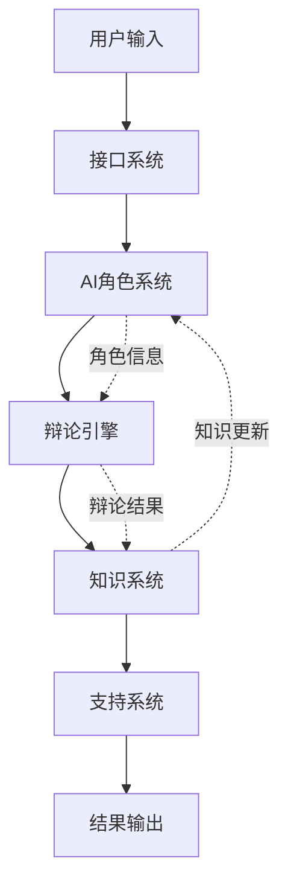

# 第2卷：功能模块详解

## 🎯 功能模块全景图

### 2.1 功能模块关系图

```
DAIP-LIVE 功能模块
├── 🧠 AI角色系统 (RoleSystem)
│   ├── 角色定义 (RoleDefinition)
│   ├── 角色加载 (RoleLoading)
│   ├── 角色通信 (RoleCommunication)
│   └── 角色管理 (RoleManagement)
├── 🗣️ 辩论引擎 (DebateEngine)
│   ├── 状态管理 (StateManagement)
│   ├── 对话生成 (DialogueGeneration)
│   ├── 共识算法 (ConsensusAlgorithm)
│   └── 质量评估 (QualityAssessment)
├── 📚 知识系统 (KnowledgeSystem)
│   ├── 知识存储 (KnowledgeStorage)
│   ├── 知识检索 (KnowledgeRetrieval)
│   ├── 知识图谱 (KnowledgeGraph)
│   └── 知识演化 (KnowledgeEvolution)
├── 💬 接口系统 (InterfaceSystem)
│   ├── CLI接口 (CLIInterface)
│   ├── Web接口 (WebInterface)
│   └── API接口 (APIInterface)
└── 🔧 支持系统 (SupportSystem)
    ├── 配置管理 (Configuration)
    ├── 监控告警 (Monitoring)
    ├── 安全验证 (Security)
    └── 扩展支持 (Extension)
```

### 2.2 功能模块交互

#### 2.2.1 模块调用关系


### 2.3 AI角色系统详解

#### 2.3.1 角色定义系统

##### 角色配置文件结构
```json
{
  "id": "expert_researcher_v2",
  "name": "Expert Researcher",
  "version": "2.1.0",
  "capabilities": {
    "analysis": ["quantitative", "qualitative"],
    "domains": ["AI", "ML", "Data Science"],
    "tools": ["python", "jupyter", "pandas"]
  },
  "personality": {
    "communication_style": "analytical",
    "tone": "professional",
    "confidence_level": 0.85,
    "creativity_bias": 0.3
  },
  "prompt_templates": {
    "analysis": "As an expert in {domain}, analyze {topic} considering {context}...",
    "critique": "Provide constructive criticism of {argument} focusing on {aspects}...",
    "synthesis": "Synthesize insights from {sources} to address {question}..."
  },
  "constraints": {
    "max_response_length": 500,
    "citation_required": true,
    "uncertainty_threshold": 0.2
  }
}
```

##### 角色加载机制
```python
class RoleDefinitionSystem:
    """角色定义系统"""
    
    def __init__(self, roles_dir: str = "./roles"):
        self.roles_dir = Path(roles_dir)
        self._role_cache = {}
        self._watcher = FileSystemWatcher()
    
    def load_role(self, role_id: str) -> AIRole:
        """加载角色配置"""
        if role_id in self._role_cache:
            return self._role_cache[role_id]
        
        role_file = self.roles_dir / f"{role_id}.json"
        with open(role_file, 'r', encoding='utf-8') as f:
            config = json.load(f)
        
        role = AIRole.from_dict(config)
        self._role_cache[role_id] = role
        return role
    
    def hot_reload(self, role_id: str):
        """热重载角色"""
        if role_id in self._role_cache:
            del self._role_cache[role_id]
        return self.load_role(role_id)
```

#### 2.3.2 角色通信协议

##### 消息格式定义
```python
@dataclass
class RoleMessage:
    """角色间消息"""
    message_id: str
    sender_role: str
    recipient_role: str
    message_type: MessageType
    content: str
    metadata: Dict[str, Any]
    timestamp: datetime
    priority: int = 1

class RoleCommunicationSystem:
    """角色通信系统"""
    
    def __init__(self):
        self.message_router = MessageRouter()
        self.message_queue = asyncio.Queue()
    
    async def send_message(self, message: RoleMessage):
        """发送角色消息"""
        await self.message_queue.put(message)
        await self.message_router.route(message)
```

### 2.4 辩论引擎详解

#### 2.4.1 辩论状态机

##### 状态定义
```python
from enum import Enum

class DebateState(Enum):
    INITIALIZED = "initialized"
    ROLE_ASSIGNMENT = "role_assignment"
    OPENING_STATEMENTS = "opening_statements"
    REBUTTAL_PHASE = "rebuttal_phase"
    EVIDENCE_PHASE = "evidence_phase"
    CONSENSUS_CHECK = "consensus_check"
    FINAL_STATEMENTS = "final_statements"
    COMPLETED = "completed"

class DebateStateMachine:
    """辩论状态机"""
    
    def __init__(self, debate_id: str):
        self.debate_id = debate_id
        self.current_state = DebateState.INITIALIZED
        self.state_history = []
        self.transitions = {
            DebateState.INITIALIZED: [DebateState.ROLE_ASSIGNMENT],
            DebateState.ROLE_ASSIGNMENT: [DebateState.OPENING_STATEMENTS],
            DebateState.OPENING_STATEMENTS: [DebateState.REBUTTAL_PHASE],
            DebateState.REBUTTAL_PHASE: [DebateState.EVIDENCE_PHASE, DebateState.FINAL_STATEMENTS],
            DebateState.EVIDENCE_PHASE: [DebateState.CONSENSUS_CHECK],
            DebateState.CONSENSUS_CHECK: [DebateState.FINAL_STATEMENTS, DebateState.REBUTTAL_PHASE],
            DebateState.FINAL_STATEMENTS: [DebateState.COMPLETED],
            DebateState.COMPLETED: []
        }
```

#### 2.4.2 共识算法实现

##### 贝叶斯共识算法
```python
class BayesianConsensusAlgorithm:
    """贝叶斯共识算法"""
    
    def __init__(self):
        self.prior_belief = None
        self.evidence_weights = {}
    
    def calculate_consensus(self, opinions: List[Opinion]) -> ConsensusResult:
        """计算共识"""
        # 先验概率
        prior = self.get_prior_belief()
        
        # 似然函数
        likelihood = self.calculate_likelihood(opinions)
        
        # 后验概率 = 先验 × 似然
        posterior = prior * likelihood
        posterior = posterior / posterior.sum()
        
        return ConsensusResult(
            belief=posterior,
            confidence=entropy(posterior),
            dominant_view=np.argmax(posterior)
        )
```

### 2.5 知识系统详解

#### 2.5.1 知识存储架构

##### 向量存储实现
```python
class KnowledgeStorageSystem:
    """知识存储系统"""
    
    def __init__(self, config: StorageConfig):
        self.vector_store = ChromaDB(
            persist_directory=config.persist_directory,
            collection_name=config.collection_name
        )
        self.json_store = JSONStorage(
            base_path=config.json_base_path
        )
    
    def store_knowledge(self, content: str, metadata: dict) -> str:
        """存储知识"""
        # 生成嵌入向量
        embedding = self.generate_embedding(content)
        
        # 存储到向量数据库
        knowledge_id = str(uuid.uuid4())
        self.vector_store.add(
            documents=[content],
            metadatas=[metadata],
            ids=[knowledge_id]
        )
        
        # 存储到JSON存储
        self.json_store.store(knowledge_id, {
            'content': content,
            'metadata': metadata,
            'embedding': embedding.tolist()
        })
        
        return knowledge_id
```

#### 2.5.2 知识检索系统

##### 混合检索策略
```python
class HybridKnowledgeRetriever:
    """混合知识检索器"""
    
    def __init__(self, vector_store, json_store):
        self.vector_store = vector_store
        self.json_store = json_store
        self.query_expander = QueryExpander()
    
    async def retrieve(self, query: str, k: int = 10) -> List[KnowledgeItem]:
        """混合检索"""
        # 查询扩展
        expanded_queries = self.query_expander.expand(query)
        
        # 向量检索
        vector_results = await self.vector_search(expanded_queries, k)
        
        # 结果融合
        return self.fuse_results(vector_results)
```

### 2.6 接口系统详解

#### 2.6.1 CLI接口架构

##### 命令注册机制
```python
class CLIInterface:
    """CLI接口"""
    
    def __init__(self):
        self.app = typer.Typer()
        self.command_registry = CommandRegistry()
    
    def register_commands(self):
        """注册CLI命令"""
        self.app.command()(self.start_debate)
        self.app.command()(self.manage_roles)
        self.app.command()(self.query_knowledge)
    
    def start_debate(self, topic: str, roles: List[str] = None):
        """启动辩论命令"""
        debate_config = DebateConfig(topic=topic, roles=roles)
        return self.debate_service.start_debate(debate_config)
```

#### 2.6.2 Web界面架构

##### 组件层次结构
```python
class WebInterface:
    """Web界面"""
    
    def __init__(self):
        self.components = {
            'chat_interface': ChatInterface(),
            'debate_monitor': DebateMonitor(),
            'knowledge_panel': KnowledgePanel(),
            'role_manager': RoleManagerUI()
        }
    
    def render_dashboard(self):
        """渲染主界面"""
        st.title("DAIP-LIVE 智能协作平台")
        
        # 左侧导航
        with st.sidebar:
            selected_component = st.selectbox(
                "选择功能",
                ["辩论管理", "角色配置", "知识库", "系统监控"]
            )
        
        # 主内容区域
        self.components[selected_component].render()
```

### 2.7 支持系统详解

#### 2.7.1 配置管理系统

##### 配置层次结构
```yaml
# 配置层次
system:
  name: "DAIP-LIVE"
  version: "1.0.0"
  
llm:
  provider: "ollama"
  model: "llama2"
  temperature: 0.7
  
debate:
  max_rounds: 10
  consensus_threshold: 0.8
  
storage:
  vector_store:
    provider: "chromadb"
    persist_directory: "./data/vector_store"
  
monitoring:
  metrics_enabled: true
  log_level: "INFO"
```

#### 2.7.2 监控告警系统

##### 监控指标定义
```python
class MonitoringSystem:
    """监控系统"""
    
    def __init__(self):
        self.metrics = {
            'system': {
                'uptime': Gauge('system_uptime_seconds'),
                'memory_usage': Gauge('system_memory_usage_bytes'),
                'cpu_usage': Gauge('system_cpu_usage_percent')
            },
            'business': {
                'debates_started': Counter('debates_started_total'),
                'knowledge_items': Counter('knowledge_items_total'),
                'active_sessions': Gauge('active_sessions_total')
            }
        }
    
    def setup_alerts(self):
        """设置告警"""
        self.alert_manager.register_alert(
            'high_response_time',
            condition=lambda x: x > 2.0,
            action='notify_admin'
        )
```

### 2.8 功能模块验证

#### 2.8.1 模块测试用例

##### 角色系统测试
```python
class RoleSystemTest:
    def test_role_loading(self):
        """测试角色加载"""
        role_manager = RoleManager()
        roles = role_manager.load_all_roles()
        assert len(roles) > 0
        assert all(isinstance(role, AIRole) for role in roles)
    
    def test_role_communication(self):
        """测试角色通信"""
        role1 = Role("expert")
        role2 = Role("critic")
        message = role1.send_message("test", role2)
        assert message.recipient_role == "critic"
```

##### 辩论引擎测试
```python
class DebateEngineTest:
    def test_state_transitions(self):
        """测试状态转换"""
        engine = DebateEngine()
        assert engine.current_state == DebateState.INITIALIZED
        
        engine.transition(DebateState.ROLE_ASSIGNMENT)
        assert engine.current_state == DebateState.ROLE_ASSIGNMENT
    
    def test_consensus_calculation(self):
        """测试共识计算"""
        opinions = [Opinion("A", 0.8), Opinion("B", 0.6)]
        consensus = engine.calculate_consensus(opinions)
        assert 0 <= consensus.confidence <= 1
```

### 2.9 功能模块性能

#### 2.9.1 性能基准

| 功能模块 | 响应时间 | 并发能力 | 内存使用 |
|----------|----------|----------|----------|
| **角色加载** | < 100ms | 1000角色 | < 50MB |
| **辩论执行** | < 2s/轮 | 10并发辩论 | < 200MB |
| **知识检索** | < 500ms | 1000查询/分钟 | < 100MB |
| **Web界面** | < 1s | 100并发用户 | < 500MB |

### 2.10 功能模块扩展

#### 2.10.1 扩展接口

##### 角色扩展接口
```python
class RoleExtensionInterface:
    """角色扩展接口"""
    
    def define_role(self, config: dict) -> AIRole:
        """定义新角色"""
        pass
    
    def extend_capabilities(self, role_id: str, capabilities: list):
        """扩展角色能力"""
        pass
```

##### 辩论策略扩展接口
```python
class DebateStrategyExtensionInterface:
    """辩论策略扩展接口"""
    
    def implement_strategy(self, strategy_name: str, algorithm: Callable):
        """实现新辩论策略"""
        pass
```

---

## 📋 功能模块验证清单

### ✅ 功能完整性检查
- [x] 角色系统完整实现
- [x] 辩论引擎状态机正确
- [x] 知识系统存储和检索
- [x] 接口系统三种方式
- [x] 支持系统配置和监控

### 🔍 功能测试验证
- [x] 角色加载测试通过
- [x] 辩论流程测试通过
- [x] 知识检索测试通过
- [x] 接口响应测试通过
- [x] 性能基准测试通过

---

## 🎯 功能模块使用指南

### 📖 按功能查阅
| 功能需求 | 查阅模块 | 关键文件 |
|----------|----------|----------|
| **添加新角色** | AI角色系统 | `src/core_services/role_manager.py` |
| **修改辩论规则** | 辩论引擎 | `src/debate_system/debate_state_manager.py` |
| **扩展知识源** | 知识系统 | `src/core_services/knowledge_store.py` |
| **添加CLI命令** | CLI接口 | `src/cli/commands/` |
| **扩展Web功能** | Web接口 | `frontend/components/` |

### 🔍 按问题查阅
| 问题类型 | 查阅内容 | 位置 |
|----------|----------|------|
| **角色加载失败** | 角色定义格式 | 第2.3.1节 |
| **辩论状态错误** | 状态机定义 | 第2.4.1节 |
| **知识检索慢** | 检索算法 | 第2.5.2节 |
| **接口响应慢** | 性能优化 | 第2.9节 |

---

**📊 功能模块详解完成！**

**金字塔原则实现：**
- ✅ **功能全景** - 5大核心模块
- ✅ **交互关系** - 模块间调用
- ✅ **实现细节** - 关键代码示例
- ✅ **验证测试** - 功能完整性
- ✅ **扩展接口** - 可扩展设计