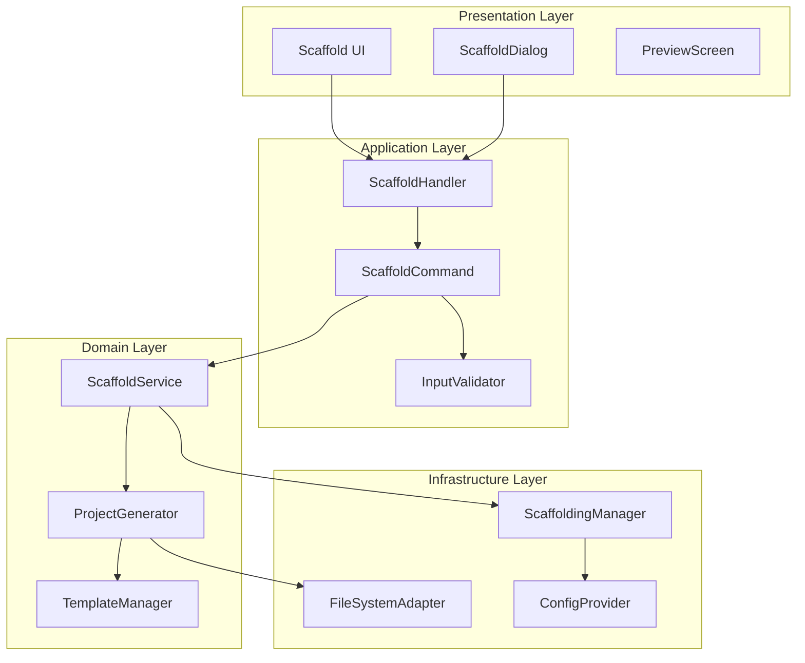

# Scaffold 脚手架功能设计文档

## 📋 文档信息
- **文档版本**: v2.0
- **创建日期**: 2025-11-25
- **设计原则**: SOLID, KISS, YAGNI, DRY
- **架构模式**: MVC + Command + Observer
- **基于需求**: SCAFFOLD_REQUIREMENTS_SPEC.md v2.0

## 🏗️ 架构设计

### 整体架构图


### 核心设计原则

#### 1. SOLID 原则应用

**S - Single Responsibility Principle (单一职责原则)**
```python
# 每个类只有一个职责
class ScaffoldCommand:          # 职责：命令解析和执行
    pass

class InputValidator:          # 职责：输入验证
    pass

class ProjectGenerator:        # 职责：项目生成
    pass

class FileSystemAdapter:       # 职责：文件系统操作
    pass
```

**O - Open/Closed Principle (开闭原则)**
```python
# 对扩展开放，对修改关闭
class TemplateManager:
    def __init__(self):
        self._template_strategies = {}

    def register_template(self, template_type: str, strategy: TemplateStrategy):
        """注册新的模板策略，无需修改现有代码"""
        self._template_strategies[template_type] = strategy

class TemplateStrategy(ABC):
    @abstractmethod
    def generate(self, description: str) -> dict:
        pass
```

**L - Liskov Substitution Principle (里氏替换原则)**
```python
# 子类可以完全替换父类
class ModelProvider(ABC):
    @abstractmethod
    async def generate(self, prompt: str) -> str:
        pass

class LiteLLMProvider(ModelProvider):
    async def generate(self, prompt: str) -> str:
        # 具体实现
        pass

class LocalModelProvider(ModelProvider):
    async def generate(self, prompt: str) -> str:
        # 不同实现，但接口一致
        pass
```

**I - Interface Segregation Principle (接口隔离原则)**
```python
# 细粒度接口，避免不必要的依赖
class InputProcessor(Protocol):
    def validate(self, input_data: str) -> ValidationResult:
        pass

class FileProcessor(Protocol):
    def read_file(self, file_path: str) -> str:
        pass

class ScaffoldExecutor(Protocol):
    async def execute(self, request: ScaffoldRequest) -> ScaffoldResult:
        pass
```

**D - Dependency Inversion Principle (依赖倒置原则)**
```python
# 高层模块不依赖低层模块，都依赖抽象
class ScaffoldService:
    def __init__(
        self,
        generator: ProjectGenerator,        # 依赖抽象
        file_adapter: FileSystemAdapter,    # 依赖抽象
        validator: InputValidator           # 依赖抽象
    ):
        self._generator = generator
        self._file_adapter = file_adapter
        self._validator = validator
```

## 🔧 详细设计

### 1. 命令处理层设计

#### 1.1 ScaffoldCommand 类
```python
from typing import List, Optional
from dataclasses import dataclass
from enum import Enum

class InputType(Enum):
    TEXT = "text"
    FILE = "file"

@dataclass
class ScaffoldCommand:
    """脚手架命令 - 单一职责：命令解析"""
    input_type: InputType
    description: str
    file_path: Optional[str] = None
    auto_confirm: bool = False

    @classmethod
    def parse(cls, args: str) -> 'ScaffoldCommand':
        """从命令行参数解析命令对象"""
        # 实现解析逻辑
        pass

    def validate(self) -> List[str]:
        """验证命令有效性"""
        # 实现验证逻辑
        pass
```

#### 1.2 InputValidator 类
```python
class ValidationResult:
    def __init__(self, is_valid: bool, errors: List[str], warnings: List[str]):
        self.is_valid = is_valid
        self.errors = errors
        self.warnings = warnings

class InputValidator:
    """输入验证器 - 单一职责：验证输入数据"""

    MIN_DESCRIPTION_LENGTH = 10
    MAX_DESCRIPTION_LENGTH = 5000
    MAX_FILE_SIZE = 1024 * 1024  # 1MB
    SUPPORTED_FILE_EXTENSIONS = {'.txt', '.md', '.docx'}

    def validate_description(self, description: str) -> ValidationResult:
        """验证项目描述"""
        errors = []
        warnings = []

        if not description:
            errors.append("描述不能为空")
        elif len(description) < self.MIN_DESCRIPTION_LENGTH:
            errors.append(f"描述长度不能少于{self.MIN_DESCRIPTION_LENGTH}个字符")
        elif len(description) > self.MAX_DESCRIPTION_LENGTH:
            errors.append(f"描述长度不能超过{self.MAX_DESCRIPTION_LENGTH}个字符")

        return ValidationResult(len(errors) == 0, errors, warnings)

    def validate_file_path(self, file_path: str) -> ValidationResult:
        """验证文件路径"""
        errors = []
        warnings = []

        if not file_path:
            errors.append("文件路径不能为空")
            return ValidationResult(False, errors, warnings)

        # 检查文件是否存在
        if not os.path.exists(file_path):
            errors.append("文件不存在")
            return ValidationResult(False, errors, warnings)

        # 检查文件大小
        file_size = os.path.getsize(file_path)
        if file_size > self.MAX_FILE_SIZE:
            errors.append(f"文件大小不能超过{self.MAX_FILE_SIZE // (1024*1024)}MB")

        # 检查文件扩展名
        file_ext = Path(file_path).suffix.lower()
        if file_ext not in self.SUPPORTED_FILE_EXTENSIONS:
            warnings.append(f"不支持的文件格式: {file_ext}")

        return ValidationResult(len(errors) == 0, errors, warnings)
```

### 2. 应用服务层设计

#### 2.1 ScaffoldService 类
```python
class ScaffoldService:
    """脚手架服务 - 应用层协调器"""

    def __init__(
        self,
        generator: ProjectGenerator,
        file_adapter: FileSystemAdapter,
        validator: InputValidator,
        template_manager: TemplateManager
    ):
        self._generator = generator
        self._file_adapter = file_adapter
        self._validator = validator
        self._template_manager = template_manager

    async def execute_scaffold(self, command: ScaffoldCommand) -> ScaffoldResult:
        """执行脚手架操作的主要流程"""
        try:
            # 1. 验证输入
            validation_result = self._validate_command(command)
            if not validation_result.is_valid:
                return ScaffoldResult.failure(validation_result.errors)

            # 2. 获取项目描述
            description = await self._get_description(command)

            # 3. 生成项目结构
            project_structure = await self._generator.generate(description)

            # 4. 创建结果对象
            result = ScaffoldResult.success(project_structure)

            return result

        except Exception as e:
            return ScaffoldResult.failure([f"执行失败: {str(e)}"])

    async def _get_description(self, command: ScaffoldCommand) -> str:
        """获取项目描述"""
        if command.input_type == InputType.TEXT:
            return command.description
        elif command.input_type == InputType.FILE:
            return await self._file_adapter.read_file(command.file_path)
        else:
            raise ValueError(f"不支持的输入类型: {command.input_type}")

    def _validate_command(self, command: ScaffoldCommand) -> ValidationResult:
        """验证命令"""
        if command.input_type == InputType.TEXT:
            return self._validator.validate_description(command.description)
        elif command.input_type == InputType.FILE:
            return self._validator.validate_file_path(command.file_path)
        else:
            return ValidationResult(False, ["不支持的输入类型"])
```

#### 2.2 ProjectGenerator 类
```python
class ProjectGenerator:
    """项目生成器 - 单一职责：生成项目结构"""

    def __init__(
        self,
        scaffolding_manager: ScaffoldingManager,
        template_manager: TemplateManager,
        retry_config: RetryConfig
    ):
        self._scaffolding_manager = scaffolding_manager
        self._template_manager = template_manager
        self._retry_config = retry_config

    async def generate(self, description: str) -> ProjectStructure:
        """生成项目结构"""
        try:
            # 使用重试机制调用LLM生成
            files = await self._generate_with_retry(description)

            # 构建项目结构对象
            project_structure = ProjectStructure(
                files=files,
                description=description,
                generated_at=datetime.now()
            )

            return project_structure

        except Exception as e:
            raise GenerationError(f"生成项目结构失败: {str(e)}")

    async def _generate_with_retry(self, description: str) -> List[ProjectFile]:
        """带重试机制的生成"""
        last_error = None

        for attempt in range(self._retry_config.max_retries + 1):
            try:
                # 调用现有的ScaffoldingManager
                files_data = await self._scaffolding_manager.generate_structure(description)

                # 转换为ProjectFile对象
                return [self._convert_to_project_file(file_data) for file_data in files_data]

            except Exception as e:
                last_error = e
                if attempt < self._retry_config.max_retries:
                    await asyncio.sleep(self._retry_config.delay_seconds)
                    continue
                else:
                    raise GenerationError(f"生成失败，已重试{self._retry_config.max_retries}次") from last_error

    def _convert_to_project_file(self, file_data: dict) -> ProjectFile:
        """转换文件数据为ProjectFile对象"""
        return ProjectFile(
            path=file_data['filename'],
            content=file_data['content'],
            size=len(file_data['content'].encode('utf-8'))
        )
```

### 3. 界面层设计

#### 3.1 ScaffoldDialog 类
```python
class ScaffoldDialog(Screen):
    """脚手架对话框 - TUI界面"""

    BINDINGS = [
        Binding("escape", "dismiss", "取消"),
        Binding("enter", "confirm", "确认"),
        Binding("ctrl+c", "cancel", "取消")
    ]

    def __init__(self, scaffold_service: ScaffoldService):
        super().__init__()
        self._scaffold_service = scaffold_service
        self._current_result: Optional[ScaffoldResult] = None
        self._is_generating = False

    def compose(self) -> ComposeResult:
        """构建界面"""
        with Vertical(id="container"):
            yield Label("🏗️ 项目脚手架生成器", id="title")

            # 输入区域
            with Horizontal(id="input_area"):
                yield Label("项目描述:", id="input_label")
                yield TextArea(placeholder="请描述您的项目需求...", id="description_input")

            # 选项区域
            with Horizontal(id="options_area"):
                yield CheckBox("从文件读取", id="file_mode")
                yield Button("选择文件", id="file_button", disabled=True)
                yield CheckBox("自动确认", id="auto_confirm")

            # 预览区域
            with Vertical(id="preview_area", classes="hidden"):
                yield Label("📋 生成预览", id="preview_title")
                yield ProjectPreview(id="project_preview")

            # 按钮区域
            with Horizontal(id="button_area"):
                yield Button("生成", id="generate_button", variant="primary")
                yield Button("确认创建", id="confirm_button", variant="success", disabled=True)
                yield Button("取消", id="cancel_button", variant="error")

    async def action_generate(self) -> None:
        """生成项目结构"""
        if self._is_generating:
            return

        self._is_generating = True
        self._update_ui_for_generation()

        try:
            # 获取输入
            description = self._get_description_input()
            command = ScaffoldCommand(InputType.TEXT, description)

            # 异步生成
            self._current_result = await self._scaffold_service.execute_scaffold(command)

            if self._current_result.is_success:
                self._show_preview()
            else:
                self._show_errors(self._current_result.errors)

        except Exception as e:
            self._show_errors([f"生成失败: {str(e)}"])
        finally:
            self._is_generating = False
            self._update_ui_after_generation()
```

### 4. 数据模型设计

#### 4.1 领域模型
```python
@dataclass
class ProjectFile:
    """项目文件模型"""
    path: str
    content: str
    size: int
    created_at: datetime = field(default_factory=datetime.now)

    def __post_init__(self):
        if self.size == 0:
            self.size = len(self.content.encode('utf-8'))

@dataclass
class ProjectStructure:
    """项目结构模型"""
    files: List[ProjectFile]
    description: str
    generated_at: datetime
    total_size: int = field(init=False)
    file_count: int = field(init=False)

    def __post_init__(self):
        self.file_count = len(self.files)
        self.total_size = sum(file.size for file in self.files)

@dataclass
class ScaffoldResult:
    """脚手架操作结果"""
    is_success: bool
    project_structure: Optional[ProjectStructure] = None
    errors: List[str] = field(default_factory=list)
    warnings: List[str] = field(default_factory=list)

    @classmethod
    def success(cls, project_structure: ProjectStructure) -> 'ScaffoldResult':
        return cls(is_success=True, project_structure=project_structure)

    @classmethod
    def failure(cls, errors: List[str]) -> 'ScaffoldResult':
        return cls(is_success=False, errors=errors)

@dataclass
class RetryConfig:
    """重试配置"""
    max_retries: int = 3
    delay_seconds: float = 1.0
    backoff_factor: float = 2.0
```

### 5. 基础设施层设计

#### 5.1 FileSystemAdapter 类
```python
class FileSystemAdapter:
    """文件系统适配器 - 遵循依赖倒置原则"""

    def __init__(self, base_path: str = "."):
        self._base_path = Path(base_path)

    async def read_file(self, file_path: str) -> str:
        """异步读取文件内容"""
        full_path = self._base_path / file_path

        if not full_path.exists():
            raise FileNotFoundError(f"文件不存在: {file_path}")

        if full_path.stat().st_size > 1024 * 1024:  # 1MB
            raise ValueError(f"文件过大: {file_path}")

        # 在线程池中执行同步IO操作
        loop = asyncio.get_event_loop()
        return await loop.run_in_executor(None, self._read_file_sync, full_path)

    def _read_file_sync(self, file_path: Path) -> str:
        """同步读取文件"""
        with open(file_path, 'r', encoding='utf-8') as f:
            return f.read()

    async def create_files(self, project_structure: ProjectStructure) -> List[str]:
        """批量创建文件"""
        created_files = []
        errors = []

        for project_file in project_structure.files:
            try:
                await self._create_single_file(project_file)
                created_files.append(project_file.path)
            except Exception as e:
                errors.append(f"创建文件 {project_file.path} 失败: {str(e)}")

        if errors:
            raise FileCreationError(f"部分文件创建失败: {'; '.join(errors)}")

        return created_files

    async def _create_single_file(self, project_file: ProjectFile) -> None:
        """创建单个文件"""
        full_path = self._base_path / project_file.path

        # 创建父目录
        full_path.parent.mkdir(parents=True, exist_ok=True)

        # 写入文件
        loop = asyncio.get_event_loop()
        await loop.run_in_executor(
            None,
            self._write_file_sync,
            full_path,
            project_file.content
        )

    def _write_file_sync(self, file_path: Path, content: str) -> None:
        """同步写入文件"""
        with open(file_path, 'w', encoding='utf-8') as f:
            f.write(content)
```

## 🎨 KISS 和 YAGNI 原则应用

### KISS (Keep It Simple, Stupid)
- **简化命令接口**: 使用单一命令 `/scaffold` 而不是复杂的子命令结构
- **直接的用户交互**: 避免多层对话框，一步到位的操作流程
- **最小化配置**: 使用合理的默认值，减少用户配置需求

### YAGNI (You Ain't Gonna Need It)
- **避免过度设计**: 暂不实现高级功能如模板继承、插件系统
- **专注核心需求**: 只实现需求规范中明确要求的功能
- **渐进式增强**: 基础功能稳定后再考虑扩展

## 🔄 DRY (Don't Repeat Yourself) 原则应用

### 共享验证逻辑
```python
class ValidationRules:
    """验证规则复用"""

    @staticmethod
    def validate_length(text: str, min_len: int, max_len: int, field_name: str) -> List[str]:
        """长度验证逻辑复用"""
        errors = []
        if len(text) < min_len:
            errors.append(f"{field_name}长度不能少于{min_len}个字符")
        if len(text) > max_len:
            errors.append(f"{field_name}长度不能超过{max_len}个字符")
        return errors
```

### 共享错误处理
```python
class ErrorHandler:
    """统一错误处理"""

    @staticmethod
    def handle_generation_error(error: Exception) -> ScaffoldResult:
        """统一处理生成错误"""
        if isinstance(error, GenerationError):
            return ScaffoldResult.failure([str(error)])
        elif isinstance(error, ValidationError):
            return ScaffoldResult.failure(error.validation_errors)
        else:
            return ScaffoldResult.failure([f"未知错误: {str(error)}"])
```

## 📊 性能优化设计

### 异步处理
- 所有IO操作使用异步实现
- UI更新与后台处理分离
- 进度反馈机制

### 资源管理
- 连接池管理模型调用
- 内存使用监控
- 及时清理临时资源

## 🧪 测试策略设计

### 测试层次结构
```
E2E Tests (端到端测试)
├── User Workflow Tests
└── Integration Tests

Integration Tests (集成测试)
├── Service Integration Tests
├── UI Integration Tests
└── File System Tests

Unit Tests (单元测试)
├── Command Tests
├── Service Tests
├── Validation Tests
└── Utility Tests
```

### 测试覆盖率目标
- 单元测试: 95%+
- 集成测试: 80%+
- E2E测试: 覆盖主要用户场景

---

## 📋 设计决策记录

| 决策ID | 决策内容 | 原因 | 影响 |
|--------|----------|------|------|
| DD-001 | 使用Textual框架构建TUI | 与现有系统保持一致 | 减少学习成本，统一技术栈 |
| DD-002 | 重用现有ScaffoldingManager | 避免重复开发 | 加快开发速度，保持一致性 |
| DD-003 | 采用命令模式处理用户操作 | 符合SOLID原则 | 提高可扩展性和可测试性 |
| DD-004 | 实现异步处理避免UI阻塞 | 提升用户体验 | 确保响应性，避免界面卡顿 |

---

**文档状态**: ✅ 设计文档完成
**遵循原则**: SOLID, KISS, YAGNI, DRY
**下一步**: 生成TDD任务执行清单
**设计评审**: 待评审