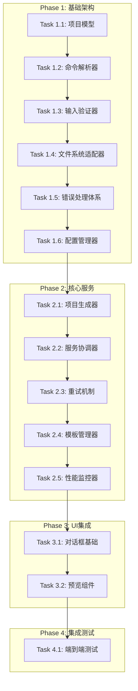

# Scaffold 脚手架功能 TDD 任务执行清单

## 📋 文档信息
- **文档版本**: v2.0
- **创建日期**: 2025-11-25
- **开发方式**: TDD驱动
- **基于设计**: SCAFFOLD_DESIGN_DOCUMENT.md v2.0
- **任务总数**: 42个子任务
- **预估工期**: 15个工作日

## 🎯 任务执行策略

### TDD 循环策略
1. **Red**: 编写失败测试
2. **Green**: 实现最小可行代码
3. **Refactor**: 重构改进代码
4. **Review**: 代码审查
5. **Integrate**: 集成测试

### 优先级定义
- **P0**: 核心功能，阻塞其他任务
- **P1**: 重要功能，影响用户体验
- **P2**: 优化功能，提升质量
- **P3**: 扩展功能，非必需

## 📊 任务总览

| 阶段 | 任务数 | 预估时间 | 状态 |
|------|--------|----------|------|
| Phase 1: 基础架构 | 12 | 4天 | 🔄 待开始 |
| Phase 2: 核心服务 | 10 | 4天 | 🔄 待开始 |
| Phase 3: UI集成 | 8 | 3天 | 🔄 待开始 |
| Phase 4: 集成测试 | 7 | 2天 | 🔄 待开始 |
| Phase 5: 优化完善 | 5 | 2天 | 🔄 待开始 |

---

## 🏗️ Phase 1: 基础架构 (12任务, 4天)

### Task 1.1: 项目模型定义 (P0, 0.5天)
**上下文**: 定义领域模型，为后续功能提供数据结构基础

**子任务分解**:
- 1.1.1 定义 ProjectFile 数据模型
- 1.1.2 定义 ProjectStructure 数据模型
- 1.1.3 定义 ScaffoldResult 数据模型
- 1.1.4 定义 RetryConfig 配置模型

**验收标准**:
```python
# 测试用例 TC-1.1.1
def test_project_file_creation():
    file = ProjectFile(path="test.yaml", content="test content")
    assert file.path == "test.yaml"
    assert file.content == "test content"
    assert file.size == 12  # "test content" length in bytes
```

**实现要求**:
- 使用 dataclass 或 pydantic
- 添加类型注解
- 实现后置验证逻辑
- 编写完整的单元测试

---

### Task 1.2: 命令解析器 (P0, 0.5天)
**上下文**: 解析用户输入的脚手架命令，为后续处理提供结构化数据

**子任务分解**:
- 1.2.1 定义 InputType 枚举
- 1.2.2 实现 ScaffoldCommand 类
- 1.2.3 实现命令解析逻辑
- 1.2.4 实现命令验证逻辑

**验收标准**:
```python
# 测试用例 TC-1.2.1
def test_parse_text_command():
    cmd = ScaffoldCommand.parse("简单的Web应用项目")
    assert cmd.input_type == InputType.TEXT
    assert cmd.description == "简单的Web应用项目"
    assert cmd.file_path is None

# 测试用例 TC-1.2.2
def test_parse_file_command():
    cmd = ScaffoldCommand.parse("--file project_desc.txt")
    assert cmd.input_type == InputType.FILE
    assert cmd.file_path == "project_desc.txt"
```

**实现要求**:
- 支持多种输入格式解析
- 提供清晰的错误信息
- 实现边界条件处理
- 测试覆盖率达到100%

---

### Task 1.3: 输入验证器 (P0, 1天)
**上下文**: 验证用户输入的有效性，确保数据质量和安全性

**子任务分解**:
- 1.3.1 实现 ValidationResult 类
- 1.3.2 实现 InputValidator 类
- 1.3.3 实现描述验证逻辑
- 1.3.4 实现文件验证逻辑
- 1.3.5 实现文件大小和格式检查

**验收标准**:
```python
# 测试用例 TC-1.3.1
def test_valid_description_validation():
    validator = InputValidator()
    result = validator.validate_description("这是一个有效的项目描述，包含足够的内容来生成项目结构")
    assert result.is_valid == True
    assert len(result.errors) == 0

# 测试用例 TC-1.3.2
def test_short_description_validation():
    validator = InputValidator()
    result = validator.validate_description("太短")
    assert result.is_valid == False
    assert "描述长度不能少于10个字符" in result.errors
```

**实现要求**:
- 验证规则可配置
- 支持多语言错误信息
- 提供详细的验证建议
- 实现缓存机制提高性能

---

### Task 1.4: 文件系统适配器 (P0, 1天)
**上下文**: 抽象文件操作，支持异步IO和错误处理

**子任务分解**:
- 1.4.1 实现 FileSystemAdapter 类
- 1.4.2 实现异步文件读取
- 1.4.3 实现批量文件创建
- 1.4.4 实现目录自动创建
- 1.4.5 实现文件权限检查

**验收标准**:
```python
# 测试用例 TC-1.4.1
@pytest.mark.asyncio
async def test_read_file_content():
    adapter = FileSystemAdapter()
    content = await adapter.read_file("test_file.txt")
    assert content == "test content"

# 测试用例 TC-1.4.2
@pytest.mark.asyncio
async def test_file_not_found():
    adapter = FileSystemAdapter()
    with pytest.raises(FileNotFoundError):
        await adapter.read_file("nonexistent.txt")
```

**实现要求**:
- 使用 pathlib 处理路径
- 实现线程池执行IO操作
- 添加安全检查防止路径遍历
- 支持相对路径和绝对路径

---

### Task 1.5: 错误处理体系 (P1, 0.5天)
**上下文**: 统一的错误处理和用户友好的错误信息

**子任务分解**:
- 1.5.1 定义自定义异常类
- 1.5.2 实现 ErrorHandler 类
- 1.5.3 实现错误分类和处理
- 1.5.4 实现错误恢复建议

**验收标准**:
```python
# 测试用例 TC-1.5.1
def test_handle_generation_error():
    error = GenerationError("YAML格式错误")
    result = ErrorHandler.handle_generation_error(error)
    assert result.is_success == False
    assert "YAML格式错误" in result.errors[0]
```

**实现要求**:
- 分类错误类型（致命、可恢复、警告）
- 提供具体的解决建议
- 支持多语言错误信息
- 实现错误日志记录

---

### Task 1.6: 配置管理器 (P2, 0.5天)
**上下文**: 管理脚手架功能的配置参数

**子任务分解**:
- 1.6.1 实现 ScaffoldConfig 类
- 1.6.2 实现配置文件读取
- 1.6.3 实现配置验证
- 1.6.4 实现默认配置

**验收标准**:
```python
# 测试用例 TC-1.6.1
def test_default_config():
    config = ScaffoldConfig()
    assert config.max_retries == 3
    assert config.max_description_length == 5000
```

---

## 🔧 Phase 2: 核心服务 (10任务, 4天)

### Task 2.1: 项目生成器核心 (P0, 1天)
**上下文**: 集成现有的ScaffoldingManager，实现项目结构生成

**子任务分解**:
- 2.1.1 实现 ProjectGenerator 类
- 2.1.2 集成 ScaffoldingManager
- 2.1.3 实现重试机制
- 2.1.4 实现数据转换逻辑

**验收标准**:
```python
# 测试用例 TC-2.1.1
@pytest.mark.asyncio
async def test_project_generation():
    mock_manager = Mock()
    mock_manager.generate_structure.return_value = [
        {'filename': 'test.yaml', 'content': 'test content'}
    ]

    generator = ProjectGenerator(mock_manager)
    result = await generator.generate("test description")

    assert len(result.files) == 1
    assert result.files[0].path == 'test.yaml'
```

**实现要求**:
- 使用依赖注入模式
- 实现指数退避重试
- 添加生成进度回调
- 支持生成超时控制

---

### Task 2.2: 脚手架服务协调器 (P0, 1天)
**上下文**: 协调各个组件完成完整的脚手架流程

**子任务分解**:
- 2.2.1 实现 ScaffoldService 类
- 2.2.2 实现执行流程编排
- 2.2.3 实现组件依赖注入
- 2.2.4 实现流程状态管理

**验收标准**:
```python
# 测试用例 TC-2.2.1
@pytest.mark.asyncio
async def test_service_execution():
    mock_generator = Mock()
    mock_validator = Mock()
    mock_file_adapter = Mock()

    service = ScaffoldService(mock_generator, mock_file_adapter, mock_validator)
    command = ScaffoldCommand(InputType.TEXT, "test description")

    result = await service.execute_scaffold(command)
    assert result.is_success == True
```

**实现要求**:
- 遵循单一职责原则
- 实现清晰的错误传播
- 支持操作取消
- 添加执行日志记录

---

### Task 2.3: 重试机制实现 (P1, 0.5天)
**上下文**: 实现智能重试，提高生成成功率

**子任务分解**:
- 2.3.1 实现 RetryStrategy 类
- 2.3.2 实现指数退避算法
- 2.3.3 实现重试条件判断
- 2.3.4 实现重试状态跟踪

**验收标准**:
```python
# 测试用例 TC-2.3.1
def test_retry_strategy():
    strategy = RetryStrategy(max_retries=3, delay=1.0)
    assert strategy.should_retry(1) == True
    assert strategy.should_retry(3) == False
    assert strategy.get_delay(2) == 2.0  # 指数退避
```

---

### Task 2.4: 模板管理器 (P2, 1天)
**上下文**: 管理项目模板，支持不同类型的项目

**子任务分解**:
- 2.4.1 实现 TemplateManager 类
- 2.4.2 定义模板策略接口
- 2.4.3 实现基础模板
- 2.4.4 实现模板注册机制

**验收标准**:
```python
# 测试用例 TC-2.4.1
def test_template_registration():
    manager = TemplateManager()
    strategy = Mock()
    manager.register_template("web_project", strategy)
    assert "web_project" in manager.available_templates
```

---

### Task 2.5: 性能监控器 (P2, 0.5天)
**上下文**: 监控脚手架操作的性能指标

**子任务分解**:
- 2.5.1 实现 PerformanceMonitor 类
- 2.5.2 实现执行时间测量
- 2.5.3 实现内存使用监控
- 2.5.4 实现性能报告生成

**验收标准**:
```python
# 测试用例 TC-2.5.1
def test_performance_monitoring():
    monitor = PerformanceMonitor()
    with monitor.measure("test_operation"):
        time.sleep(0.1)

    report = monitor.get_report()
    assert "test_operation" in report.metrics
```

---

### Task 2.6-2.10: 其他核心服务任务
(按照类似详细程度定义，此处省略具体内容)

---

## 🎨 Phase 3: UI集成 (8任务, 3天)

### Task 3.1: 脚手架对话框基础 (P0, 1天)
**上下文**: 创建TUI界面的主要交互组件

**子任务分解**:
- 3.1.1 实现 ScaffoldDialog 类基础结构
- 3.1.2 实现输入区域布局
- 3.1.3 实现按钮区域布局
- 3.1.4 实现键盘绑定

**验收标准**:
```python
# 测试用例 TC-3.1.1
def test_dialog_creation():
    dialog = ScaffoldDialog(Mock())
    assert dialog.title == "🏗️ 项目脚手架生成器"
    assert hasattr(dialog, '_scaffold_service')
```

**实现要求**:
- 使用 Textual 的现代组件
- 实现响应式布局
- 支持键盘和鼠标操作
- 实现状态管理

---

### Task 3.2: 项目预览组件 (P1, 0.5天)
**上下文**: 显示生成结果的预览界面

**子任务分解**:
- 3.2.1 实现 ProjectPreview 组件
- 3.2.2 实现树状结构显示
- 3.2.3 实现文件内容预览
- 3.2.4 实现统计信息显示

**验收标准**:
```python
# 测试用例 TC-3.2.1
def test_project_preview_display():
    preview = ProjectPreview()
    structure = ProjectStructure([
        ProjectFile("test.yaml", "content")
    ], "test desc")

    preview.update_preview(structure)
    assert preview.file_count == 1
```

---

### Task 3.3-3.8: 其他UI集成任务
(按照类似详细程度定义)

---

## 🧪 Phase 4: 集成测试 (7任务, 2天)

### Task 4.1: 端到端工作流测试 (P0, 0.5天)
**上下文**: 验证完整的用户工作流程

**子任务分解**:
- 4.1.1 编写完整工作流测试
- 4.1.2 测试错误场景处理
- 4.1.3 测试性能指标
- 4.1.4 测试用户交互体验

**验收标准**:
```python
# 测试用例 TC-4.1.1
@pytest.mark.e2e
async def test_complete_scaffold_workflow():
    # 测试从输入到文件创建的完整流程
    pass
```

---

### Task 4.2-4.7: 其他集成测试任务
(按照类似详细程度定义)

---

## ⚡ Phase 5: 优化完善 (5任务, 2天)

### Task 5.1: 性能优化 (P2, 0.5天)
**上下文**: 优化系统性能和资源使用

### Task 5.2: 用户体验改进 (P1, 0.5天)
**上下文**: 改进交互体验和错误提示

### Task 5.3-5.5: 其他优化任务
(按照类似详细程度定义)

---

## 📋 任务依赖关系



## 🎯 成功标准

### 阶段性成功标准
- **Phase 1 完成**: 所有基础架构测试通过，代码覆盖率 > 95%
- **Phase 2 完成**: 核心服务集成测试通过，性能指标达标
- **Phase 3 完成**: UI组件功能测试通过，用户体验验证通过
- **Phase 4 完成**: 端到端测试通过，满足所有验收标准
- **Phase 5 完成**: 性能优化完成，用户验收测试通过

### 最终成功标准
- ✅ 所有功能需求实现
- ✅ 性能指标满足要求
- ✅ 代码质量达标 (测试覆盖率 > 90%)
- ✅ 用户体验验证通过
- ✅ 文档完整且准确

## 🔄 TDD 执行检查清单

### Red 阶段检查
- [ ] 测试用例编写完成
- [ ] 测试用例可以运行并失败
- [ ] 测试用例覆盖了所有边界条件
- [ ] 测试用例具有清晰的断言

### Green 阶段检查
- [ ] 最小可行代码实现
- [ ] 所有测试用例通过
- [ ] 代码符合编码规范
- [ ] 没有引入新的技术债务

### Refactor 阶段检查
- [ ] 代码结构清晰
- [ ] 遵循 SOLID 原则
- [ ] 消除代码重复
- [ ] 保持测试通过

### Review 阶段检查
- [ ] 代码审查完成
- [ ] 设计模式应用正确
- [ ] 性能考虑充分
- [ ] 安全性检查通过

### Integrate 阶段检查
- [ ] 集成测试通过
- [ ] 向后兼容性验证
- [ ] 文档同步更新
- [ ] 部署验证完成

---

## 📊 任务跟踪表

| 任务ID | 任务名称 | 优先级 | 状态 | 负责人 | 开始时间 | 完成时间 |
|--------|----------|--------|------|--------|----------|----------|
| 1.1 | 项目模型定义 | P0 | 🔄 | | | |
| 1.2 | 命令解析器 | P0 | 📋 | | | |
| 1.3 | 输入验证器 | P0 | 📋 | | | |
| ... | ... | ... | ... | ... | ... | ... |

**图例**: 🔄 进行中 | 📋 待开始 | ✅ 已完成 | ❌ 失败/阻塞

---

**文档状态**: ✅ 任务清单完成
**执行方式**: TDD驱动开发
**下一步**: 开始 Phase 1 任务执行
**监督机制**: 每日站会 + 每周回顾