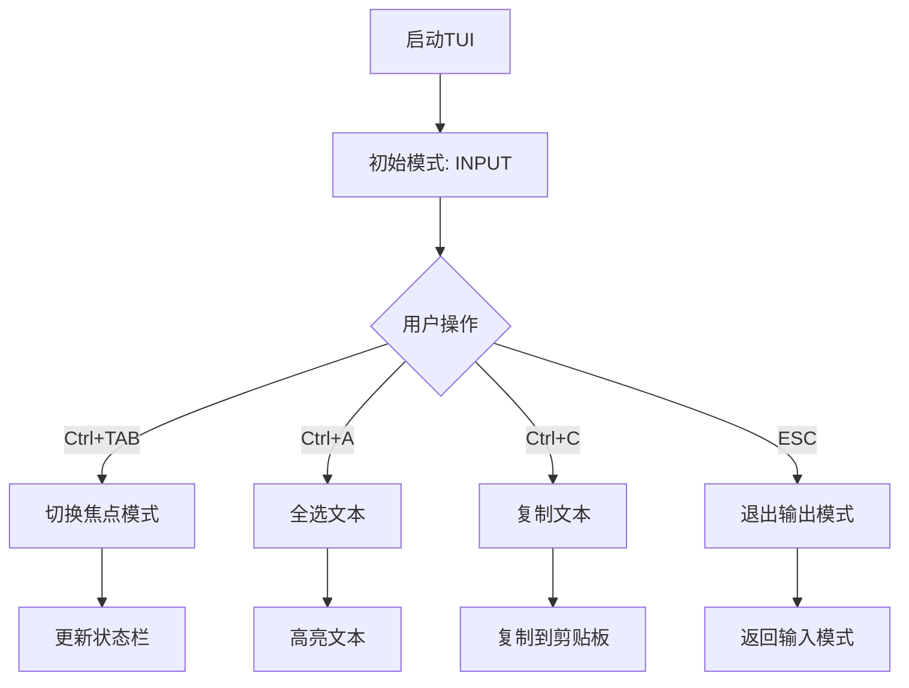

# TDD实施规范文档 - TUI焦点切换系统

## 1. 需求规范 (Requirements)

### 1.1 业务需求
**需求ID**: REQ-TUI-FOCUS-001  
**需求描述**: TUI界面必须支持焦点切换和复制粘贴功能  
**优先级**: P0 (最高)  
**验收标准**:
- [ ] Ctrl+TAB在输出区和输入区切换焦点
- [ ] 输出区域支持鼠标选择和键盘复制
- [ ] 焦点模式下快捷键行为正确
- [ ] 用户体验流畅无卡顿

### 1.2 功能需求
| 功能ID | 功能描述 | 输入 | 处理 | 输出 |
|--------|----------|------|------|------|
| FUNC-001 | 焦点切换 | Ctrl+TAB | 切换焦点模式 | 更新焦点状态 |
| FUNC-002 | 文本选择 | 鼠标拖拽/键盘 | 选择文本 | 高亮显示 |
| FUNC-003 | 复制文本 | Ctrl+C | 复制到剪贴板 | 成功提示 |
| FUNC-004 | 全选文本 | Ctrl+A | 选择全部文本 | 全选状态 |

### 1.3 非功能需求
- **性能**: 焦点切换<100ms
- **可用性**: 支持键盘和鼠标操作
- **兼容性**: 跨平台剪贴板支持
- **可维护性**: 单一职责原则

## 2. 设计规范 (Design)

### 2.1 架构设计
```
┌─────────────────────────────────────────┐
│           TUI Focus System              │
├─────────────────────────────────────────┤
│  FocusMode Enum                        │
│  ├─ INPUT: 输入模式                    │
│  └─ OUTPUT: 输出模式                   │
├─────────────────────────────────────────┤
│  Key Bindings                          │
│  ├─ Ctrl+TAB: toggle_focus()          │
│  ├─ Ctrl+A: select_all()              │
│  ├─ Ctrl+C: copy_text()               │
│  └─ ESC: exit_output_mode()           │
├─────────────────────────────────────────┤
│  Components                            │
│  ├─ TextArea: 输出区域                │
│  ├─ Input: 输入区域                   │
│  └─ Static: 状态栏                    │
└─────────────────────────────────────────┘
```

### 2.2 状态管理
```python
class FocusState:
    mode: FocusMode
    selected_text: str
    clipboard_content: str
```

### 2.3 交互流程


## 3. 实现规范 (Implementation)

### 3.1 代码结构
```
src/daip_live/
├── tui.py (主实现)
├── focus/
│   ├── __init__.py
│   ├── focus_manager.py
│   └── clipboard_handler.py
└── tests/
    ├── test_tui_focus.py
    └── test_focus_manager.py
```

### 3.2 核心类设计
```python
class FocusManager:
    """焦点管理器 - 单一职责原则"""
    
    def __init__(self):
        self.current_mode = FocusMode.INPUT
        
    def toggle_focus(self) -> FocusMode:
        """切换焦点模式"""
        self.current_mode = (
            FocusMode.OUTPUT if self.current_mode == FocusMode.INPUT 
            else FocusMode.INPUT
        )
        return self.current_mode

class ClipboardHandler:
    """剪贴板处理器 - 开闭原则"""
    
    def copy_text(self, text: str) -> bool:
        """复制文本到剪贴板"""
        try:
            import pyperclip
            pyperclip.copy(text)
            return True
        except ImportError:
            return False
```

### 3.3 测试策略
**测试金字塔**:
- 单元测试: 80% (函数级别)
- 集成测试: 15% (组件交互)
- 端到端测试: 5% (用户场景)

## 4. 任务清单 (Tasks)

### 4.1 测试阶段 (红)
- [ ] 编写FocusMode枚举测试
- [ ] 编写焦点切换功能测试
- [ ] 编写TextArea组件测试
- [ ] 编写复制粘贴功能测试
- [ ] 编写焦点模式行为测试

### 4.2 实现阶段 (绿)
- [ ] 实现FocusMode枚举
- [ ] 实现焦点切换逻辑
- [ ] 实现TextArea输出组件
- [ ] 实现复制粘贴功能
- [ ] 实现焦点模式行为

### 4.3 重构阶段 (重构)
- [ ] 提取焦点管理器
- [ ] 优化状态更新
- [ ] 添加错误处理
- [ ] 性能优化

## 5. TDD工作流

### 5.1 红-绿-重构循环
```bash
# 1. 编写测试 (红)
poetry run pytest tests/test_tui_focus.py -v

# 2. 实现功能 (绿)
# 3. 运行测试通过
poetry run pytest tests/test_tui_focus.py -v

# 4. 重构优化
# 5. 重复循环
```

### 5.2 测试覆盖率要求
- **行覆盖率**: ≥90%
- **分支覆盖率**: ≥85%
- **函数覆盖率**: ≥95%

### 5.3 代码审查检查单
- [ ] 每个功能都有对应测试
- [ ] 测试命名清晰描述行为
- [ ] 代码符合SOLID原则
- [ ] 无重复代码
- [ ] 错误处理完善

## 6. 验收标准

### 6.1 功能验收
| 测试场景 | 预期结果 | 实际结果 | 状态 |
|----------|----------|----------|------|
| Ctrl+TAB切换焦点 | 焦点模式切换 | 待测试 | 待验证 |
| 文本选择 | 支持鼠标/键盘选择 | 待测试 | 待验证 |
| 复制文本 | 成功复制到剪贴板 | 待测试 | 待验证 |
| 全选文本 | 选择全部内容 | 待测试 | 待验证 |

### 6.2 性能验收
- 焦点切换响应时间 < 100ms
- 复制操作响应时间 < 50ms
- 内存使用增量 < 1MB

### 6.3 用户体验验收
- 焦点切换有视觉反馈
- 操作有明确提示
- 错误处理友好

## 7. 实施计划

### 7.1 第一阶段 (1天)
- 完成测试用例编写
- 运行测试确认失败
- 实现基础框架

### 7.2 第二阶段 (1天)
- 实现焦点切换功能
- 实现复制粘贴功能
- 通过所有测试

### 7.3 第三阶段 (0.5天)
- 代码重构优化
- 性能测试
- 用户体验优化

## 8. 风险与缓解

### 8.1 技术风险
- **风险**: TextArea组件限制
- **缓解**: 使用标准TextArea，必要时自定义

### 8.2 依赖风险
- **风险**: pyperclip跨平台兼容性
- **缓解**: 提供回退机制

### 8.3 测试风险
- **风险**: 异步测试复杂性
- **缓解**: 使用pytest-asyncio和mock

## 9. 成功标准

### 9.1 技术成功
- [ ] 所有测试通过
- [ ] 代码覆盖率>90%
- [ ] 性能指标达标

### 9.2 业务成功
- [ ] 用户可流畅使用焦点切换
- [ ] 复制粘贴功能正常工作
- [ ] 无重大bug

### 9.3 维护成功
- [ ] 代码易于维护
- [ ] 文档完整
- [ ] 测试易于扩展