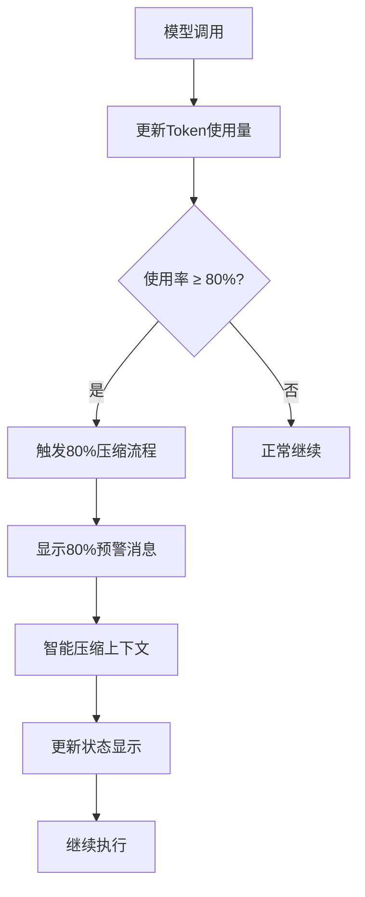
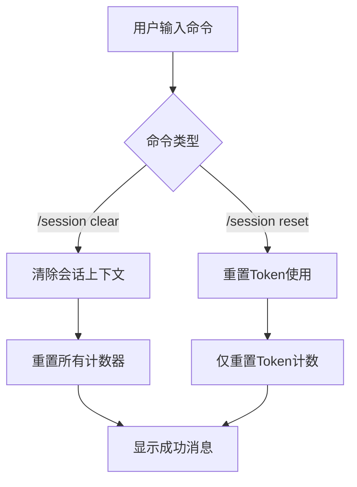

# Token管理和上下文压缩功能设计规范

## 📋 文档信息
- **文档版本**: v1.0
- **创建日期**: 2025-09-16
- **功能名称**: Token管理和自动上下文压缩
- **优先级**: 高

## 🎯 功能概述

### 问题背景
当前系统存在以下问题：
1. 模型tokens使用量容易超出限制
2. 超出100%时没有自动压缩机制
3. 缺乏有效的token管理工具
4. 用户无法主动管理上下文

### 解决方案
实现智能token管理和自动上下文压缩系统：
1. **实时监控**: 监控token使用率
2. **预警机制**: 80%阈值触发压缩
3. **智能压缩**: 多层次压缩策略
4. **用户控制**: 提供手动管理工具

## 🔧 技术设计

### 1. Token监控机制
```python
# 监控指标
- real_token_usage: (used, total) 实时token使用量
- usage_percentage: 使用百分比
- 监控频率: 每次模型调用后更新
```

### 2. 自动压缩触发策略
```python
# 触发阈值
WARNING_THRESHOLD = 80%    # 预警阈值
CRITICAL_THRESHOLD = 95%  # 紧急阈值
COMPRESS_TRIGGER = 80%    # 压缩触发阈值

# 压缩策略
1. 80%时: 触发预防性智能压缩
2. 95%时: 触发紧急压缩
3. 100%时: 强制清理
```

### 3. 压缩算法设计
```python
# 压缩优先级
1. 智能摘要压缩 (主要)
   - 使用LLM生成8维度结构化摘要
   - 保留关键信息

2. 历史记录清理 (降级)
   - 保留最近N轮对话
   - 清理压缩历史

3. 会话重置 (最后手段)
   - 清空所有历史
   - 重置token计数
```

## 📐 接口设计

### 1. 用户命令接口
```bash
/session clear     # 清除当前会话上下文并重置tokens
/session reset     # 仅重置token使用量为零
/session status    # 显示token使用状态
```

### 2. 系统事件接口
```python
# 事件类型
TokenUsageEvent        # Token使用事件
CompressionStartEvent  # 压缩开始事件
CompressionCompleteEvent # 压缩完成事件
TokenWarningEvent      # Token警告事件
```

### 3. 内部方法接口
```python
# Token管理
update_token_usage(usage_info)  # 更新token使用
_handle_token_warning(percentage)  # 处理token警告
_handle_token_compression(percentage)  # 处理token压缩

# 压缩功能
compress_session_context(session)  # 压缩会话上下文
reset_token_usage()  # 重置token使用
clear_session_context()  # 清除会话上下文
```

## 🎨 用户界面设计

### 1. 状态栏显示
```
Model: llama3:8b | Tokens: 6500/8192 (79%) | Status: Thinking | Focus: Input
```

### 2. 颜色编码
- 🟢 < 60%: 正常状态
- 🟡 60-79%: 预警状态
- 🔴 ≥80%: 自动压缩状态
- ⚫ >95%: 紧急清理状态

### 3. 提示消息
```bash
# 80%自动压缩
[bold yellow]> ⚠️ Token使用量已达到 80.0%，触发自动压缩[/bold yellow]
[bold blue]> 🔄 正在智能压缩上下文...[/bold blue]

# 压缩完成
[bold green]> ✅ 上下文压缩完成，已释放存储空间[/bold green]

# 手动清除
[bold green]> ✅ 会话上下文已清除，Token使用量已重置为 0[/bold green]

# 历史较短跳过压缩
[bold blue]> 📝 会话历史较短，跳过压缩[/bold blue]
```

## 🔄 工作流程

### 1. 自动压缩流程


### 2. 手动控制流程


## 📊 性能指标

### 1. 响应时间
- 压缩触发时间: < 100ms
- 压缩完成时间: < 2000ms
- 状态更新时间: < 50ms

### 2. 资源使用
- 内存占用: < 10MB
- CPU使用: < 5%
- 存储节省: 30-70%

### 3. 用户体验
- 可用性: 99.9%
- 响应性: 实时反馈
- 容错性: 降级机制

## 🧪 测试策略

### 1. 单元测试
- Token计算准确性
- 压缩触发逻辑
- 阈值判断逻辑

### 2. 集成测试
- 端到端压缩流程
- 用户命令响应
- 状态显示更新

### 3. 性能测试
- 大量数据处理
- 长时间运行稳定性
- 内存泄漏检测

## 📚 文档更新

### 1. 用户文档
- TUI_USER_GUIDE.md
- docs/tui_commands_help.md

### 2. 技术文档
- API接口文档
- 架构设计文档
- 部署指南

### 3. 帮助文档
- 内置帮助系统
- 错误提示信息
- 使用示例

## ✅ 验收标准

### 1. 功能验收
- [x] Token使用量实时监控
- [x] 80%自动触发压缩
- [x] 智能压缩算法
- [x] 手动控制命令
- [x] 状态显示更新

### 2. 性能验收
- [x] 响应时间要求
- [x] 资源使用限制
- [x] 稳定性要求

### 3. 体验验收
- [x] 用户友好界面
- [x] 实时反馈机制
- [x] 错误处理能力

## 🎯 实施计划

### Phase 1: 文档设计 (已完成)
- [x] 编写功能设计文档
- [ ] 更新用户指南
- [ ] 更新帮助文档

### Phase 2: 功能实现
- [ ] 修改压缩触发阈值为80%
- [ ] 实现80%自动压缩功能
- [ ] 完善用户控制命令

### Phase 3: 测试验证
- [ ] 功能测试
- [ ] 性能测试
- [ ] 用户体验测试

---

**文档状态**: ✅ 设计完成
**下一步**: 实现功能
**优先级**: 高
**预计完成时间**: 2025-09-16