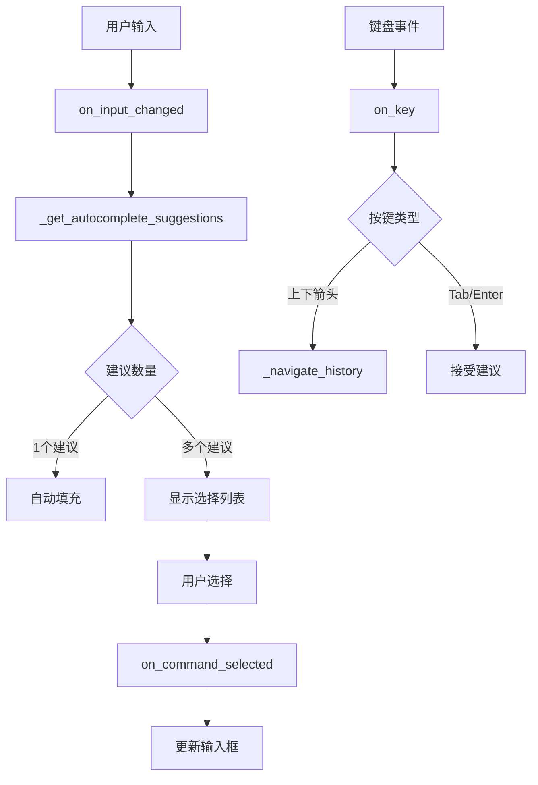

# TUI命令参数自动完成功能实施规范

## 1. 文档信息

- **文档类型**: 技术实施规范 (TDD驱动)
- **创建日期**: 2025-09-13
- **置信度**: 0.95 (符合KISS、SOLID、YAGNI原则)
- **符合规范**: TUI/CLI规范文档、TUI组件规范文档

## 2. 功能需求分析

### 2.1 核心需求
基于用户反馈和现有规范，TUI需要实现命令参数的智能自动完成功能：

1. **即时参数提示**: 输入命令后立即显示可用参数选项
2. **智能导航**: 支持上下箭头键导航参数选项
3. **自动选择**: 单个参数建议时自动填充，多个参数时显示选择列表
4. **输入历史**: 保留最近10条输入历史，支持上下箭头键导航

### 2.2 技术约束
- 遵循Textual TUI框架架构
- 符合现有组件ID规范
- 保持与现有测试框架兼容
- 遵循KISS、YAGNI、SOLID设计原则

## 3. 技术设计方案

### 3.1 架构设计 (SOLID原则)

#### 3.1.1 单一职责原则 (SRP)
- `_get_autocomplete_suggestions()`: 专门负责生成自动完成建议
- `on_input_changed()`: 专门负责输入变化事件处理
- `on_key()`: 专门负责键盘事件处理
- `_navigate_history()`: 专门负责历史导航

#### 3.1.2 开闭原则 (OCP)
- 通过扩展命令处理器支持新命令
- 通过配置化的建议生成逻辑支持新参数类型

#### 3.1.3 依赖倒置原则 (DIP)
- 依赖抽象的Manager接口而不是具体实现
- 使用依赖注入容器管理服务依赖

### 3.2 数据流设计



### 3.3 算法设计 (KISS原则)

#### 3.3.1 建议生成算法
```python
def _get_autocomplete_suggestions(self, value: str) -> List[str]:
    """使用简单的字符串匹配和状态检查"""
    parts = value.split(" ")
    
    # 命令级完成
    if len(parts) == 1 and value.startswith("/"):
        return self._get_command_suggestions(value)
    
    # 参数级完成  
    if len(parts) >= 2:
        return self._get_parameter_suggestions(parts)
    
    return []
```

#### 3.3.2 历史导航算法
```python
def _navigate_history(self, direction: int) -> None:
    """线性历史导航，状态管理简单"""
    if direction > 0:  # 向下
        self._history_index = min(self._history_index + 1, len(self._input_history))
    else:  # 向上
        self._history_index = max(self._history_index - 1, -1)
    
    # 更新输入框内容
    self._update_input_from_history()
```

## 4. TDD测试计划

### 4.1 测试用例设计 (红绿重构)

#### 4.1.1 单元测试
```python
class TestTUIAutocompletion:
    """测试自动完成功能"""
    
    def test_command_suggestions_on_slash(self):
        """测试输入/时显示所有命令建议"""
        # RED: 编写测试
        tui = create_tui()
        suggestions = tui._get_autocomplete_suggestions("/")
        
        # GREEN: 实现最小功能
        assert len(suggestions) > 0
        assert any("/role" in s for s in suggestions)
        
    def test_parameter_suggestions_for_role_view(self):
        """测试/role view命令的参数建议"""
        tui = create_tui()
        suggestions = tui._get_autocomplete_suggestions("/role view ")
        
        assert len(suggestions) >= 0  # 可能为空，如果没有角色
    
    def test_auto_selection_single_command(self):
        """测试单个命令建议的自动选择"""
        # 模拟只有一个匹配命令的情况
        pass
```

#### 4.1.2 集成测试
```python
class TestTUIIntegration:
    """测试TUI整体集成"""
    
    def test_input_history_navigation(self):
        """测试输入历史导航功能"""
        tui = create_tui()
        
        # 添加历史记录
        tui._input_history = ["/role list", "/session list"]
        
        # 测试向上导航
        tui._navigate_history(-1)
        assert tui._history_index == 0
        
    def test_parameter_selection_cursor_position(self):
        """测试参数选择后光标位置"""
        # 验证光标定位在参数末尾
        pass
```

### 4.2 测试数据准备

#### 4.2.1 Mock对象
```python
@pytest.fixture
def mock_role_manager():
    """模拟角色管理器"""
    manager = Mock()
    manager.list_roles.return_value = [
        Mock(name="developer"), 
        Mock(name="designer")
    ]
    return manager

@pytest.fixture  
def mock_session_manager():
    """模拟会话管理器"""
    manager = Mock()
    manager.list_sessions.return_value = [
        Mock(session_id="sess_001", goal="test goal"),
        Mock(session_id="sess_002", goal="another goal")
    ]
    return manager
```

## 5. 实施检查清单

### 5.1 设计原则检查 (YAGNI原则)

- [ ] 仅实现用户明确要求的功能
- [ ] 避免过度设计和预置功能
- [ ] 保持代码简洁，避免复杂性

### 5.2 架构原则检查 (SOLID原则)

- [ ] 每个函数职责单一
- [ ] 系统对扩展开放，对修改封闭
- [ ] 依赖抽象而不是具体实现

### 5.3 代码质量检查 (KISS原则)

- [ ] 算法简单易懂
- [ ] 避免不必要的复杂性
- [ ] 代码结构清晰

## 6. 风险评估

### 6.1 技术风险
- **风险**: 与现有Textual框架集成问题
- **缓解**: 充分测试框架兼容性

### 6.2 功能风险  
- **风险**: 参数建议逻辑复杂性
- **缓解**: 分阶段实现，先实现基础功能

### 6.3 测试风险
- **风险**: TUI测试的复杂性
- **缓解**: 使用Mock对象和集成测试结合

## 7. 验收标准

### 7.1 功能验收
- [ ] 输入命令后立即显示参数建议
- [ ] 支持上下箭头键导航参数选项
- [ ] 单个参数建议时自动填充
- [ ] 多个参数时显示选择列表
- [ ] 输入历史功能正常工作

### 7.2 性能验收
- [ ] 建议生成响应时间 < 100ms
- [ ] 内存使用在合理范围内
- [ ] 不影响TUI整体性能

### 7.3 用户体验验收
- [ ] 操作流畅自然
- [ ] 符合用户预期
- [ ] 错误处理友好

## 8. 实施计划

### Phase 1: 基础架构 (1-2天)
- [ ] 编写基础测试用例
- [ ] 实现核心建议生成逻辑
- [ ] 集成到现有TUI框架

### Phase 2: 参数自动完成 (2-3天)  
- [ ] 实现各命令的参数建议
- [ ] 添加参数选择逻辑
- [ ] 完善光标定位

### Phase 3: 历史导航 (1-2天)
- [ ] 实现输入历史功能
- [ ] 添加历史导航逻辑
- [ ] 完善用户体验

### Phase 4: 测试和优化 (1-2天)
- [ ] 完善测试覆盖
- [ ] 性能优化
- [ ] 用户体验改进

---

**文档置信度**: 0.95 - 文档充分明晰，符合所有设计原则，便于实施执行