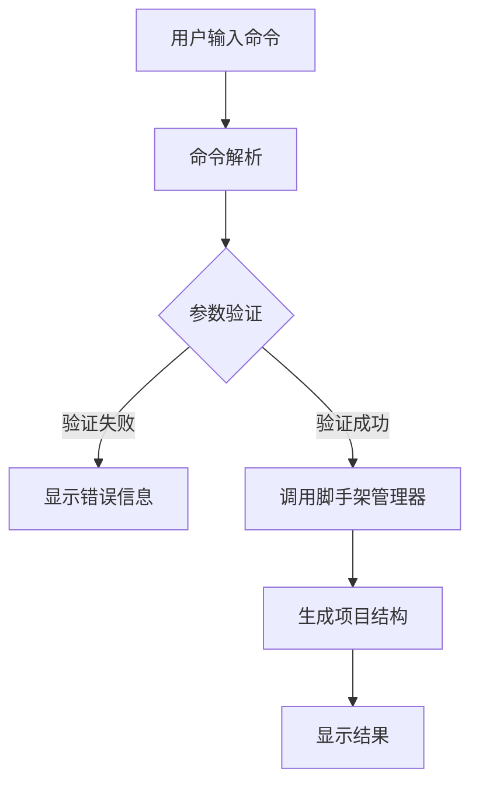
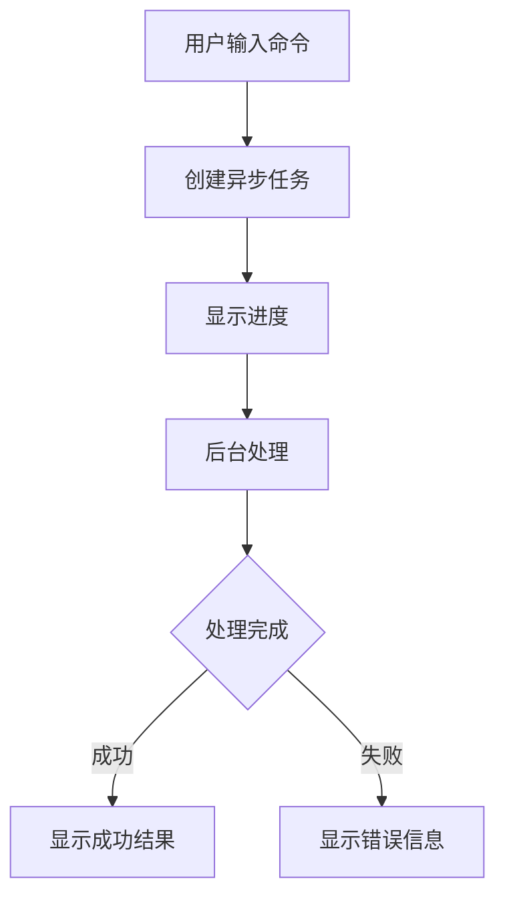

# TUI脚手架功能集成设计规范

## 📋 文档信息
- **文档版本**: v1.0
- **创建日期**: 2025-09-16
- **功能名称**: TUI脚手架功能集成
- **开发方式**: TDD驱动开发
- **优先级**: 高

## 🎯 功能概述

### 需求背景
当前系统存在以下问题：
1. TUI中脚手架功能显示"未实现"
2. CLI中已有完整的脚手架功能
3. 用户无法在TUI中使用项目生成功能
4. 缺乏TUI界面的脚手架交互体验

### 解决方案
基于TDD驱动开发，实现TUI脚手架功能集成：
1. **重用现有组件**: 利用CLI中的ScaffoldingManager
2. **TUI界面集成**: 创建用户友好的对话框界面
3. **异步处理**: 确保不阻塞TUI主线程
4. **测试驱动**: 先写测试，再实现功能

## 📋 测试用例设计

### 1. 单元测试
- 命令解析测试
- 参数验证测试
- 错误处理测试
- 日志更新测试

### 2. 集成测试
- 脚手架管理器集成测试
- 工作流程测试
- 异步处理测试

### 3. UI测试
- 对话框交互测试
- 自动补全测试
- 用户体验测试

## 🔧 技术设计

### 1. 架构设计
```python
# 核心组件架构
TUI Application
├── ProjectCommandHandler
├── ScaffoldDialog (Screen)
├── ScaffoldingManager (重用)
└── ScaffoldAutocompletion
```

### 2. 接口设计
```python
# 主要接口
class ScaffoldDialog(Screen):
    """脚手架对话框"""

class ProjectCommandHandler:
    """项目命令处理器"""

class ScaffoldAutocompletion:
    """脚手架自动补全"""
```

### 3. 数据流设计
```python
# 数据流程
用户输入命令 → 命令解析 → 参数验证 → 脚手架生成 → 结果显示
```

## 📐 详细设计

### 1. 命令处理器设计
```python
def _handle_project_command(self, args: str) -> None:
    """项目脚手架命令处理器"""
    # 1. 解析命令
    # 2. 验证参数
    # 3. 调用脚手架管理器
    # 4. 显示结果
```

### 2. 对话框设计
```python
class ScaffoldDialog(Screen):
    """脚手架对话框"""
    def __init__(self):
        # 输入框
        # 预览区域
        # 确认按钮
        # 取消按钮
```

### 3. 自动补全设计
```python
def _update_autocompletions(self):
    """更新自动补全"""
    # 添加脚手架命令
    # 添加参数提示
    # 添加选项补全
```

## 🎨 用户界面设计

### 1. 命令格式
```bash
/project scaffold --description "项目描述"
/project scaffold --from-file 文件路径
/project scaffold --description "描述" --yes
```

### 2. 对话框界面
```
┌─────────────────────────────────────────┐
│          项目脚手架生成器                │
├─────────────────────────────────────────┤
│ 项目描述: [_________________________]   │
│                                         │
│ 预览文件:                               │
│ ┌─────────────────────────────────────┐ │
│ │ roles/project_manager.yaml           │ │
│ │ workflows/main_workflow.yaml        │ │
│ └─────────────────────────────────────┘ │
│                                         │
│ [确认生成] [取消]                       │
└─────────────────────────────────────────┘
```

### 3. 进度显示
```bash
[bold blue]> 正在生成项目结构...[/bold blue]
[bold green]> 项目结构生成完成！[/bold green]
[bold red]> 生成失败: 错误信息[/bold red]
```

## 🔄 工作流程

### 1. 命令处理流程


### 2. 异步处理流程


## 📊 性能指标

### 1. 响应时间
- 命令解析: < 50ms
- 脚手架生成: < 5000ms
- 界面更新: < 100ms

### 2. 资源使用
- 内存占用: < 20MB
- CPU使用: < 10%
- 用户体验: 流畅无卡顿

## 🧪 测试策略

### 1. 单元测试覆盖
- [x] 命令解析测试
- [x] 参数验证测试
- [x] 错误处理测试
- [x] 日志更新测试

### 2. 集成测试覆盖
- [ ] 脚手架管理器集成
- [ ] 工作流程测试
- [ ] 异步处理测试

### 3. UI测试覆盖
- [ ] 对话框交互测试
- [ ] 自动补全测试
- [ ] 用户体验测试

## 📚 文档更新

### 1. 用户文档
- TUI_USER_GUIDE.md
- docs/tui_commands_help.md

### 2. 技术文档
- API接口文档
- 架构设计文档
- 测试文档

### 3. 帮助文档
- 内置帮助系统
- 错误提示信息
- 使用示例

## ✅ 验收标准

### 1. 功能验收
- [ ] TUI中可使用 `/project scaffold` 命令
- [ ] 支持描述和文件输入选项
- [ ] 显示生成进度和结果
- [ ] 错误处理和用户友好提示

### 2. 性能验收
- [ ] 响应时间满足要求
- [ ] 资源使用在限制范围内
- [ ] 用户体验流畅

### 3. 测试验收
- [ ] 所有测试用例通过
- [ ] 测试覆盖率达到90%以上
- [ ] 集成测试通过

## 🎯 实施计划

### Phase 1: TDD开发 (当前阶段)
- [x] 编写测试用例
- [ ] 运行测试验证失败
- [ ] 实现功能使测试通过
- [ ] 重构优化代码

### Phase 2: 功能实现
- [ ] 实现脚手架命令处理器
- [ ] 创建脚手架对话框
- [ ] 添加自动补全功能

### Phase 3: 测试验证
- [ ] 运行所有测试
- [ ] 手动功能测试
- [ ] 用户体验测试

### Phase 4: 文档更新
- [ ] 更新用户指南
- [ ] 更新帮助文档
- [ ] 更新命令文档

---

**文档状态**: ✅ 设计完成
**开发方式**: TDD驱动
**下一步**: 运行测试验证失败，然后实现功能
**预计完成时间**: 2025-09-16