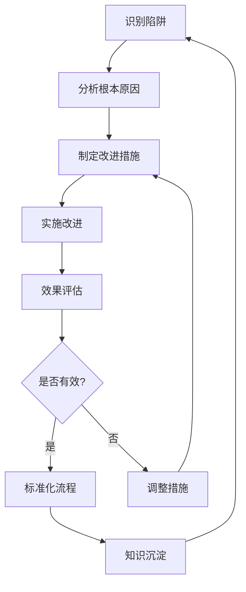

# 🚫 避免常见开发陷阱指南

## 📋 概述

本文档详细阐述在网站开发过程中常见的陷阱及其避免策略，帮助团队提高开发质量，减少返工和bug，确保项目顺利进行。

## 🎯 主要陷阱分类

### 1. 需求理解偏差
### 2. 技术实现问题
### 3. 团队协作障碍
### 4. 质量控制疏漏
### 5. 项目管理失误

## 🚩 需求理解偏差类陷阱

### 1. 上下级任务不对应

#### 问题描述
子任务与父任务目标不一致，导致实现偏离预期。

#### 典型表现
- 子任务完成后无法满足父任务需求
- 多个子任务之间存在冲突
- 实现结果与用户期望不符

#### 避免策略

##### A. 任务分解检查清单
```markdown
## 任务分解验证清单

### 父任务层面
- [ ] 任务目标是否明确具体？
- [ ] 验收标准是否可量化验证？
- [ ] 是否有明确的业务价值？

### 子任务层面
- [ ] 每个子任务是否直接服务于父任务目标？
- [ ] 子任务之间是否存在依赖关系？
- [ ] 子任务边界是否清晰？
- [ ] 是否存在重复或遗漏？

### 关联性检查
- [ ] 所有子任务完成后是否能达成父任务目标？
- [ ] 子任务优先级是否合理？
- [ ] 资源分配是否均衡？
```

##### B. 任务映射矩阵
```javascript
// 任务映射关系验证工具
class TaskMappingValidator {
  constructor() {
    this.mappings = new Map();
  }
  
  addParentChildMapping(parentId, childId, contribution) {
    if (!this.mappings.has(parentId)) {
      this.mappings.set(parentId, []);
    }
    
    this.mappings.get(parentId).push({
      childId,
      contribution, // 子任务对父任务的贡献度(0-1)
      verified: false
    });
  }
  
  validateMappingCompleteness(parentId) {
    const children = this.mappings.get(parentId) || [];
    const totalContribution = children.reduce((sum, child) => 
      sum + child.contribution, 0
    );
    
    if (totalContribution < 0.95) {
      return {
        valid: false,
        message: `任务覆盖不完整，当前贡献度: ${(totalContribution * 100).toFixed(1)}%`
      };
    }
    
    if (totalContribution > 1.05) {
      return {
        valid: false,
        message: `任务贡献度超限，可能存在重复，当前贡献度: ${(totalContribution * 100).toFixed(1)}%`
      };
    }
    
    return {
      valid: true,
      message: `任务映射完整，贡献度: ${(totalContribution * 100).toFixed(1)}%`
    };
  }
}
```

##### C. 定期对齐会议
```markdown
## 任务对齐会议议程

### 会议频率
- 每周一次任务对齐会
- 重大里程碑前专项对齐

### 会议内容
1. **进度同步** (15分钟)
   - 各子任务当前状态
   - 遇到的主要问题
   
2. **目标校验** (20分钟)
   - 父任务目标确认
   - 子任务贡献度评估
   - 偏差识别与纠正
   
3. **风险识别** (15分钟)
   - 技术风险
   - 进度风险
   - 资源风险
   
4. **行动计划** (10分钟)
   - 问题解决方案
   - 调整建议
   - 下一步安排
```

### 2. 需求变更频繁

#### 问题描述
需求在开发过程中频繁变更，导致返工和延期。

#### 避免策略

##### A. 需求冻结机制
```javascript
// 需求变更控制流程
class RequirementChangeControl {
  constructor() {
    this.freezePeriod = 7; // 需求冻结期(天)
    this.changeRequests = [];
  }
  
  submitChangeRequest(request) {
    const now = new Date();
    const daysSinceStart = Math.floor(
      (now - request.projectStartDate) / (1000 * 60 * 60 * 24)
    );
    
    if (daysSinceStart < this.freezePeriod) {
      return {
        approved: false,
        reason: `项目启动后${this.freezePeriod}天内需求冻结`,
        alternative: '请在冻结期结束后提交变更请求'
      };
    }
    
    this.changeRequests.push({
      ...request,
      submittedAt: now,
      status: 'pending_review'
    });
    
    return {
      approved: false,
      reason: '变更请求已提交，等待评审',
      nextSteps: '请参加下次变更评审会议'
    };
  }
  
  evaluateChangeImpact(changeRequest) {
    return {
      effort: this.estimateEffort(changeRequest),
      risk: this.assessRisk(changeRequest),
      scheduleImpact: this.calculateScheduleImpact(changeRequest),
      costImpact: this.calculateCostImpact(changeRequest)
    };
  }
}
```

##### B. 变更成本可视化
```html
<!-- 需求变更成本展示 -->
<div class="change-cost-visualization">
  <h3>需求变更成本分析</h3>
  
  <div class="cost-breakdown">
    <div class="cost-item">
      <label>开发成本:</label>
      <span class="cost-value">{{developmentCost}}</span>
    </div>
    
    <div class="cost-item">
      <label>测试成本:</label>
      <span class="cost-value">{{testingCost}}</span>
    </div>
    
    <div class="cost-item">
      <label>延期成本:</label>
      <span class="cost-value">{{delayCost}}</span>
    </div>
    
    <div class="cost-item total">
      <label>总成本:</label>
      <span class="cost-value">{{totalCost}}</span>
    </div>
  </div>
  
  <div class="impact-assessment">
    <div class="impact-level" :class="'level-' + impactLevel">
      影响等级: {{impactLevelText}}
    </div>
    
    <div class="recommendation">
      建议: {{recommendationText}}
    </div>
  </div>
</div>
```

## ⚙️ 技术实现类陷阱

### 1. 缺乏TDD驱动测试

#### 问题描述
先实现功能再写测试，或者根本不写测试，导致质量问题难以发现。

#### 避免策略

##### A. 测试先行工作坊
```javascript
// TDD实施模板
class TDDWorkshop {
  static getTemplate() {
    return `
## TDD实施步骤

### 1. 红灯阶段 (Red)
\`\`\`javascript
// 第一步：编写失败的测试
describe('${this.featureName}', () => {
  it('should ${this.expectedBehavior}', () => {
    // Arrange - 准备测试数据
    const input = ${this.sampleInput};
    
    // Act - 执行待测试函数
    const result = ${this.functionCall};
    
    // Assert - 验证结果
    expect(result).toBe(${this.expectedOutput});
  });
});

// 运行测试 - 应该失败
\`\`\`

### 2. 绿灯阶段 (Green)
\`\`\`javascript
// 第二步：编写刚好能让测试通过的最小实现
function ${this.functionName}(${this.parameters}) {
  // 最简单的实现
  return ${this.simplestImplementation};
}

// 运行测试 - 应该通过
\`\`\`

### 3. 重构阶段 (Refactor)
\`\`\`javascript
// 第三步：优化代码结构，保持测试通过
function ${this.functionName}(${this.parameters}) {
  // 优化后的实现
  ${this.optimizedImplementation}
}

// 运行测试 - 确保仍然通过
\`\`\`
    `;
  }
}
```

##### B. 测试覆盖率监控
```javascript
// 测试覆盖率检查工具
class TestCoverageMonitor {
  constructor(threshold = 80) {
    this.threshold = threshold;
  }
  
  checkCoverage(coverageReport) {
    const issues = [];
    
    // 检查总体覆盖率
    if (coverageReport.lines.pct < this.threshold) {
      issues.push({
        type: 'overall_coverage',
        severity: 'high',
        message: `代码行覆盖率 ${coverageReport.lines.pct}% 低于阈值 ${this.threshold}%`
      });
    }
    
    // 检查关键模块覆盖率
    const criticalModules = ['auth', 'payment', 'security'];
    criticalModules.forEach(module => {
      const moduleCoverage = coverageReport[module];
      if (moduleCoverage && moduleCoverage.lines.pct < 90) {
        issues.push({
          type: 'module_coverage',
          severity: 'medium',
          message: `关键模块 ${module} 覆盖率 ${moduleCoverage.lines.pct}% 过低`
        });
      }
    });
    
    // 检查未覆盖的复杂函数
    const uncoveredComplexFunctions = this.findUncoveredComplexFunctions(coverageReport);
    uncoveredComplexFunctions.forEach(func => {
      issues.push({
        type: 'complex_function',
        severity: 'high',
        message: `复杂函数 ${func.name} 未被测试覆盖，复杂度: ${func.complexity}`
      });
    });
    
    return {
      compliant: issues.length === 0,
      issues,
      summary: this.generateCoverageSummary(coverageReport)
    };
  }
  
  generateCoverageSummary(coverageReport) {
    return {
      overall: `${coverageReport.lines.pct}%`,
      functions: `${coverageReport.functions.pct}%`,
      branches: `${coverageReport.branches.pct}%`,
      statements: `${coverageReport.statements.pct}%`
    };
  }
}
```

##### C. CI/CD集成检查
```yaml
# .github/workflows/test-coverage.yml
name: Test Coverage Check

on:
  pull_request:
    branches: [ main, develop ]

jobs:
  coverage-check:
    runs-on: ubuntu-latest
    
    steps:
    - uses: actions/checkout@v2
    
    - name: Setup Node.js
      uses: actions/setup-node@v2
      with:
        node-version: '16'
        
    - name: Install dependencies
      run: npm ci
      
    - name: Run tests with coverage
      run: npm run test:coverage
      
    - name: Check coverage threshold
      run: |
        COVERAGE=$(node scripts/check-coverage.js)
        if [ "$COVERAGE" -lt "80" ]; then
          echo "测试覆盖率 $COVERAGE% 低于阈值 80%"
          exit 1
        fi
        
    - name: Generate coverage report
      run: npm run coverage:report
      
    - name: Upload coverage report
      uses: actions/upload-artifact@v2
      with:
        name: coverage-report
        path: coverage/
```

### 2. 重复造轮子

#### 问题描述
重新开发已有功能，浪费时间和资源。

#### 避免策略

##### A. 组件库和复用清单
```javascript
// 组件复用检查工具
class ComponentReuseChecker {
  constructor(componentRegistry) {
    this.registry = componentRegistry;
  }
  
  checkForExistingSolutions(requirements) {
    const matches = [];
    
    // 基于功能需求匹配现有组件
    requirements.functional.forEach(requirement => {
      const similarComponents = this.findSimilarComponents(requirement);
      
      if (similarComponents.length > 0) {
        matches.push({
          requirement,
          existingSolutions: similarComponents,
          recommendation: this.getRecommendation(similarComponents)
        });
      }
    });
    
    return {
      hasMatches: matches.length > 0,
      matches,
      suggestion: matches.length > 0 
        ? '建议优先考虑复用现有组件' 
        : '未找到相似组件，可考虑开发新组件'
    };
  }
  
  findSimilarComponents(requirement) {
    return this.registry.filter(component => 
      this.calculateSimilarity(component.features, requirement) > 0.7
    );
  }
  
  calculateSimilarity(features1, features2) {
    // 简化的相似度计算
    const intersection = features1.filter(f => features2.includes(f));
    const union = [...new Set([...features1, ...features2])];
    
    return intersection.length / union.length;
  }
}
```

##### B. 技术雷达和决策记录
```markdown
# 技术雷达

## 采用 (ADOPT)
- React 18 for UI development
- Jest for unit testing
- Docker for containerization

## 试验 (TRIAL)
- Next.js 14 for SSR
- Cypress for E2E testing
- GraphQL for API layer

## 评估 (ASSESS)
- SvelteKit for alternative frontend
- Playwright for cross-browser testing
- WebAssembly for performance-critical features

## 持续 (HOLD)
- Vue 3 (等待生态成熟)
- Angular (已有项目继续维护)
- jQuery (遗留系统逐步迁移)

---

# 架构决策记录 (ADR)

## ADR-001: 前端框架选择

### 状态
已采纳

### 背景
需要选择适合团队技能和项目需求的前端框架

### 选项
1. React - 生态丰富，学习曲线适中
2. Vue - 上手简单，文档完善
3. Angular - 功能完整，学习成本高

### 决策
选择React，原因如下：
- 团队已有React经验
- 生态系统丰富，第三方库多
- 社区活跃，问题解决快

### 后果
- 需要加强Hooks使用培训
- 建立组件库规范
- 制定代码审查标准
```

##### C. 代码审查检查清单
```markdown
## 代码复用检查清单

### 1. 组件复用检查
- [ ] 是否有相似功能的现有组件？
- [ ] 现有组件是否满足当前需求？
- [ ] 是否可以通过扩展现有组件实现？

### 2. 工具库检查
- [ ] 是否有成熟的第三方库可以使用？
- [ ] 现有工具函数是否可以复用？
- [ ] 是否重复实现了通用功能？

### 3. 设计模式检查
- [ ] 是否可以应用现有的设计模式？
- [ ] 代码结构是否符合团队规范？
- [ ] 是否遵循SOLID原则？

### 4. 性能优化检查
- [ ] 是否重复计算了相同结果？
- [ ] 是否有缓存机制？
- [ ] 是否考虑了内存泄漏问题？
```

### 3. 模拟实现骗过测试

#### 问题描述
为了通过测试而写的临时实现，无法满足真实需求。

#### 避免策略

##### A. 真实场景测试
```javascript
// 真实场景测试模板
class RealWorldScenarioTester {
  constructor() {
    this.scenarios = [
      {
        name: '正常用户操作',
        description: '用户正常使用功能的场景',
        steps: [
          '用户登录系统',
          '访问功能页面',
          '执行正常操作',
          '查看结果'
        ],
        testData: {
          user: { id: 1, name: '正常用户' },
          inputs: ['正常输入1', '正常输入2']
        }
      },
      {
        name: '边界条件测试',
        description: '测试极端情况下的表现',
        steps: [
          '输入最大长度字符串',
          '输入特殊字符',
          '连续快速操作',
          '网络不稳定情况'
        ],
        testData: {
          user: { id: 2, name: '边界测试用户' },
          inputs: ['', 'a'.repeat(1000), '<script>alert(1)</script>']
        }
      },
      {
        name: '异常处理测试',
        description: '测试系统异常情况的处理',
        steps: [
          '模拟网络错误',
          '模拟服务器错误',
          '模拟数据库连接失败',
          '验证错误提示'
        ],
        testData: {
          user: { id: 3, name: '异常测试用户' },
          inputs: ['error_case_1', 'error_case_2']
        }
      }
    ];
  }
  
  generateTestSuite(feature) {
    return this.scenarios.map(scenario => ({
      name: `${feature} - ${scenario.name}`,
      description: scenario.description,
      test: () => this.executeScenario(scenario, feature)
    }));
  }
  
  async executeScenario(scenario, feature) {
    console.log(`执行场景: ${scenario.name}`);
    
    for (const step of scenario.steps) {
      console.log(`步骤: ${step}`);
      // 执行具体步骤
      await this.executeStep(step, scenario.testData);
    }
    
    // 验证结果
    return this.validateScenarioResult(scenario, feature);
  }
}
```

##### B. 集成测试覆盖
```javascript
// 集成测试检查工具
class IntegrationTestCoverage {
  constructor() {
    this.integrationPoints = [
      'API接口调用',
      '数据库操作',
      '第三方服务集成',
      '用户认证授权',
      '文件上传下载',
      '消息队列处理'
    ];
  }
  
  checkIntegrationCoverage(testFiles) {
    const coverage = {};
    
    this.integrationPoints.forEach(point => {
      const hasTests = testFiles.some(file => 
        file.content.includes(point) && file.content.includes('test')
      );
      
      coverage[point] = {
        covered: hasTests,
        files: hasTests ? this.getRelatedTestFiles(point, testFiles) : []
      };
    });
    
    const uncoveredPoints = Object.keys(coverage)
      .filter(point => !coverage[point].covered);
    
    return {
      coverage,
      uncovered: uncoveredPoints,
      completeness: `${((Object.keys(coverage).length - uncoveredPoints.length) / Object.keys(coverage).length * 100).toFixed(1)}%`
    };
  }
  
  getRelatedTestFiles(integrationPoint, testFiles) {
    return testFiles
      .filter(file => file.content.includes(integrationPoint))
      .map(file => file.name);
  }
}
```

##### C. 代码质量门禁
```javascript
// 代码质量检查规则
class CodeQualityGate {
  constructor() {
    this.rules = [
      {
        name: '禁止硬编码测试数据',
        pattern: /expect\([^)]*\)\s*\.\s*toBe\(\s*['"][^'"]*['"]\s*\)/,
        severity: 'high',
        message: '避免硬编码期望值，使用变量或常量'
      },
      {
        name: '禁止空实现',
        pattern: /\{\s*return\s*(null|undefined|''|\{\})?\s*;\s*\}/,
        severity: 'critical',
        message: '检测到可能的空实现，请确保功能完整'
      },
      {
        name: '禁止忽略错误',
        pattern: /catch\s*\([^)]*\)\s*\{\s*\}/,
        severity: 'high',
        message: '不应忽略捕获的错误，至少应记录日志'
      }
    ];
  }
  
  checkCodeQuality(code) {
    const violations = [];
    
    this.rules.forEach(rule => {
      if (rule.pattern.test(code)) {
        violations.push({
          rule: rule.name,
          severity: rule.severity,
          message: rule.message,
          location: this.findViolationLocation(code, rule.pattern)
        });
      }
    });
    
    return {
      passed: violations.filter(v => v.severity === 'critical').length === 0,
      violations
    };
  }
  
  findViolationLocation(code, pattern) {
    const lines = code.split('\n');
    for (let i = 0; i < lines.length; i++) {
      if (pattern.test(lines[i])) {
        return {
          line: i + 1,
          content: lines[i].trim()
        };
      }
    }
    return null;
  }
}
```

## 👥 团队协作类陷阱

### 1. 沟通不畅

#### 问题描述
团队成员之间沟通不充分，导致理解偏差和重复工作。

#### 避免策略

##### A. 每日站会标准化
```markdown
## 每日站会模板

### 时间
每天上午 9:30 - 9:45

### 参与人员
- 项目经理
- 前端开发
- 后端开发
- 测试工程师
- UX设计师（需要时）

### 议程 (每人2分钟)
1. **昨天完成了什么？**
   - 具体任务和进展
   - 遇到的挑战

2. **今天计划做什么？**
   - 明确的今日目标
   - 需要协助的事项

3. **遇到了什么阻碍？**
   - 技术难题
   - 资源短缺
   - 依赖阻塞

### 注意事项
- 站着开会，保持简洁
- 专注工作相关话题
- 会后单独解决详细问题
```

##### B. 知识共享机制
```javascript
// 知识管理系统
class KnowledgeSharingSystem {
  constructor() {
    this.knowledgeBase = new Map();
    this.sharingSchedule = [
      { day: 'Monday', topic: '技术分享' },
      { day: 'Wednesday', topic: '项目回顾' },
      { day: 'Friday', topic: '行业动态' }
    ];
  }
  
  addKnowledge(topic, content, author, tags = []) {
    const id = this.generateId();
    
    this.knowledgeBase.set(id, {
      id,
      topic,
      content,
      author,
      tags,
      createdAt: new Date(),
      views: 0,
      likes: 0
    });
    
    this.notifyTeam(`${author} 分享了新知识: ${topic}`);
  }
  
  searchKnowledge(query) {
    const results = [];
    
    for (const [id, knowledge] of this.knowledgeBase) {
      if (knowledge.topic.includes(query) || 
          knowledge.content.includes(query) ||
          knowledge.tags.includes(query)) {
        results.push(knowledge);
      }
    }
    
    return results.sort((a, b) => b.createdAt - a.createdAt);
  }
  
  getWeeklyHighlights() {
    const oneWeekAgo = new Date(Date.now() - 7 * 24 * 60 * 60 * 1000);
    const recentKnowledge = [];
    
    for (const [id, knowledge] of this.knowledgeBase) {
      if (knowledge.createdAt > oneWeekAgo) {
        recentKnowledge.push(knowledge);
      }
    }
    
    return recentKnowledge.sort((a, b) => b.likes - a.likes);
  }
}
```

### 2. 责任不清

#### 问题描述
任务责任界限模糊，出现问题时互相推诿。

#### 避免策略

##### A. RACI责任矩阵
```markdown
## RACI责任分配矩阵模板

### 角色定义
- **R (Responsible)**: 负责执行任务的人
- **A (Accountable)**: 对任务结果负责的人
- **C (Consulted)**: 需要咨询意见的人
- **I (Informed)**: 需要告知结果的人

### 示例：用户注册功能开发

| 任务/角色 | 前端开发 | 后端开发 | UI设计师 | 测试工程师 | 产品经理 |
|----------|---------|---------|---------|----------|--------|
| 需求分析 | C | C | C | I | A,R |
| 界面设计 | I | I | R,A | I | C |
| 前端实现 | R,A | C | C | C | I |
| 后端实现 | C | R,A | I | C | I |
| 接口联调 | R | R | I | C | I |
| 测试验证 | C | C | I | R,A | I |
| 上线发布 | C | C | I | C | A,R |

### 使用说明
1. 每个任务必须有且仅有一个A（负责人）
2. 每个任务至少有一个R（执行人）
3. C和I根据实际需要分配
4. 定期回顾和更新责任矩阵
```

##### B. 任务看板透明化
```html
<!-- 任务看板模板 -->
<div class="task-board">
  <div class="board-column" data-status="todo">
    <h3>待办 (TODO)</h3>
    <div class="tasks">
      <div class="task-card" data-assignee="张三">
        <div class="task-header">
          <span class="task-id">TASK-101</span>
          <span class="assignee">张三</span>
        </div>
        <div class="task-title">实现用户登录功能</div>
        <div class="task-meta">
          <span class="priority high">高优先级</span>
          <span class="estimate">3天</span>
        </div>
        <div class="task-dependencies">
          <!-- 依赖关系可视化 -->
        </div>
      </div>
    </div>
  </div>
  
  <div class="board-column" data-status="in-progress">
    <h3>进行中 (IN PROGRESS)</h3>
    <div class="tasks">
      <!-- 进行中的任务 -->
    </div>
  </div>
  
  <div class="board-column" data-status="review">
    <h3>代码审查 (REVIEW)</h3>
    <div class="tasks">
      <!-- 等待审查的任务 -->
    </div>
  </div>
  
  <div class="board-column" data-status="testing">
    <h3>测试中 (TESTING)</h3>
    <div class="tasks">
      <!-- 测试中的任务 -->
    </div>
  </div>
  
  <div class="board-column" data-status="done">
    <h3>已完成 (DONE)</h3>
    <div class="tasks">
      <!-- 已完成的任务 -->
    </div>
  </div>
</div>
```

## 📊 质量控制类陷阱

### 1. 测试覆盖不全

#### 问题描述
测试用例覆盖不全面，遗漏重要场景。

#### 避免策略

##### A. 测试金字塔实施
```javascript
// 测试金字塔检查工具
class TestPyramidValidator {
  constructor() {
    this.pyramidRatios = {
      unit: 0.7,    // 70% 单元测试
      integration: 0.2, // 20% 集成测试
      e2e: 0.1      // 10% 端到端测试
    };
  }
  
  validatePyramid(testCounts) {
    const total = testCounts.unit + testCounts.integration + testCounts.e2e;
    
    if (total === 0) {
      return {
        valid: false,
        message: '没有测试用例'
      };
    }
    
    const actualRatios = {
      unit: testCounts.unit / total,
      integration: testCounts.integration / total,
      e2e: testCounts.e2e / total
    };
    
    const issues = [];
    
    Object.keys(this.pyramidRatios).forEach(level => {
      const expected = this.pyramidRatios[level];
      const actual = actualRatios[level];
      const tolerance = 0.05; // 5% 容差
      
      if (Math.abs(actual - expected) > tolerance) {
        issues.push({
          level,
          expected: `${(expected * 100).toFixed(0)}%`,
          actual: `${(actual * 100).toFixed(0)}%`,
          deviation: `${((actual - expected) * 100).toFixed(1)}%`
        });
      }
    });
    
    return {
      valid: issues.length === 0,
      issues,
      ratios: actualRatios
    };
  }
  
  generateRecommendations(issues) {
    const recommendations = [];
    
    issues.forEach(issue => {
      if (issue.level === 'unit' && parseFloat(issue.actual) < parseFloat(issue.expected)) {
        recommendations.push('增加单元测试覆盖率');
      } else if (issue.level === 'e2e' && parseFloat(issue.actual) > parseFloat(issue.expected)) {
        recommendations.push('减少端到端测试，增加单元测试');
      }
    });
    
    return recommendations;
  }
}
```

##### B. 边界条件测试生成器
```javascript
// 边界条件测试用例生成器
class BoundaryConditionGenerator {
  constructor() {
    this.boundaryValues = {
      numeric: [-1, 0, 1, Number.MAX_SAFE_INTEGER, Number.MIN_SAFE_INTEGER],
      string: ['', 'a', 'a'.repeat(255), 'a'.repeat(256)],
      array: [[], [1], Array(100).fill(1), Array(101).fill(1)],
      date: [new Date(0), new Date(), new Date('2099-12-31')]
    };
  }
  
  generateBoundaryTests(inputSpec) {
    const tests = [];
    
    Object.keys(inputSpec).forEach(fieldName => {
      const fieldType = inputSpec[fieldName].type;
      const boundaries = this.boundaryValues[fieldType];
      
      if (boundaries) {
        boundaries.forEach(boundaryValue => {
          tests.push({
            name: `${fieldName}边界测试: ${JSON.stringify(boundaryValue)}`,
            input: {
              ...this.getDefaultInput(inputSpec),
              [fieldName]: boundaryValue
            },
            expected: this.getExpectedResult(fieldName, boundaryValue, inputSpec)
          });
        });
      }
    });
    
    return tests;
  }
  
  getDefaultInput(inputSpec) {
    const defaultInput = {};
    
    Object.keys(inputSpec).forEach(fieldName => {
      defaultInput[fieldName] = inputSpec[fieldName].default;
    });
    
    return defaultInput;
  }
}
```

## 📈 效果评估和持续改进

### 1. 关键指标监控
```javascript
// 开发陷阱监控面板
class PitfallMonitoringDashboard {
  constructor() {
    this.metrics = {
      requirementChanges: 0,
      codeRewrites: 0,
      bugEscapes: 0,
      teamConflicts: 0,
      missedDeadlines: 0
    };
    
    this.targets = {
      requirementChanges: '< 3次/月',
      codeRewrites: '< 5%',
      bugEscapes: '< 2%',
      teamConflicts: '< 1次/月',
      missedDeadlines: '< 5%'
    };
  }
  
  updateMetric(metricName, value) {
    if (this.metrics.hasOwnProperty(metricName)) {
      this.metrics[metricName] += value;
      this.checkThreshold(metricName);
    }
  }
  
  checkThreshold(metricName) {
    const currentValue = this.metrics[metricName];
    const threshold = this.getThreshold(metricName);
    
    if (currentValue > threshold) {
      this.triggerAlert(metricName, currentValue, threshold);
    }
  }
  
  generateMonthlyReport() {
    return {
      period: '2025年12月',
      metrics: this.metrics,
      targets: this.targets,
      compliance: this.calculateCompliance(),
      recommendations: this.generateRecommendations()
    };
  }
}
```

### 2. 持续改进循环


## 🎯 总结

通过建立完善的预防机制和检查体系，可以有效避免开发过程中的常见陷阱：

1. **建立清晰的责任分工和沟通机制**
2. **实施严格的测试驱动开发流程**
3. **加强代码复用和质量控制**
4. **持续监控关键指标并及时调整**
5. **营造持续改进的团队文化**

只有全员参与、持续改进，才能真正避免这些陷阱，提高开发效率和产品质量。

---
*本文档将持续更新，以反映最新的避免开发陷阱实践经验和最佳做法。*