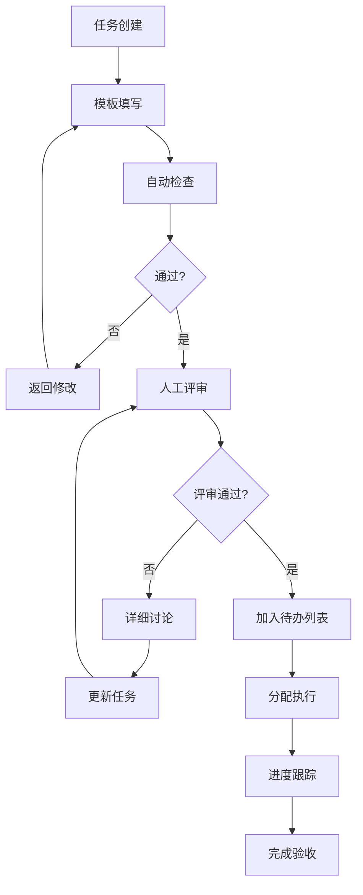

# 🧭 任务分解上下文明晰性检测机制

## 📋 概述

本文档详细介绍如何建立和实施任务分解的上下文明晰性检测机制，确保每个任务都有清晰的背景、目标和执行路径，避免因上下文不明确导致的开发偏差和返工。

## 🎯 检测目标

### 1. 上下文完整性
- 任务背景清晰
- 相关依赖明确
- 影响范围确定

### 2. 目标明确性
- 任务目标具体可衡量
- 验收标准清晰
- 成功指标量化

### 3. 执行路径清晰
- 实施步骤明确
- 资源需求清楚
- 风险识别充分

## 🛠️ 检测机制设计

### 1. 任务描述模板标准化

```markdown
## 任务ID: [TASK-XXX]
### 任务标题: [简明扼要的任务标题]
### 任务类型: [功能开发|缺陷修复|技术优化|文档编写|测试实施]
### 优先级: [紧急|高|中|低]
### 状态: [待办|进行中|代码审查|测试中|已完成]

### 背景信息:
[描述为什么要执行这个任务，解决什么问题，相关的业务场景]

### 相关需求:
- [关联的需求ID和简要说明]
- [上游任务ID]
- [并行任务ID]

### 任务目标:
[明确描述任务要达成的具体目标，使用SMART原则]

### 验收标准:
- [具体、可验证的验收条件1]
- [具体、可验证的验收条件2]
- [具体、可验证的验收条件3]

### 实施步骤:
1. [第一步详细说明]
2. [第二步详细说明]
3. [第三步详细说明]

### 资源需求:
- [人力需求：开发人员、测试人员等]
- [技术资源：服务器、数据库、第三方服务等]
- [时间预算：预计工时]

### 风险评估:
- [技术风险及应对措施]
- [时间风险及缓冲方案]
- [质量风险及保障措施]

### 交付物:
- [代码实现]
- [测试用例]
- [文档更新]
- [部署脚本]
```

### 2. 自动化检查规则

#### 规则1: 上下文完整性检查
```javascript
function checkContextCompleteness(task) {
  const errors = [];
  const warnings = [];
  
  // 检查背景信息
  if (!task.background || task.background.trim().length < 20) {
    errors.push('背景信息过于简短或缺失');
  }
  
  // 检查相关需求
  if (!task.relatedRequirements || task.relatedRequirements.length === 0) {
    warnings.push('未关联相关需求，可能导致开发偏离目标');
  }
  
  // 检查依赖关系
  if (task.dependencies && task.dependencies.length > 0) {
    task.dependencies.forEach(dep => {
      if (!dep.id || !dep.description) {
        warnings.push('依赖关系描述不完整');
      }
    });
  }
  
  return {
    valid: errors.length === 0,
    errors,
    warnings
  };
}
```

#### 规则2: 目标明确性检查
```javascript
function checkGoalClarity(task) {
  const errors = [];
  
  // 检查任务目标
  if (!task.goal || task.goal.trim().length < 15) {
    errors.push('任务目标描述不清晰');
  } else {
    // 检查是否符合SMART原则
    const smartChecks = {
      Specific: /[具体|明确|详细]/i.test(task.goal),
      Measurable: /[数量|指标|百分比|时间]/i.test(task.goal),
      Achievable: !/[不可能|很难|或许]/i.test(task.goal),
      Relevant: /[业务|用户|系统]/i.test(task.goal),
      Timebound: /[天|周|月|完成|截止]/i.test(task.goal)
    };
    
    const missingSmart = Object.keys(smartChecks).filter(key => !smartChecks[key]);
    if (missingSmart.length > 2) {
      errors.push(`任务目标缺少SMART要素: ${missingSmart.join(', ')}`);
    }
  }
  
  // 检查验收标准
  if (!task.acceptanceCriteria || task.acceptanceCriteria.length === 0) {
    errors.push('缺少验收标准');
  } else {
    task.acceptanceCriteria.forEach((criteria, index) => {
      if (!criteria || criteria.trim().length === 0) {
        errors.push(`验收标准第${index + 1}项为空`);
      } else if (!/[应该|必须|能够|可以]/.test(criteria)) {
        errors.push(`验收标准第${index + 1}项缺少行为动词`);
      }
    });
  }
  
  return {
    valid: errors.length === 0,
    errors
  };
}
```

#### 规则3: 执行路径清晰度检查
```javascript
function checkExecutionPathClarity(task) {
  const errors = [];
  const warnings = [];
  
  // 检查实施步骤
  if (!task.steps || task.steps.length === 0) {
    errors.push('缺少实施步骤');
  } else {
    if (task.steps.length < 2) {
      warnings.push('实施步骤过少，可能不够详细');
    }
    
    task.steps.forEach((step, index) => {
      if (!step || step.trim().length === 0) {
        errors.push(`实施步骤第${index + 1}项为空`);
      } else if (step.length < 10) {
        warnings.push(`实施步骤第${index + 1}项描述过于简单`);
      }
    });
  }
  
  // 检查资源需求
  if (!task.resources) {
    warnings.push('未明确资源需求');
  } else {
    if (!task.resources.human && !task.resources.technical) {
      warnings.push('资源需求描述不完整');
    }
  }
  
  // 检查风险评估
  if (!task.risks || task.risks.length === 0) {
    warnings.push('未进行风险评估');
  }
  
  return {
    valid: errors.length === 0,
    errors,
    warnings
  };
}
```

## 🔄 明晰性检测流程

### 阶段一: 静态分析 (Static Analysis)

#### 1. 结构完整性检查
```javascript
function validateTaskStructure(task) {
  const requiredSections = [
    'id', 'title', 'type', 'priority', 'background', 
    'goal', 'acceptanceCriteria', 'steps'
  ];
  
  const missingSections = requiredSections.filter(section => 
    !task[section] || 
    (Array.isArray(task[section]) && task[section].length === 0) ||
    (typeof task[section] === 'string' && task[section].trim().length === 0)
  );
  
  return {
    valid: missingSections.length === 0,
    missing: missingSections
  };
}
```

#### 2. 内容质量检查
```javascript
function checkContentQuality(task) {
  const issues = [];
  
  // 检查是否使用模糊词汇
  const fuzzyWords = ['大概', '可能', '差不多', '左右', '等等', '一些', '很多'];
  const contentToCheck = [
    task.background,
    task.goal,
    ...(task.acceptanceCriteria || []),
    ...(task.steps || []).join(' ')
  ].join(' ');
  
  fuzzyWords.forEach(word => {
    if (contentToCheck.includes(word)) {
      issues.push(`内容中包含模糊词汇: "${word}"`);
    }
  });
  
  // 检查是否包含具体的技术细节
  const hasTechnicalDetails = /[API|数据库|函数|类|组件]/.test(contentToCheck);
  if (!hasTechnicalDetails && task.type === '功能开发') {
    issues.push('功能开发任务应包含技术实现细节');
  }
  
  // 检查时间估算
  if (!task.timeEstimate) {
    issues.push('缺少时间估算');
  }
  
  return {
    issues
  };
}
```

### 阶段二: 上下文关联检查 (Contextual Relationship Analysis)

#### 1. 依赖关系合理性检查
```javascript
function checkDependencyRationality(task, allTasks) {
  const issues = [];
  
  if (task.dependencies) {
    task.dependencies.forEach(depId => {
      const depTask = allTasks.find(t => t.id === depId);
      if (!depTask) {
        issues.push(`依赖的任务 ${depId} 不存在`);
      } else {
        // 检查循环依赖
        if (depTask.dependencies && depTask.dependencies.includes(task.id)) {
          issues.push(`与任务 ${depId} 存在循环依赖`);
        }
        
        // 检查优先级合理性
        if (task.priority === '紧急' && depTask.priority === '低') {
          issues.push(`紧急任务依赖低优先级任务 ${depId}`);
        }
      }
    });
  }
  
  // 检查依赖数量合理性
  if (task.dependencies && task.dependencies.length > 5) {
    issues.push(`依赖过多 (${task.dependencies.length}个)，建议拆分任务`);
  }
  
  return {
    issues
  };
}
```

#### 2. 影响范围分析
```javascript
function analyzeImpactScope(task) {
  const warnings = [];
  
  // 检查是否明确了影响范围
  if (!task.impactScope || task.impactScope.trim().length === 0) {
    warnings.push('未明确说明任务的影响范围');
  } else {
    // 检查影响范围描述的完整性
    const scopeIndicators = ['用户', '系统', '性能', '安全性', '兼容性'];
    const hasScopeDetails = scopeIndicators.some(indicator => 
      task.impactScope.includes(indicator)
    );
    
    if (!hasScopeDetails) {
      warnings.push('影响范围描述不够具体');
    }
  }
  
  return {
    warnings
  };
}
```

### 阶段三: 可执行性检查 (Executability Analysis)

#### 1. 步骤可行性评估
```javascript
function evaluateStepFeasibility(task) {
  const issues = [];
  
  if (task.steps) {
    task.steps.forEach((step, index) => {
      // 检查步骤是否过于宽泛
      const broadKeywords = ['实现', '开发', '完成', '处理'];
      const isBroad = broadKeywords.some(keyword => 
        new RegExp(`^${keyword}|${keyword}$`).test(step.trim())
      );
      
      if (isBroad) {
        issues.push(`步骤${index + 1}过于宽泛: "${step}"`);
      }
      
      // 检查步骤是否包含明确的输出
      const outputKeywords = ['创建', '生成', '编写', '构建', '部署'];
      const hasOutput = outputKeywords.some(keyword => step.includes(keyword));
      
      if (!hasOutput) {
        issues.push(`步骤${index + 1}缺少明确的输出描述: "${step}"`);
      }
    });
  }
  
  return {
    issues
  };
}
```

#### 2. 资源匹配度检查
```javascript
function checkResourceAlignment(task) {
  const warnings = [];
  
  if (task.resources) {
    // 检查人力资源与任务复杂度匹配
    if (task.resources.human && task.complexity) {
      const complexityLevel = getComplexityLevel(task.complexity);
      const requiredResources = getResourcesForComplexity(complexityLevel);
      
      if (task.resources.human < requiredResources.min) {
        warnings.push(`人力资源(${task.resources.human}人)可能不足以完成${complexityLevel}复杂度的任务`);
      }
    }
    
    // 检查时间估算合理性
    if (task.timeEstimate && task.complexity) {
      const estimatedHours = parseTimeEstimate(task.timeEstimate);
      const expectedHours = getExpectedHoursForComplexity(task.complexity);
      
      if (estimatedHours < expectedHours * 0.5) {
        warnings.push(`时间估算(${estimatedHours}小时)可能过于乐观`);
      } else if (estimatedHours > expectedHours * 3) {
        warnings.push(`时间估算(${estimatedHours}小时)可能过于保守`);
      }
    }
  }
  
  return {
    warnings
  };
}

function getComplexityLevel(complexity) {
  const levels = {
    '简单': 1,
    '中等': 2,
    '复杂': 3,
    'very_complex': 4
  };
  return Object.keys(levels).find(key => levels[key] === complexity) || '中等';
}
```

## 📊 检测报告格式

### 详细报告模板
```markdown
# 任务分解上下文明晰性检测报告

## 检测时间: 2025-12-09 15:00:00
## 检测范围: Sprint 2025-W50 任务列表
## 检测结果: ⚠️ 发现问题

## 📋 检测概览
- 总任务数量: 25
- 通过检测: 18
- 存在问题: 7
- 严重问题: 3
- 警告: 4

## ❌ 严重问题
### 1. 上下文缺失
- **任务ID**: TASK-101
- **问题类型**: 背景信息不足
- **问题描述**: 任务背景仅有一句话描述，未说明业务场景和用户需求
- **建议**: 补充详细的业务背景和用户故事

### 2. 目标不明确
- **任务ID**: TASK-105
- **问题类型**: 目标描述模糊
- **问题描述**: "优化系统性能"过于宽泛，未说明具体优化哪方面性能
- **建议**: 明确性能指标，如"将页面加载时间从3秒优化至1秒"

### 3. 循环依赖
- **任务ID**: TASK-112, TASK-115
- **问题类型**: 任务间循环依赖
- **问题描述**: 用户认证任务依赖权限管理，权限管理又依赖用户认证
- **建议**: 重新设计任务边界，引入中间层解耦

## ⚠️ 警告
### 1. 实施步骤不详细
- **任务ID**: TASK-108
- **问题**: 实施步骤仅有3个宽泛描述，缺乏具体操作指导

### 2. 资源估算不足
- **任务ID**: TASK-118
- **问题**: 复杂任务仅分配1人，可能无法按时完成

### 3. 风险评估缺失
- **任务ID**: TASK-122
- **问题**: 未识别潜在的技术风险和应对措施

### 4. 影响范围不明确
- **任务ID**: TASK-124
- **问题**: 未说明任务变更对现有功能的影响

## ✅ 通过检测的任务
- TASK-102 ~ TASK-104: 用户界面优化
- TASK-106 ~ TASK-107: 数据库迁移
- TASK-109 ~ TASK-111: API接口开发
- TASK-113 ~ TASK-114: 测试用例编写
- TASK-116 ~ TASK-125: 文档更新

## 📈 可执行性评分
- 上下文完整性: 85%
- 目标明确性: 78%
- 执行路径清晰度: 82%
- 资源匹配度: 75%
```

## 🛠️ 实施工具

### 1. 命令行检测工具
```bash
#!/bin/bash
# task-validator.sh

echo "开始检测任务分解上下文明晰性..."

# 检查参数
if [ $# -eq 0 ]; then
  echo "用法: $0 <tasks-directory>"
  exit 1
fi

TASKS_DIR=$1

# 检查目录存在性
if [ ! -d "$TASKS_DIR" ]; then
  echo "错误: 目录 $TASKS_DIR 不存在"
  exit 1
fi

# 运行各项检查
echo "1. 检查任务结构完整性..."
node check-task-structure.js "$TASKS_DIR"

echo "2. 检查上下文完整性..."
node check-context-completeness.js "$TASKS_DIR"

echo "3. 检查目标明确性..."
node check-goal-clarity.js "$TASKS_DIR"

echo "4. 检查执行路径清晰度..."
node check-execution-clarity.js "$TASKS_DIR"

echo "5. 生成综合报告..."
node generate-clarity-report.js "$TASKS_DIR"

echo "检测完成! 详细报告已生成。"
```

### 2. 集成到项目管理工具
```javascript
// task-clarity-checker.js
class TaskClarityChecker {
  constructor(projectManagementAPI) {
    this.api = projectManagementAPI;
    this.checkRules = [
      this.checkContextCompleteness,
      this.checkGoalClarity,
      this.checkExecutionPathClarity,
      this.checkDependencies,
      this.checkResources
    ];
  }
  
  async checkAllTasks() {
    const tasks = await this.api.getTasks();
    const results = [];
    
    for (const task of tasks) {
      const taskResult = await this.checkTask(task);
      results.push({
        taskId: task.id,
        title: task.title,
        clarityScore: this.calculateClarityScore(taskResult),
        issues: taskResult.issues,
        recommendations: this.generateRecommendations(taskResult)
      });
    }
    
    return this.generateSummaryReport(results);
  }
  
  async checkTask(task) {
    const results = {};
    
    for (const rule of this.checkRules) {
      results[rule.name] = await rule.call(this, task);
    }
    
    return results;
  }
  
  calculateClarityScore(checkResults) {
    // 基于检查结果计算明晰性分数
    const weights = {
      context: 0.25,
      goal: 0.30,
      execution: 0.25,
      dependencies: 0.10,
      resources: 0.10
    };
    
    let score = 100;
    
    if (checkResults.checkContextCompleteness.errors.length > 0) {
      score -= 20;
    }
    
    if (checkResults.checkGoalClarity.errors.length > 0) {
      score -= 25;
    }
    
    // ... 其他评分逻辑
    
    return Math.max(0, score);
  }
}
```

## 🎯 最佳实践

### 1. 任务编写规范
```markdown
## 任务编写黄金法则

### 1. INVEST原则
- **Independent**: 独立性 - 任务尽量独立，减少依赖
- **Negotiable**: 可协商性 - 任务内容可以讨论调整
- **Valuable**: 有价值性 - 任务必须为用户或业务创造价值
- **Estimable**: 可估算性 - 任务规模可以被合理估算
- **Small**: 小规模性 - 任务应该足够小，能在几天内完成
- **Testable**: 可测试性 - 任务结果可以被验证

### 2. 3C原则
- **Card**: 卡片 - 简洁的任务描述
- **Conversation**: 对话 - 详细的讨论和澄清
- **Confirmation**: 确认 - 明确的验收标准

### 3. SMART原则
- **Specific**: 具体的 - 目标明确不模糊
- **Measurable**: 可衡量的 - 有具体的衡量标准
- **Achievable**: 可达成的 - 在能力和资源范围内
- **Relevant**: 相关的 - 与业务目标相关
- **Time-bound**: 有时限的 - 有明确的时间要求
```

### 2. 团队协作流程


### 3. 持续改进机制
- 定期回顾典型问题
- 更新检查规则库
- 优化任务模板
- 提升团队培训

## 📊 效果评估指标

### 1. 质量指标
- 任务返工率降低: 35-50%
- 需求理解偏差减少: 40-60%
- 开发效率提升: 20-30%

### 2. 团队指标
- 任务估算准确率: 80-90%
- 团队协作效率提升: 25-35%
- 新成员上手时间缩短: 30-40%

### 3. 项目指标
- 项目延期率降低: 20-35%
- 客户满意度提升: 15-25%
- 维护成本降低: 20-30%

---
*本文档将持续更新，以反映最新的任务分解上下文明晰性检测实践经验和最佳做法。*