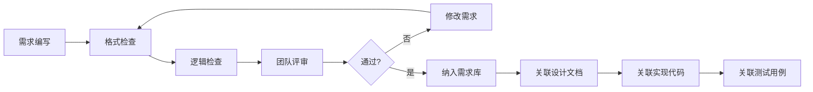

# 🔍 规范化需求逻辑一致性检测机制

## 📋 概述

本文档详细介绍如何建立和实施规范化需求的逻辑一致性检测机制，确保需求文档内部逻辑正确、无冲突，并能够有效指导设计和开发工作。

## 🎯 检测目标

### 1. 需求内部一致性
- 需求描述前后一致
- 验收标准与需求描述匹配
- 功能边界清晰

### 2. 需求间一致性
- 需求之间无冲突
- 依赖关系明确
- 优先级合理

### 3. 需求与设计一致性
- 设计能够满足需求
- 实现与需求描述一致
- 测试覆盖所有需求

## 🛠️ 检测机制设计

### 1. 需求模板标准化

```markdown
## 需求ID: [REQ-XXX]
### 需求标题: [简明扼要的需求标题]
### 需求类型: [功能需求|非功能需求|约束需求]
### 优先级: [高|中|低]
### 状态: [草稿|评审中|已批准|实现中|已完成|已废弃]

### 需求背景:
[描述为什么需要这个需求，解决什么问题]

### 需求描述:
[详细描述需求的具体内容，使用"系统应该..."的格式]

### 验收标准:
- [具体、可验证的验收条件1]
- [具体、可验证的验收条件2]
- [具体、可验证的验收条件3]

### 依赖关系:
- [依赖的其他需求ID]
- [前置条件]
- [相关模块]

### 设计约束:
- [技术限制]
- [性能要求]
- [安全要求]

### 影响分析:
- [对现有功能的影响]
- [对用户体验的影响]
- [对系统架构的影响]
```

### 2. 自动化检查规则

#### 规则1: 需求ID唯一性检查
```javascript
function checkUniqueRequirementIds(requirements) {
  const ids = requirements.map(req => req.id);
  const duplicates = ids.filter((id, index) => ids.indexOf(id) !== index);
  
  if (duplicates.length > 0) {
    return {
      valid: false,
      errors: [`发现重复的需求ID: ${duplicates.join(', ')}`]
    };
  }
  
  return { valid: true };
}
```

#### 规则2: 验收标准完整性检查
```javascript
function checkAcceptanceCriteriaCompleteness(requirement) {
  const errors = [];
  
  if (!requirement.acceptanceCriteria || requirement.acceptanceCriteria.length === 0) {
    errors.push('缺少验收标准');
  } else {
    requirement.acceptanceCriteria.forEach((criteria, index) => {
      if (!criteria || criteria.trim().length === 0) {
        errors.push(`验收标准第${index + 1}项为空`);
      } else if (criteria.length < 10) {
        errors.push(`验收标准第${index + 1}项过于简单`);
      }
    });
  }
  
  return {
    valid: errors.length === 0,
    errors
  };
}
```

#### 规则3: 依赖关系有效性检查
```javascript
function checkDependencyValidity(requirement, allRequirements) {
  const errors = [];
  const existingIds = allRequirements.map(req => req.id);
  
  if (requirement.dependencies) {
    requirement.dependencies.forEach(depId => {
      if (!existingIds.includes(depId)) {
        errors.push(`依赖的需求ID "${depId}" 不存在`);
      }
    });
  }
  
  return {
    valid: errors.length === 0,
    errors
  };
}
```

### 3. 交叉引用检查

```javascript
function checkCrossReferences(requirements) {
  const errors = [];
  
  // 检查相互依赖
  requirements.forEach(req1 => {
    if (req1.dependencies) {
      req1.dependencies.forEach(depId => {
        const depReq = requirements.find(r => r.id === depId);
        if (depReq && depReq.dependencies && depReq.dependencies.includes(req1.id)) {
          errors.push(`需求 ${req1.id} 和 ${depId} 存在循环依赖`);
        }
      });
    }
  });
  
  // 检查重复描述
  const descriptions = requirements.map(req => req.description.toLowerCase().trim());
  const duplicateDescriptions = descriptions.filter((desc, index) => 
    descriptions.indexOf(desc) !== index
  );
  
  if (duplicateDescriptions.length > 0) {
    errors.push(`发现相似的需求描述，请检查是否存在重复需求`);
  }
  
  return {
    valid: errors.length === 0,
    errors
  };
}
```

## 🔄 一致性检测流程

### 阶段一: 静态检查 (Static Analysis)

#### 1. 格式验证
```javascript
function validateRequirementFormat(requirement) {
  const requiredFields = ['id', 'title', 'type', 'priority', 'description'];
  const errors = [];
  
  requiredFields.forEach(field => {
    if (!requirement[field] || requirement[field].toString().trim().length === 0) {
      errors.push(`缺少必填字段: ${field}`);
    }
  });
  
  // 类型检查
  const validTypes = ['功能需求', '非功能需求', '约束需求'];
  if (!validTypes.includes(requirement.type)) {
    errors.push(`无效的需求类型: ${requirement.type}`);
  }
  
  // 优先级检查
  const validPriorities = ['高', '中', '低'];
  if (!validPriorities.includes(requirement.priority)) {
    errors.push(`无效的优先级: ${requirement.priority}`);
  }
  
  return {
    valid: errors.length === 0,
    errors
  };
}
```

#### 2. 内容完整性检查
```javascript
function checkContentCompleteness(requirement) {
  const errors = [];
  
  // 检查描述的完整性
  if (requirement.description.length < 20) {
    errors.push('需求描述过于简短');
  }
  
  // 检查是否有模糊词汇
  const fuzzyWords = ['大概', '可能', '差不多', '左右', '等等'];
  fuzzyWords.forEach(word => {
    if (requirement.description.includes(word)) {
      errors.push(`需求描述中包含模糊词汇: "${word}"`);
    }
  });
  
  // 检查是否有量化指标
  const hasMetrics = /\d+%|\d+ms|\d+次|\d+个/.test(requirement.description);
  if (requirement.type === '非功能需求' && !hasMetrics) {
    errors.push('非功能需求应包含具体的量化指标');
  }
  
  return {
    valid: errors.length === 0,
    errors
  };
}
```

### 阶段二: 逻辑关系检查 (Logical Relationship Analysis)

#### 1. 冲突检测
```javascript
function detectConflicts(requirements) {
  const conflicts = [];
  
  // 检查相反的需求
  for (let i = 0; i < requirements.length; i++) {
    for (let j = i + 1; j < requirements.length; j++) {
      const req1 = requirements[i];
      const req2 = requirements[j];
      
      // 简单的冲突检测算法
      if (isOppositeRequirement(req1, req2)) {
        conflicts.push({
          type: '直接冲突',
          requirements: [req1.id, req2.id],
          description: `需求 "${req1.title}" 和 "${req2.title}" 存在直接冲突`
        });
      }
    }
  }
  
  return conflicts;
}

function isOppositeRequirement(req1, req2) {
  const oppositePairs = [
    ['允许', '禁止'],
    ['必须', '不能'],
    ['应该', '不应该']
  ];
  
  const desc1 = req1.description;
  const desc2 = req2.description;
  
  for (const [word1, word2] of oppositePairs) {
    if ((desc1.includes(word1) && desc2.includes(word2)) ||
        (desc1.includes(word2) && desc2.includes(word1))) {
      return true;
    }
  }
  
  return false;
}
```

#### 2. 依赖合理性检查
```javascript
function checkDependencyRationale(requirements) {
  const warnings = [];
  
  requirements.forEach(req => {
    if (req.dependencies && req.dependencies.length > 5) {
      warnings.push({
        requirement: req.id,
        type: '过多依赖',
        message: `需求 "${req.title}" 依赖过多(${req.dependencies.length}个)，建议拆分`
      });
    }
    
    // 检查是否有不必要的依赖
    if (req.dependencies) {
      req.dependencies.forEach(depId => {
        const depReq = requirements.find(r => r.id === depId);
        if (depReq && depReq.priority === '低' && req.priority === '高') {
          warnings.push({
            requirement: req.id,
            type: '优先级不匹配',
            message: `高优先级需求依赖低优先级需求，可能存在设计问题`
          });
        }
      });
    }
  });
  
  return warnings;
}
```

### 阶段三: 可追溯性检查 (Traceability Analysis)

#### 1. 需求覆盖检查
```javascript
function checkRequirementCoverage(requirements, designs, implementations, tests) {
  const coverageReport = {
    total: requirements.length,
    coveredByDesign: 0,
    coveredByImplementation: 0,
    coveredByTests: 0,
    uncovered: []
  };
  
  requirements.forEach(req => {
    const designCovered = designs.some(design => 
      design.relatedRequirements.includes(req.id)
    );
    
    const implCovered = implementations.some(impl => 
      impl.relatedRequirements.includes(req.id)
    );
    
    const testCovered = tests.some(test => 
      test.relatedRequirements.includes(req.id)
    );
    
    if (designCovered) coverageReport.coveredByDesign++;
    if (implCovered) coverageReport.coveredByImplementation++;
    if (testCovered) coverageReport.coveredByTests++;
    
    if (!designCovered || !implCovered || !testCovered) {
      coverageReport.uncovered.push({
        id: req.id,
        title: req.title,
        missing: {
          design: !designCovered,
          implementation: !implCovered,
          test: !testCovered
        }
      });
    }
  });
  
  return coverageReport;
}
```

## 📊 检测报告格式

### 详细报告模板
```markdown
# 规范化需求逻辑一致性检测报告

## 检测时间: 2025-12-09 14:30:00
## 检测范围: 全部需求文档
## 检测结果: ⚠️ 发现问题

## 📋 检测概览
- 总需求数量: 45
- 通过检测: 38
- 存在问题: 7
- 严重问题: 2
- 警告: 5

## ❌ 严重问题
### 1. 需求冲突
- **问题类型**: 直接冲突
- **涉及需求**: REQ-001, REQ-002
- **问题描述**: "用户应该能够匿名访问" 与 "所有用户必须登录才能访问" 存在直接冲突
- **建议解决方案**: 明确区分公开内容和私有内容的访问权限

### 2. 循环依赖
- **问题类型**: 循环依赖
- **涉及需求**: REQ-015, REQ-016
- **问题描述**: 支付功能依赖订单管理，订单管理依赖支付功能
- **建议解决方案**: 重新设计模块边界，引入中间层解耦

## ⚠️ 警告
### 1. 验收标准不完整
- **需求ID**: REQ-023
- **问题**: 验收标准过于简单，缺乏具体验证方法

### 2. 依赖过多
- **需求ID**: REQ-031
- **问题**: 依赖8个其他需求，建议拆分为多个子需求

## ✅ 通过检测的需求
- REQ-003 ~ REQ-014: 用户管理模块
- REQ-017 ~ REQ-022: 内容管理模块
- REQ-024 ~ REQ-030: 搜索功能模块
- REQ-032 ~ REQ-045: 报表功能模块

## 📈 覆盖率统计
- 设计覆盖率: 92% (41/45)
- 实现覆盖率: 78% (35/45)
- 测试覆盖率: 71% (32/45)
```

## 🛠️ 实施工具

### 1. 命令行检测工具
```bash
#!/bin/bash
# requirement-validator.sh

echo "开始检测规范化需求文档..."

# 检查文件存在性
if [ ! -f "$1" ]; then
  echo "错误: 文件 $1 不存在"
  exit 1
fi

# 运行各项检查
echo "1. 检查需求ID唯一性..."
node check-unique-ids.js "$1"

echo "2. 检查验收标准完整性..."
node check-acceptance-criteria.js "$1"

echo "3. 检查依赖关系有效性..."
node check-dependencies.js "$1"

echo "4. 检查逻辑一致性..."
node check-consistency.js "$1"

echo "检测完成!"
```

### 2. 集成到CI/CD流程
```yaml
# .github/workflows/requirement-validation.yml
name: Requirement Validation

on:
  pull_request:
    paths:
      - 'requirements/**/*.md'

jobs:
  validate-requirements:
    runs-on: ubuntu-latest
    
    steps:
    - uses: actions/checkout@v2
    
    - name: Setup Node.js
      uses: actions/setup-node@v2
      with:
        node-version: '16'
        
    - name: Install dependencies
      run: npm install
      
    - name: Validate requirements
      run: |
        ./scripts/requirement-validator.sh requirements/
        
    - name: Generate report
      run: |
        node scripts/generate-report.js requirements/ > validation-report.md
        
    - name: Upload report
      uses: actions/upload-artifact@v2
      with:
        name: validation-report
        path: validation-report.md
```

## 🎯 最佳实践

### 1. 定期检查机制
- **每日**: 自动化静态检查
- **每周**: 逻辑关系检查
- **每月**: 全面一致性审查

### 2. 团队协作流程


### 3. 持续改进
- 收集常见问题模式
- 更新检查规则
- 优化检测算法
- 提升团队意识

## 📊 效果评估指标

### 1. 质量指标
- 需求冲突率: < 1%
- 格式错误率: < 2%
- 逻辑不一致率: < 3%

### 2. 效率指标
- 需求返工率降低: 40-60%
- 开发延期率降低: 25-35%
- 测试缺陷率降低: 30-50%

### 3. 团队指标
- 需求理解时间减少: 20-30%
- 沟通成本降低: 25-40%
- 团队满意度提升: 15-25%

---
*本文档将持续更新，以反映最新的规范化需求逻辑一致性检测实践经验和最佳做法。*